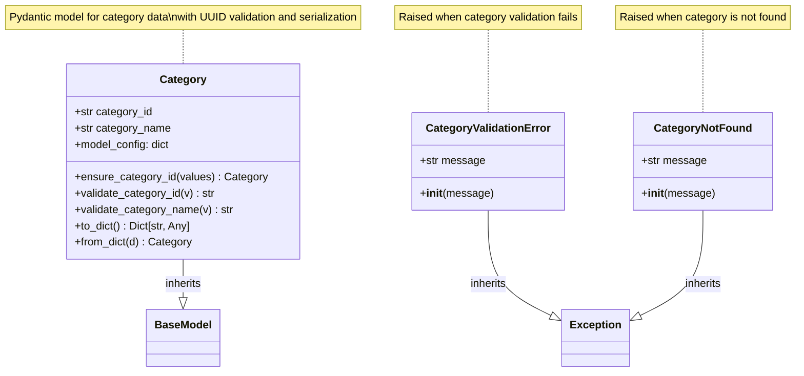

# Category Model - UML Class Diagram

```mermaid
classDiagram
    class Category {
        +str category_id
        +str category_name
        +model_config: dict
        +ensure_category_id(values) Category
        +validate_category_id(v) str
        +validate_category_name(v) str
        +to_dict() Dict[str, Any]
        +from_dict(d) Category
    }

    class CategoryValidationError {
        +str message
        +__init__(message)
    }

    class CategoryNotFound {
        +str message
        +__init__(message)
    }

    Category --|> BaseModel : inherits
    CategoryValidationError --|> Exception : inherits
    CategoryNotFound --|> Exception : inherits

    note for Category "Pydantic model for category data\nwith UUID validation and serialization"
    note for CategoryValidationError "Raised when category validation fails"
    note for CategoryNotFound "Raised when category is not found"
```
