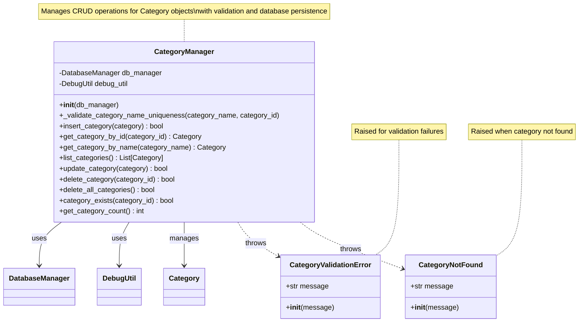

# Category Manager - UML Class Diagram

```mermaid
classDiagram
    class CategoryManager {
        -DatabaseManager db_manager
        -DebugUtil debug_util
        +__init__(db_manager)
        +_validate_category_name_uniqueness(category_name, category_id)
        +insert_category(category) bool
        +get_category_by_id(category_id) Category
        +get_category_by_name(category_name) Category
        +list_categories() List[Category]
        +update_category(category) bool
        +delete_category(category_id) bool
        +delete_all_categories() bool
        +category_exists(category_id) bool
        +get_category_count() int
    }

    class CategoryValidationError {
        +str message
        +__init__(message)
    }

    class CategoryNotFound {
        +str message
        +__init__(message)
    }

    CategoryManager --> DatabaseManager : uses
    CategoryManager --> DebugUtil : uses
    CategoryManager --> Category : manages
    CategoryManager ..> CategoryValidationError : throws
    CategoryManager ..> CategoryNotFound : throws

    note for CategoryManager "Manages CRUD operations for Category objects\nwith validation and database persistence"
    note for CategoryValidationError "Raised for validation failures"
    note for CategoryNotFound "Raised when category not found"
```
