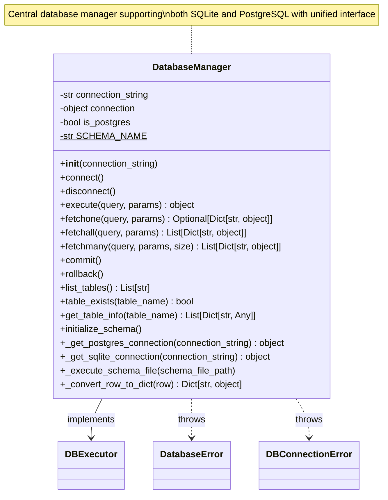

# Database Manager - UML Class Diagram

```mermaid
classDiagram
    class DatabaseManager {
        -str connection_string
        -object connection
        -bool is_postgres
        -str SCHEMA_NAME$
        +__init__(connection_string)
        +connect()
        +disconnect()
        +execute(query, params) object
        +fetchone(query, params) Optional[Dict[str, object]]
        +fetchall(query, params) List[Dict[str, object]]
        +fetchmany(query, params, size) List[Dict[str, object]]
        +commit()
        +rollback()
        +list_tables() List[str]
        +table_exists(table_name) bool
        +get_table_info(table_name) List[Dict[str, Any]]
        +initialize_schema()
        +_get_postgres_connection(connection_string) object
        +_get_sqlite_connection(connection_string) object
        +_execute_schema_file(schema_file_path)
        +_convert_row_to_dict(row) Dict[str, object]
    }

    DatabaseManager --> DBExecutor : implements
    DatabaseManager ..> DatabaseError : throws
    DatabaseManager ..> DBConnectionError : throws

    note for DatabaseManager "Central database manager supporting\nboth SQLite and PostgreSQL with unified interface"
```
