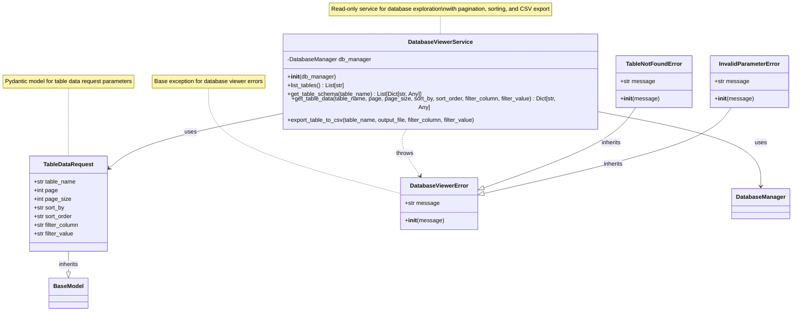

# Database Viewer Service - UML Class Diagram

```mermaid
classDiagram
    class DatabaseViewerService {
        -DatabaseManager db_manager
        +__init__(db_manager)
        +list_tables() List[str]
        +get_table_schema(table_name) List[Dict[str, Any]]
        +get_table_data(table_name, page, page_size, sort_by, sort_order, filter_column, filter_value) Dict[str, Any]
        +export_table_to_csv(table_name, output_file, filter_column, filter_value)
    }

    class TableDataRequest {
        +str table_name
        +int page
        +int page_size
        +str sort_by
        +str sort_order
        +str filter_column
        +str filter_value
    }

    class DatabaseViewerError {
        +str message
        +__init__(message)
    }

    class TableNotFoundError {
        +str message
        +__init__(message)
    }

    class InvalidParameterError {
        +str message
        +__init__(message)
    }

    DatabaseViewerService --> DatabaseManager : uses
    DatabaseViewerService --> TableDataRequest : uses
    DatabaseViewerService ..> DatabaseViewerError : throws
    TableNotFoundError --|> DatabaseViewerError : inherits
    InvalidParameterError --|> DatabaseViewerError : inherits
    TableDataRequest --|> BaseModel : inherits

    note for DatabaseViewerService "Read-only service for database exploration\nwith pagination, sorting, and CSV export"
    note for TableDataRequest "Pydantic model for table data request parameters"
    note for DatabaseViewerError "Base exception for database viewer errors"
```
