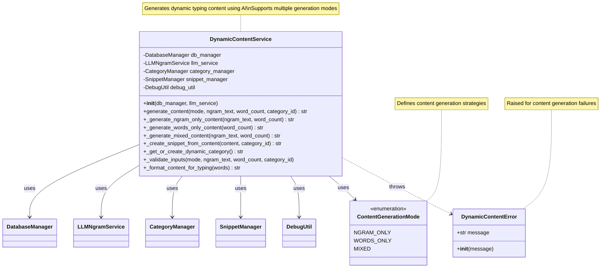

# Dynamic Content Service - UML Class Diagram

```mermaid
classDiagram
    class DynamicContentService {
        -DatabaseManager db_manager
        -LLMNgramService llm_service
        -CategoryManager category_manager
        -SnippetManager snippet_manager
        -DebugUtil debug_util
        +__init__(db_manager, llm_service)
        +generate_content(mode, ngram_text, word_count, category_id) str
        +_generate_ngram_only_content(ngram_text, word_count) str
        +_generate_words_only_content(word_count) str
        +_generate_mixed_content(ngram_text, word_count) str
        +_create_snippet_from_content(content, category_id) str
        +_get_or_create_dynamic_category() str
        +_validate_inputs(mode, ngram_text, word_count, category_id)
        +_format_content_for_typing(words) str
    }

    class ContentGenerationMode {
        <<enumeration>>
        NGRAM_ONLY
        WORDS_ONLY  
        MIXED
    }

    class DynamicContentError {
        +str message
        +__init__(message)
    }

    DynamicContentService --> DatabaseManager : uses
    DynamicContentService --> LLMNgramService : uses
    DynamicContentService --> CategoryManager : uses
    DynamicContentService --> SnippetManager : uses
    DynamicContentService --> DebugUtil : uses
    DynamicContentService --> ContentGenerationMode : uses
    DynamicContentService ..> DynamicContentError : throws

    note for DynamicContentService "Generates dynamic typing content using AI\nSupports multiple generation modes"
    note for ContentGenerationMode "Defines content generation strategies"
    note for DynamicContentError "Raised for content generation failures"
```
