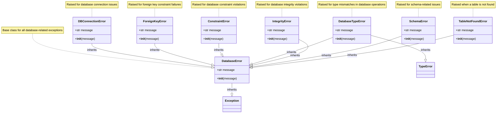

# Database Exceptions - UML Class Diagram

```mermaid
classDiagram
    class DatabaseError {
        +str message
        +__init__(message)
    }

    class DBConnectionError {
        +str message
        +__init__(message)
    }

    class ForeignKeyError {
        +str message
        +__init__(message)
    }

    class ConstraintError {
        +str message
        +__init__(message)
    }

    class DatabaseTypeError {
        +str message
        +__init__(message)
    }

    class IntegrityError {
        +str message
        +__init__(message)
    }

    class SchemaError {
        +str message
        +__init__(message)
    }

    class TableNotFoundError {
        +str message
        +__init__(message)
    }

    DatabaseError --|> Exception : inherits
    DBConnectionError --|> DatabaseError : inherits
    ForeignKeyError --|> DatabaseError : inherits
    ConstraintError --|> DatabaseError : inherits
    DatabaseTypeError --|> DatabaseError : inherits
    DatabaseTypeError --|> TypeError : inherits
    IntegrityError --|> DatabaseError : inherits
    SchemaError --|> DatabaseError : inherits
    TableNotFoundError --|> DatabaseError : inherits

    note for DatabaseError "Base class for all database-related exceptions"
    note for DBConnectionError "Raised for database connection issues"
    note for ForeignKeyError "Raised for foreign key constraint failures"
    note for ConstraintError "Raised for database constraint violations"
    note for DatabaseTypeError "Raised for type mismatches in database operations"
    note for IntegrityError "Raised for database integrity violations"
    note for SchemaError "Raised for schema-related issues"
    note for TableNotFoundError "Raised when a table is not found"
```
