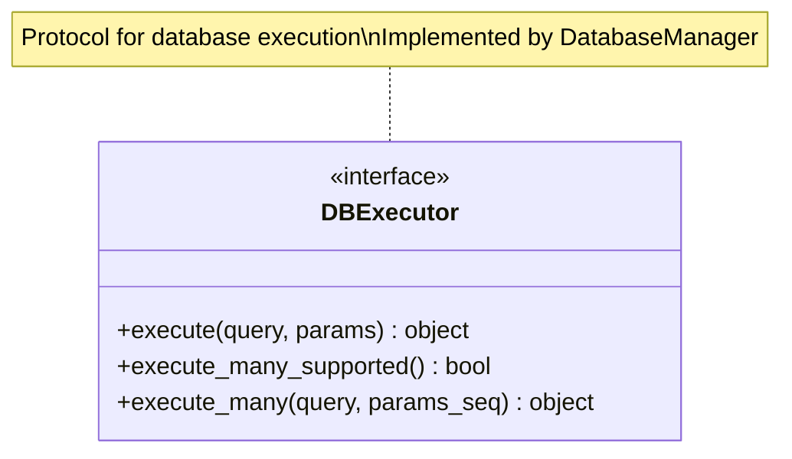

# Database Interfaces - UML Class Diagram

```mermaid
classDiagram
    class DBExecutor {
        <<interface>>
        +execute(query, params) object
        +execute_many_supported() bool
        +execute_many(query, params_seq) object
    }

    note for DBExecutor "Protocol for database execution\nImplemented by DatabaseManager"
```
