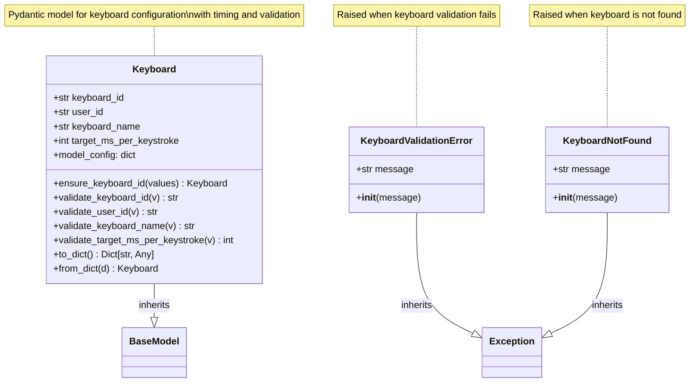

# Keyboard Model - UML Class Diagram

```mermaid
classDiagram
    class Keyboard {
        +str keyboard_id
        +str user_id
        +str keyboard_name
        +int target_ms_per_keystroke
        +model_config: dict
        +ensure_keyboard_id(values) Keyboard
        +validate_keyboard_id(v) str
        +validate_user_id(v) str
        +validate_keyboard_name(v) str
        +validate_target_ms_per_keystroke(v) int
        +to_dict() Dict[str, Any]
        +from_dict(d) Keyboard
    }

    class KeyboardValidationError {
        +str message
        +__init__(message)
    }

    class KeyboardNotFound {
        +str message
        +__init__(message)
    }

    Keyboard --|> BaseModel : inherits
    KeyboardValidationError --|> Exception : inherits
    KeyboardNotFound --|> Exception : inherits

    note for Keyboard "Pydantic model for keyboard configuration\nwith timing and validation"
    note for KeyboardValidationError "Raised when keyboard validation fails"
    note for KeyboardNotFound "Raised when keyboard is not found"
```
