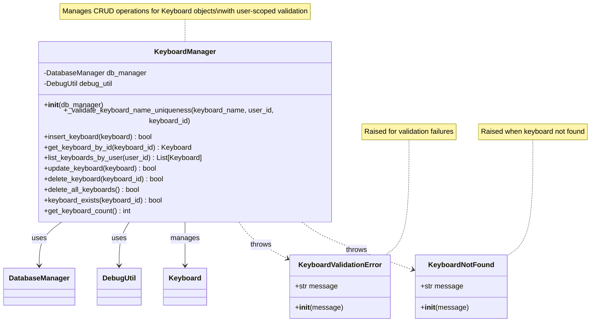

# Keyboard Manager - UML Class Diagram

```mermaid
classDiagram
    class KeyboardManager {
        -DatabaseManager db_manager
        -DebugUtil debug_util
        +__init__(db_manager)
        +_validate_keyboard_name_uniqueness(keyboard_name, user_id, keyboard_id)
        +insert_keyboard(keyboard) bool
        +get_keyboard_by_id(keyboard_id) Keyboard
        +list_keyboards_by_user(user_id) List[Keyboard]
        +update_keyboard(keyboard) bool
        +delete_keyboard(keyboard_id) bool
        +delete_all_keyboards() bool
        +keyboard_exists(keyboard_id) bool
        +get_keyboard_count() int
    }

    class KeyboardValidationError {
        +str message
        +__init__(message)
    }

    class KeyboardNotFound {
        +str message
        +__init__(message)
    }

    KeyboardManager --> DatabaseManager : uses
    KeyboardManager --> DebugUtil : uses
    KeyboardManager --> Keyboard : manages
    KeyboardManager ..> KeyboardValidationError : throws
    KeyboardManager ..> KeyboardNotFound : throws

    note for KeyboardManager "Manages CRUD operations for Keyboard objects\nwith user-scoped validation"
    note for KeyboardValidationError "Raised for validation failures"
    note for KeyboardNotFound "Raised when keyboard not found"
```
