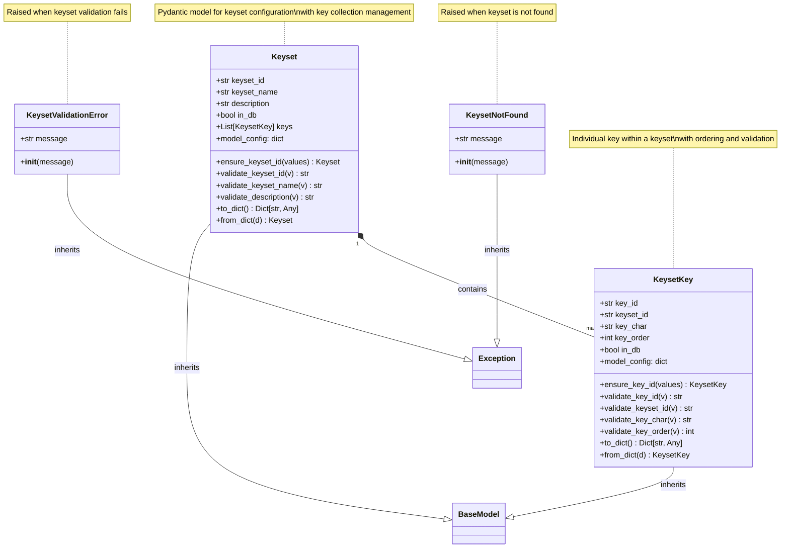

# Keyset Model - UML Class Diagram

```mermaid
classDiagram
    class Keyset {
        +str keyset_id
        +str keyset_name
        +str description
        +bool in_db
        +List[KeysetKey] keys
        +model_config: dict
        +ensure_keyset_id(values) Keyset
        +validate_keyset_id(v) str
        +validate_keyset_name(v) str
        +validate_description(v) str
        +to_dict() Dict[str, Any]
        +from_dict(d) Keyset
    }

    class KeysetKey {
        +str key_id
        +str keyset_id
        +str key_char
        +int key_order
        +bool in_db
        +model_config: dict
        +ensure_key_id(values) KeysetKey
        +validate_key_id(v) str
        +validate_keyset_id(v) str
        +validate_key_char(v) str
        +validate_key_order(v) int
        +to_dict() Dict[str, Any]
        +from_dict(d) KeysetKey
    }

    class KeysetValidationError {
        +str message
        +__init__(message)
    }

    class KeysetNotFound {
        +str message
        +__init__(message)
    }

    Keyset --|> BaseModel : inherits
    KeysetKey --|> BaseModel : inherits
    KeysetValidationError --|> Exception : inherits
    KeysetNotFound --|> Exception : inherits
    Keyset "1" *-- "many" KeysetKey : contains

    note for Keyset "Pydantic model for keyset configuration\nwith key collection management"
    note for KeysetKey "Individual key within a keyset\nwith ordering and validation"
    note for KeysetValidationError "Raised when keyset validation fails"
    note for KeysetNotFound "Raised when keyset is not found"
```
