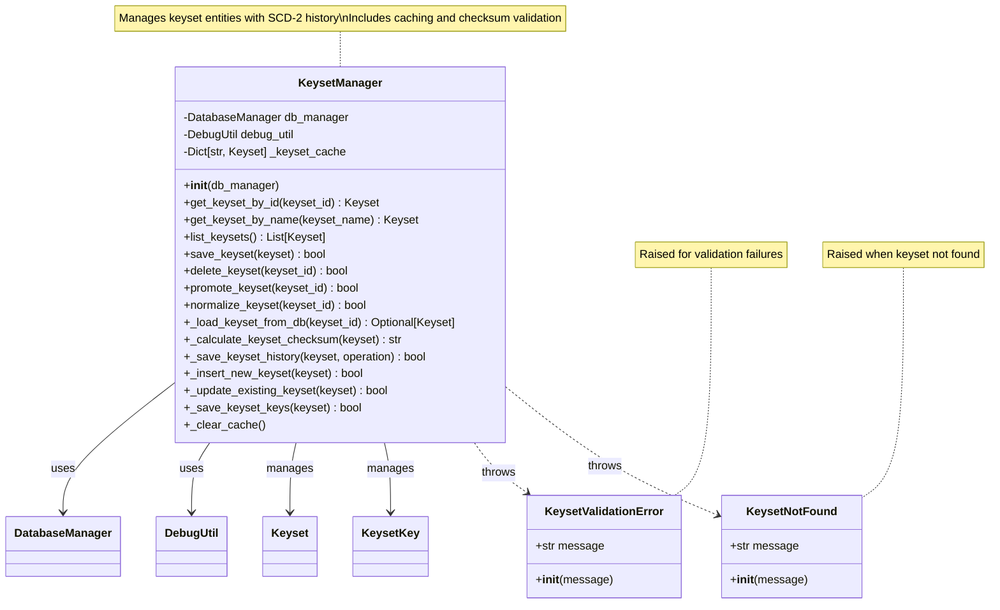

# Keyset Manager - UML Class Diagram

```mermaid
classDiagram
    class KeysetManager {
        -DatabaseManager db_manager
        -DebugUtil debug_util
        -Dict[str, Keyset] _keyset_cache
        +__init__(db_manager)
        +get_keyset_by_id(keyset_id) Keyset
        +get_keyset_by_name(keyset_name) Keyset
        +list_keysets() List[Keyset]
        +save_keyset(keyset) bool
        +delete_keyset(keyset_id) bool
        +promote_keyset(keyset_id) bool
        +normalize_keyset(keyset_id) bool
        +_load_keyset_from_db(keyset_id) Optional[Keyset]
        +_calculate_keyset_checksum(keyset) str
        +_save_keyset_history(keyset, operation) bool
        +_insert_new_keyset(keyset) bool
        +_update_existing_keyset(keyset) bool
        +_save_keyset_keys(keyset) bool
        +_clear_cache()
    }

    class KeysetValidationError {
        +str message
        +__init__(message)
    }

    class KeysetNotFound {
        +str message
        +__init__(message)
    }

    KeysetManager --> DatabaseManager : uses
    KeysetManager --> DebugUtil : uses
    KeysetManager --> Keyset : manages
    KeysetManager --> KeysetKey : manages
    KeysetManager ..> KeysetValidationError : throws
    KeysetManager ..> KeysetNotFound : throws

    note for KeysetManager "Manages keyset entities with SCD-2 history\nIncludes caching and checksum validation"
    note for KeysetValidationError "Raised for validation failures"
    note for KeysetNotFound "Raised when keyset not found"
```
