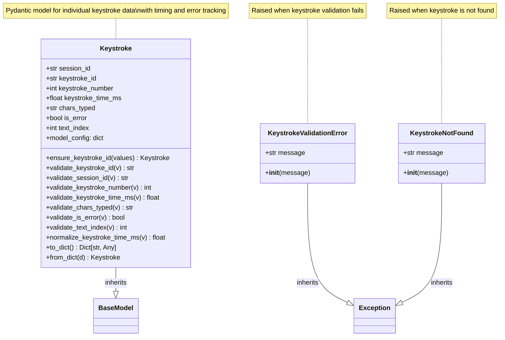

# Keystroke Model - UML Class Diagram

```mermaid
classDiagram
    class Keystroke {
        +str session_id
        +str keystroke_id
        +int keystroke_number
        +float keystroke_time_ms
        +str chars_typed
        +bool is_error
        +int text_index
        +model_config: dict
        +ensure_keystroke_id(values) Keystroke
        +validate_keystroke_id(v) str
        +validate_session_id(v) str
        +validate_keystroke_number(v) int
        +validate_keystroke_time_ms(v) float
        +validate_chars_typed(v) str
        +validate_is_error(v) bool
        +validate_text_index(v) int
        +normalize_keystroke_time_ms(v) float
        +to_dict() Dict[str, Any]
        +from_dict(d) Keystroke
    }

    class KeystrokeValidationError {
        +str message
        +__init__(message)
    }

    class KeystrokeNotFound {
        +str message
        +__init__(message)
    }

    Keystroke --|> BaseModel : inherits
    KeystrokeValidationError --|> Exception : inherits
    KeystrokeNotFound --|> Exception : inherits

    note for Keystroke "Pydantic model for individual keystroke data\nwith timing and error tracking"
    note for KeystrokeValidationError "Raised when keystroke validation fails"
    note for KeystrokeNotFound "Raised when keystroke is not found"
```
