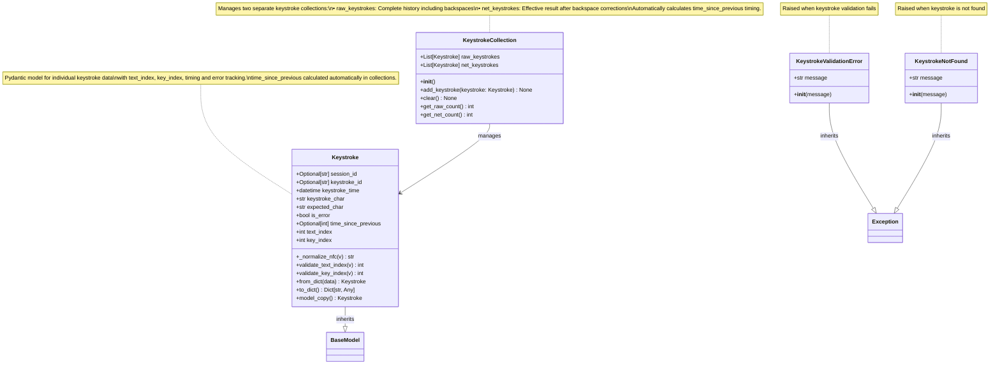

# Keystroke Model - UML Class Diagram



## KeystrokeCollection Functionality

### Dual Collection Architecture

The `KeystrokeCollection` class maintains two separate collections of keystrokes:

#### Raw Keystrokes (`raw_keystrokes`)
- **Purpose**: Complete chronological history of all key presses
- **Behavior**: Every keystroke is appended, including backspaces
- **Use Case**: Analytics, replay functionality, error pattern analysis
- **Example**: Typing "helo" then backspace then "lo" results in: `['h', 'e', 'l', 'o', '\b', 'l', 'o']`

#### Net Keystrokes (`net_keystrokes`)
- **Purpose**: Effective typing result after corrections
- **Behavior**: Backspaces remove the previous character from the collection
- **Use Case**: Final text analysis, WPM calculations, accuracy metrics
- **Example**: Same sequence as above results in: `['h', 'e', 'l', 'l', 'o']`

### Backspace Handling Logic

```python
if keystroke_char == '\b':  # Backspace detected
    if net_keystrokes:    # Only remove if characters exist
        net_keystrokes.pop()  # Remove last character
else:
    net_keystrokes.append(keystroke.model_copy())  # Add character
```

### Automatic Timing Calculation

The collection automatically calculates `time_since_previous` for both collections:

#### Timing Rules
- **First keystroke**: `time_since_previous = -1` (no previous keystroke)
- **Subsequent keystrokes**: `time_since_previous = (current_time - previous_time) * 1000` (milliseconds)
- **Independent timing**: Raw and net collections maintain separate timing calculations
- **Precision**: Converted to integer milliseconds using `int()` function

#### Timing Examples

**Raw Keystrokes Timing:**
```
Keystroke: 'a' -> time_since_previous: -1 (first keystroke)
Keystroke: 'b' -> time_since_previous: 150 (150ms after 'a')
Keystroke: '\b' -> time_since_previous: 80 (80ms after 'b')
```

**Net Keystrokes Timing:**
```
After 'a': time_since_previous: -1 (first keystroke)  
After 'b': time_since_previous: 150 (150ms after 'a')
After '\b': net collection becomes ['a'] (timing preserved for remaining keystroke)
```

### Object Isolation

- Uses `keystroke.model_copy()` to create independent copies
- Prevents unintended side effects from shared object references
- Ensures thread safety and data integrity

### Key Features

1. **Dual Analytics**: Separate raw and effective keystroke analysis
2. **Automatic Timing**: No manual timing calculations required
3. **Backspace Intelligence**: Proper handling of corrections and deletions
4. **Memory Efficient**: Uses Pydantic model copying for data integrity
5. **Thread Safe**: Independent object copies prevent race conditions
