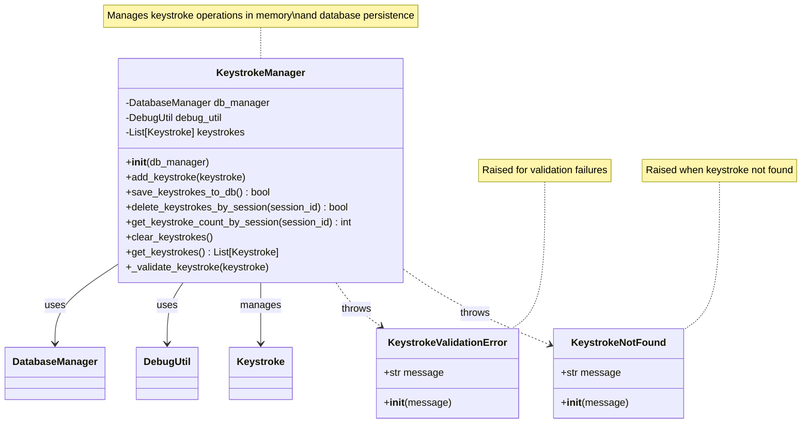

# Keystroke Manager - UML Class Diagram

```mermaid
classDiagram
    class KeystrokeManager {
        -DatabaseManager db_manager
        -DebugUtil debug_util
        -List[Keystroke] keystrokes
        +__init__(db_manager)
        +add_keystroke(keystroke)
        +save_keystrokes_to_db() bool
        +delete_keystrokes_by_session(session_id) bool
        +get_keystroke_count_by_session(session_id) int
        +clear_keystrokes()
        +get_keystrokes() List[Keystroke]
        +_validate_keystroke(keystroke)
    }

    class KeystrokeValidationError {
        +str message
        +__init__(message)
    }

    class KeystrokeNotFound {
        +str message
        +__init__(message)
    }

    KeystrokeManager --> DatabaseManager : uses
    KeystrokeManager --> DebugUtil : uses
    KeystrokeManager --> Keystroke : manages
    KeystrokeManager ..> KeystrokeValidationError : throws
    KeystrokeManager ..> KeystrokeNotFound : throws

    note for KeystrokeManager "Manages keystroke operations in memory\nand database persistence"
    note for KeystrokeValidationError "Raised for validation failures"
    note for KeystrokeNotFound "Raised when keystroke not found"
```
