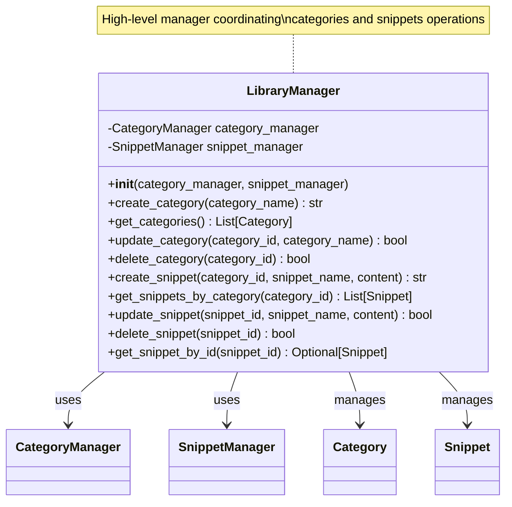

# Library Manager - UML Class Diagram

```mermaid
classDiagram
    class LibraryManager {
        -CategoryManager category_manager
        -SnippetManager snippet_manager
        +__init__(category_manager, snippet_manager)
        +create_category(category_name) str
        +get_categories() List[Category]
        +update_category(category_id, category_name) bool
        +delete_category(category_id) bool
        +create_snippet(category_id, snippet_name, content) str
        +get_snippets_by_category(category_id) List[Snippet]
        +update_snippet(snippet_id, snippet_name, content) bool
        +delete_snippet(snippet_id) bool
        +get_snippet_by_id(snippet_id) Optional[Snippet]
    }

    LibraryManager --> CategoryManager : uses
    LibraryManager --> SnippetManager : uses
    LibraryManager --> Category : manages
    LibraryManager --> Snippet : manages

    note for LibraryManager "High-level manager coordinating\ncategories and snippets operations"
```
