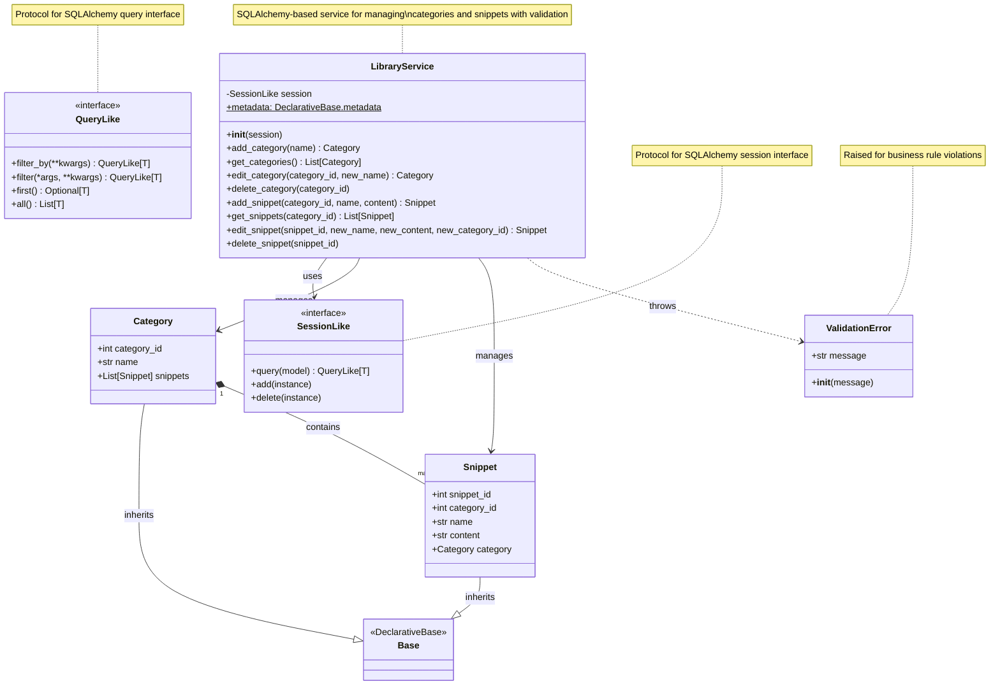

# Library Service - UML Class Diagram

```mermaid
classDiagram
    class LibraryService {
        -SessionLike session
        +metadata: DeclarativeBase.metadata$
        +__init__(session)
        +add_category(name) Category
        +get_categories() List[Category]
        +edit_category(category_id, new_name) Category
        +delete_category(category_id)
        +add_snippet(category_id, name, content) Snippet
        +get_snippets(category_id) List[Snippet]
        +edit_snippet(snippet_id, new_name, new_content, new_category_id) Snippet
        +delete_snippet(snippet_id)
    }

    class Category {
        +int category_id
        +str name
        +List[Snippet] snippets
    }

    class Snippet {
        +int snippet_id
        +int category_id
        +str name
        +str content
        +Category category
    }

    class ValidationError {
        +str message
        +__init__(message)
    }

    class SessionLike {
        <<interface>>
        +query(model) QueryLike[T]
        +add(instance)
        +delete(instance)
    }

    class QueryLike {
        <<interface>>
        +filter_by(**kwargs) QueryLike[T]
        +filter(*args, **kwargs) QueryLike[T]
        +first() Optional[T]
        +all() List[T]
    }

    class Base {
        <<DeclarativeBase>>
    }

    LibraryService --> SessionLike : uses
    LibraryService --> Category : manages
    LibraryService --> Snippet : manages
    LibraryService ..> ValidationError : throws
    Category --|> Base : inherits
    Snippet --|> Base : inherits
    Category "1" *-- "many" Snippet : contains

    note for LibraryService "SQLAlchemy-based service for managing\ncategories and snippets with validation"
    note for SessionLike "Protocol for SQLAlchemy session interface"
    note for QueryLike "Protocol for SQLAlchemy query interface"
    note for ValidationError "Raised for business rule violations"
```
