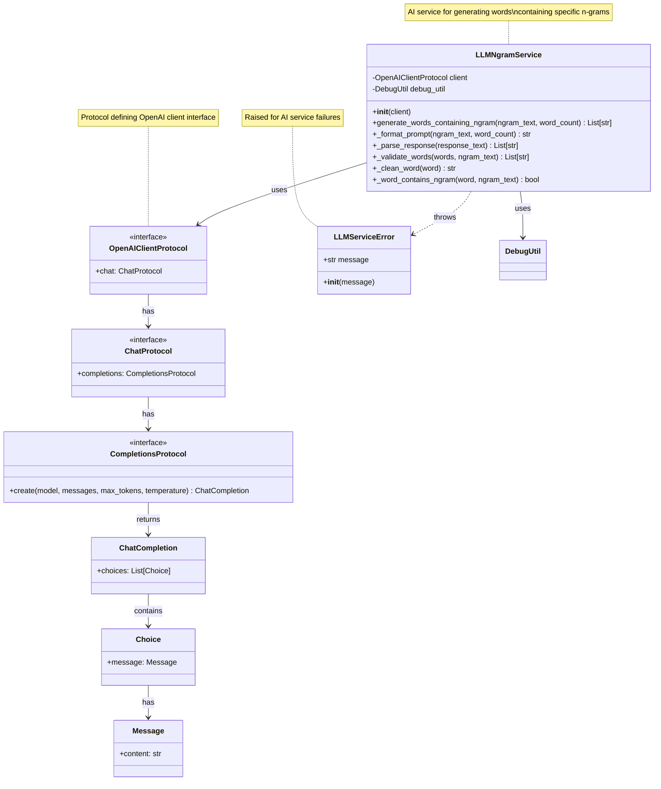

# LLM N-gram Service - UML Class Diagram

```mermaid
classDiagram
    class LLMNgramService {
        -OpenAIClientProtocol client
        -DebugUtil debug_util
        +__init__(client)
        +generate_words_containing_ngram(ngram_text, word_count) List[str]
        +_format_prompt(ngram_text, word_count) str
        +_parse_response(response_text) List[str]
        +_validate_words(words, ngram_text) List[str]
        +_clean_word(word) str
        +_word_contains_ngram(word, ngram_text) bool
    }

    class OpenAIClientProtocol {
        <<interface>>
        +chat: ChatProtocol
    }

    class ChatProtocol {
        <<interface>>
        +completions: CompletionsProtocol
    }

    class CompletionsProtocol {
        <<interface>>
        +create(model, messages, max_tokens, temperature) ChatCompletion
    }

    class ChatCompletion {
        +choices: List[Choice]
    }

    class Choice {
        +message: Message
    }

    class Message {
        +content: str
    }

    class LLMServiceError {
        +str message
        +__init__(message)
    }

    LLMNgramService --> OpenAIClientProtocol : uses
    LLMNgramService --> DebugUtil : uses
    LLMNgramService ..> LLMServiceError : throws
    OpenAIClientProtocol --> ChatProtocol : has
    ChatProtocol --> CompletionsProtocol : has
    CompletionsProtocol --> ChatCompletion : returns
    ChatCompletion --> Choice : contains
    Choice --> Message : has

    note for LLMNgramService "AI service for generating words\ncontaining specific n-grams"
    note for OpenAIClientProtocol "Protocol defining OpenAI client interface"
    note for LLMServiceError "Raised for AI service failures"
```
