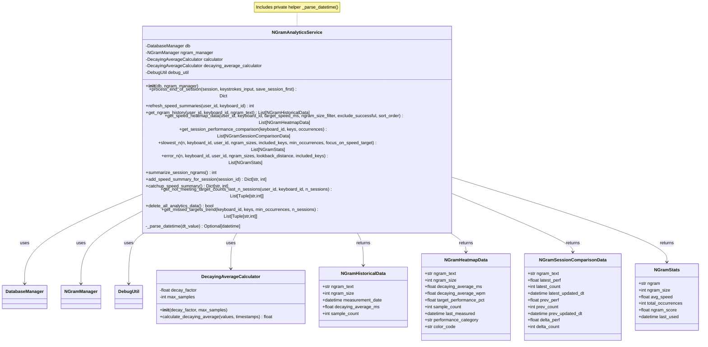

# N-gram Analytics Service - UML Class Diagram

```mermaid
classDiagram
    class NGramAnalyticsService {
        -DatabaseManager db
        -NGramManager ngram_manager
        -DecayingAverageCalculator calculator
        -DecayingAverageCalculator decaying_average_calculator
        -DebugUtil debug_util
        +__init__(db, ngram_manager)
        +process_end_of_session(session, keystrokes_input, save_session_first) Dict
        +refresh_speed_summaries(user_id, keyboard_id) int
        +get_ngram_history(user_id, keyboard_id, ngram_text) List[NGramHistoricalData]
        +get_speed_heatmap_data(user_id, keyboard_id, target_speed_ms, ngram_size_filter, exclude_successful, sort_order) List[NGramHeatmapData]
        +get_session_performance_comparison(keyboard_id, keys, occurrences) List[NGramSessionComparisonData]
        +slowest_n(n, keyboard_id, user_id, ngram_sizes, included_keys, min_occurrences, focus_on_speed_target) List[NGramStats]
        +error_n(n, keyboard_id, user_id, ngram_sizes, lookback_distance, included_keys) List[NGramStats]
        +summarize_session_ngrams() int
        +add_speed_summary_for_session(session_id) Dict[str, int]
        +catchup_speed_summary() Dict[str, int]
        +get_not_meeting_target_counts_last_n_sessions(user_id, keyboard_id, n_sessions) List[Tuple[str,int]]
        +delete_all_analytics_data() bool
        +get_missed_targets_trend(keyboard_id, keys, min_occurrences, n_sessions) List[Tuple[str,int]]
        -_parse_datetime(dt_value) Optional[datetime]
    }

    class DecayingAverageCalculator {
        -float decay_factor
        -int max_samples
        +__init__(decay_factor, max_samples)
        +calculate_decaying_average(values, timestamps) float
    }

    class NGramHistoricalData {
        +str ngram_text
        +int ngram_size
        +datetime measurement_date
        +float decaying_average_ms
        +int sample_count
    }

    class NGramHeatmapData {
        +str ngram_text
        +int ngram_size
        +float decaying_average_ms
        +float decaying_average_wpm
        +float target_performance_pct
        +int sample_count
        +datetime last_measured
        +str performance_category
        +str color_code
    }

    class NGramSessionComparisonData {
        +str ngram_text
        +float latest_perf
        +int latest_count
        +datetime latest_updated_dt
        +float prev_perf
        +int prev_count
        +datetime prev_updated_dt
        +float delta_perf
        +int delta_count
    }

    class NGramStats {
        +str ngram
        +int ngram_size
        +float avg_speed
        +int total_occurrences
        +float ngram_score
        +datetime last_used
    }

    NGramAnalyticsService --> DatabaseManager : uses
    NGramAnalyticsService --> NGramManager : uses
    NGramAnalyticsService --> DebugUtil : uses
    NGramAnalyticsService --> DecayingAverageCalculator : uses
    NGramAnalyticsService --> NGramHistoricalData : returns
    NGramAnalyticsService --> NGramHeatmapData : returns
    NGramAnalyticsService --> NGramSessionComparisonData : returns
    NGramAnalyticsService --> NGramStats : returns

    note for NGramAnalyticsService "Includes private helper _parse_datetime()"
```
