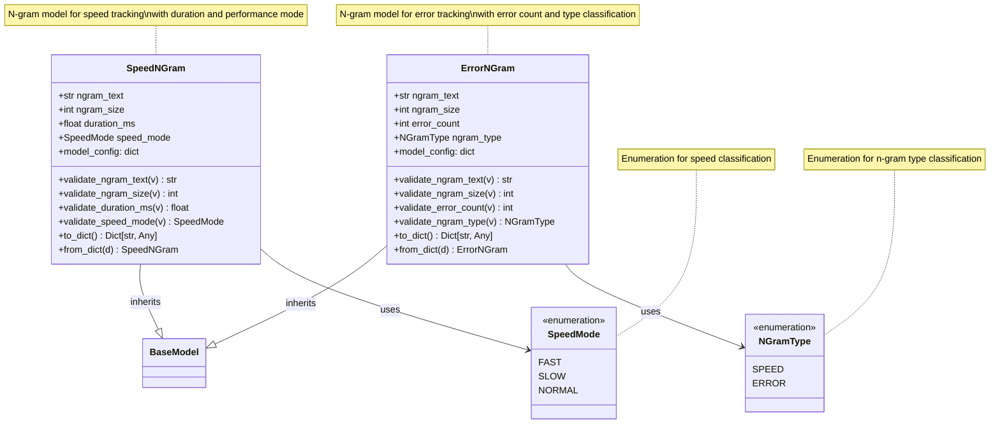

# N-gram Models - UML Class Diagram

```mermaid
classDiagram
    class SpeedNGram {
        +str ngram_text
        +int ngram_size
        +float duration_ms
        +SpeedMode speed_mode
        +model_config: dict
        +validate_ngram_text(v) str
        +validate_ngram_size(v) int
        +validate_duration_ms(v) float
        +validate_speed_mode(v) SpeedMode
        +to_dict() Dict[str, Any]
        +from_dict(d) SpeedNGram
    }

    class ErrorNGram {
        +str ngram_text
        +int ngram_size
        +int error_count
        +NGramType ngram_type
        +model_config: dict
        +validate_ngram_text(v) str
        +validate_ngram_size(v) int
        +validate_error_count(v) int
        +validate_ngram_type(v) NGramType
        +to_dict() Dict[str, Any]
        +from_dict(d) ErrorNGram
    }

    class SpeedMode {
        <<enumeration>>
        FAST
        SLOW
        NORMAL
    }

    class NGramType {
        <<enumeration>>
        SPEED
        ERROR
    }

    SpeedNGram --|> BaseModel : inherits
    ErrorNGram --|> BaseModel : inherits
    SpeedNGram --> SpeedMode : uses
    ErrorNGram --> NGramType : uses

    note for SpeedNGram "N-gram model for speed tracking\nwith duration and performance mode"
    note for ErrorNGram "N-gram model for error tracking\nwith error count and type classification"
    note for SpeedMode "Enumeration for speed classification"
    note for NGramType "Enumeration for n-gram type classification"
```
