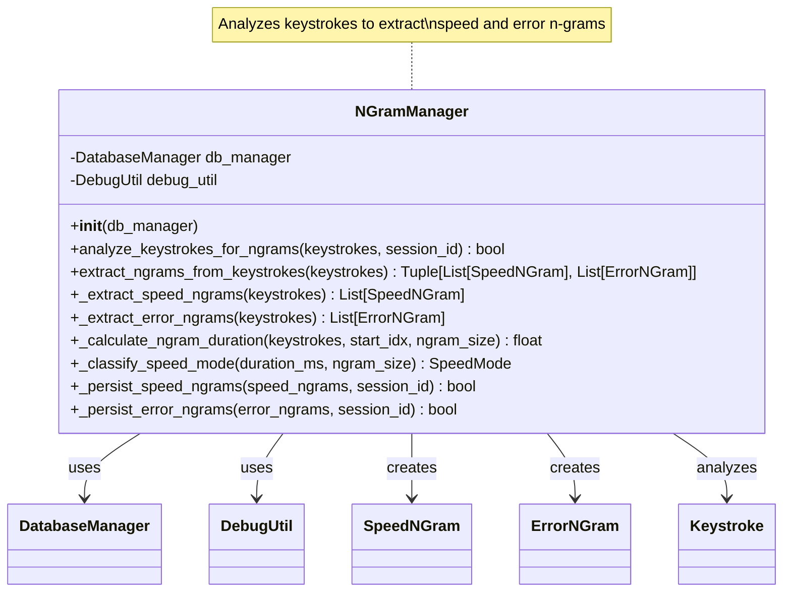

# N-gram Manager - UML Class Diagram

```mermaid
classDiagram
    class NGramManager {
        -DatabaseManager db_manager
        -DebugUtil debug_util
        +__init__(db_manager)
        +analyze_keystrokes_for_ngrams(keystrokes, session_id) bool
        +extract_ngrams_from_keystrokes(keystrokes) Tuple[List[SpeedNGram], List[ErrorNGram]]
        +_extract_speed_ngrams(keystrokes) List[SpeedNGram]
        +_extract_error_ngrams(keystrokes) List[ErrorNGram]
        +_calculate_ngram_duration(keystrokes, start_idx, ngram_size) float
        +_classify_speed_mode(duration_ms, ngram_size) SpeedMode
        +_persist_speed_ngrams(speed_ngrams, session_id) bool
        +_persist_error_ngrams(error_ngrams, session_id) bool
    }

    NGramManager --> DatabaseManager : uses
    NGramManager --> DebugUtil : uses
    NGramManager --> SpeedNGram : creates
    NGramManager --> ErrorNGram : creates
    NGramManager --> Keystroke : analyzes

    note for NGramManager "Analyzes keystrokes to extract\nspeed and error n-grams"
```
