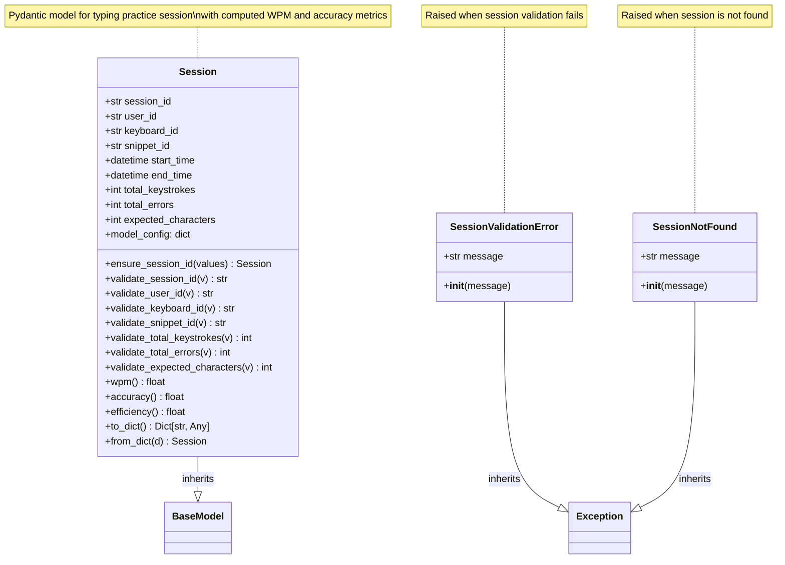

# Session Model - UML Class Diagram

```mermaid
classDiagram
    class Session {
        +str session_id
        +str user_id
        +str keyboard_id
        +str snippet_id
        +datetime start_time
        +datetime end_time
        +int total_keystrokes
        +int total_errors
        +int expected_characters
        +model_config: dict
        +ensure_session_id(values) Session
        +validate_session_id(v) str
        +validate_user_id(v) str
        +validate_keyboard_id(v) str
        +validate_snippet_id(v) str
        +validate_total_keystrokes(v) int
        +validate_total_errors(v) int
        +validate_expected_characters(v) int
        +wpm() float
        +accuracy() float
        +efficiency() float
        +to_dict() Dict[str, Any]
        +from_dict(d) Session
    }

    class SessionValidationError {
        +str message
        +__init__(message)
    }

    class SessionNotFound {
        +str message
        +__init__(message)
    }

    Session --|> BaseModel : inherits
    SessionValidationError --|> Exception : inherits
    SessionNotFound --|> Exception : inherits

    note for Session "Pydantic model for typing practice session\nwith computed WPM and accuracy metrics"
    note for SessionValidationError "Raised when session validation fails"
    note for SessionNotFound "Raised when session is not found"
```
