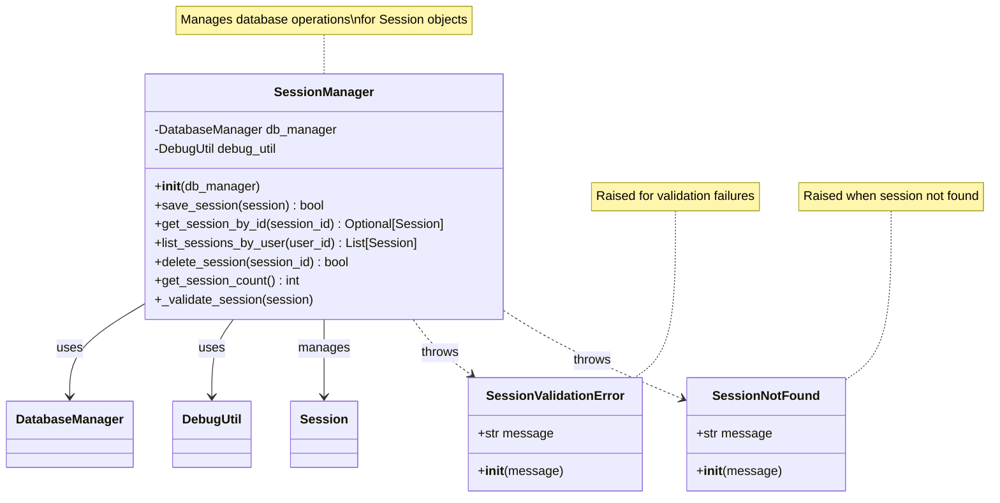

# Session Manager - UML Class Diagram

```mermaid
classDiagram
    class SessionManager {
        -DatabaseManager db_manager
        -DebugUtil debug_util
        +__init__(db_manager)
        +save_session(session) bool
        +get_session_by_id(session_id) Optional[Session]
        +list_sessions_by_user(user_id) List[Session]
        +delete_session(session_id) bool
        +get_session_count() int
        +_validate_session(session)
    }

    class SessionValidationError {
        +str message
        +__init__(message)
    }

    class SessionNotFound {
        +str message
        +__init__(message)
    }

    SessionManager --> DatabaseManager : uses
    SessionManager --> DebugUtil : uses
    SessionManager --> Session : manages
    SessionManager ..> SessionValidationError : throws
    SessionManager ..> SessionNotFound : throws

    note for SessionManager "Manages database operations\nfor Session objects"
    note for SessionValidationError "Raised for validation failures"
    note for SessionNotFound "Raised when session not found"
```
