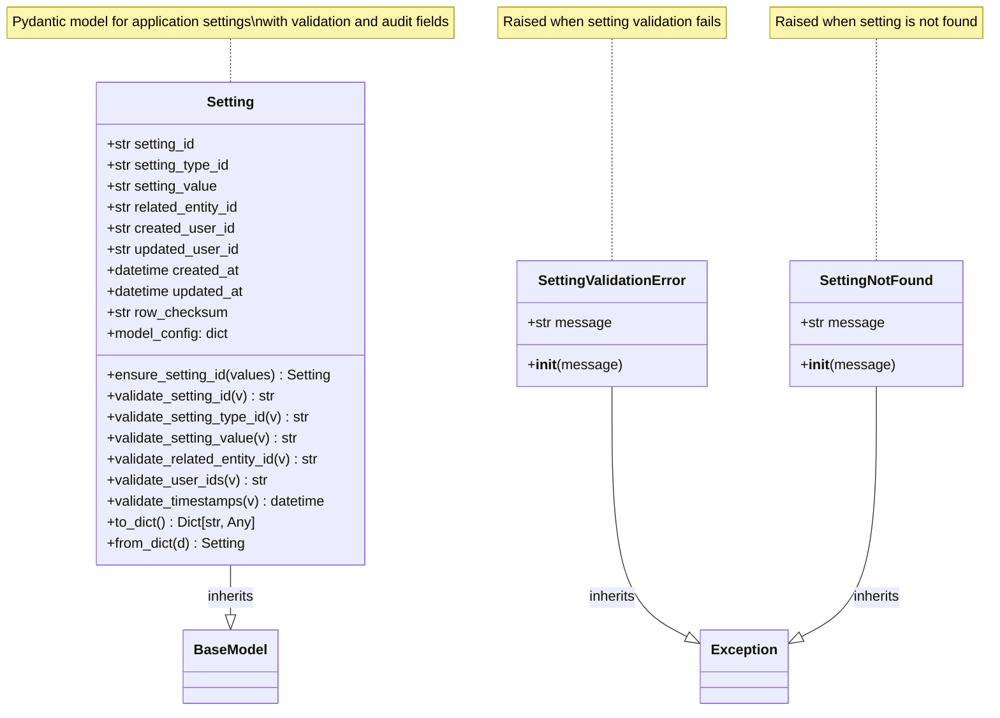

# Setting Model - UML Class Diagram

```mermaid
classDiagram
    class Setting {
        +str setting_id
        +str setting_type_id
        +str setting_value
        +str related_entity_id
        +str created_user_id
        +str updated_user_id
        +datetime created_at
        +datetime updated_at
        +str row_checksum
        +model_config: dict
        +ensure_setting_id(values) Setting
        +validate_setting_id(v) str
        +validate_setting_type_id(v) str
        +validate_setting_value(v) str
        +validate_related_entity_id(v) str
        +validate_user_ids(v) str
        +validate_timestamps(v) datetime
        +to_dict() Dict[str, Any]
        +from_dict(d) Setting
    }

    class SettingValidationError {
        +str message
        +__init__(message)
    }

    class SettingNotFound {
        +str message
        +__init__(message)
    }

    Setting --|> BaseModel : inherits
    SettingValidationError --|> Exception : inherits
    SettingNotFound --|> Exception : inherits

    note for Setting "Pydantic model for application settings\nwith validation and audit fields"
    note for SettingValidationError "Raised when setting validation fails"
    note for SettingNotFound "Raised when setting is not found"
```
