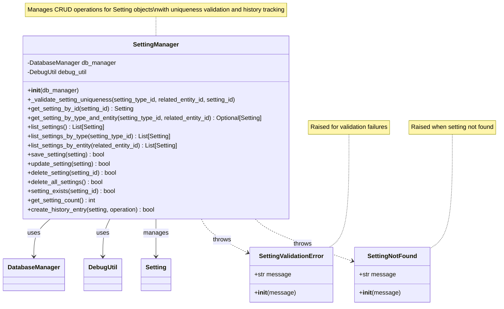

# Setting Manager - UML Class Diagram

```mermaid
classDiagram
    class SettingManager {
        -DatabaseManager db_manager
        -DebugUtil debug_util
        +__init__(db_manager)
        +_validate_setting_uniqueness(setting_type_id, related_entity_id, setting_id)
        +get_setting_by_id(setting_id) Setting
        +get_setting_by_type_and_entity(setting_type_id, related_entity_id) Optional[Setting]
        +list_settings() List[Setting]
        +list_settings_by_type(setting_type_id) List[Setting]
        +list_settings_by_entity(related_entity_id) List[Setting]
        +save_setting(setting) bool
        +update_setting(setting) bool
        +delete_setting(setting_id) bool
        +delete_all_settings() bool
        +setting_exists(setting_id) bool
        +get_setting_count() int
        +create_history_entry(setting, operation) bool
    }

    class SettingValidationError {
        +str message
        +__init__(message)
    }

    class SettingNotFound {
        +str message
        +__init__(message)
    }

    SettingManager --> DatabaseManager : uses
    SettingManager --> DebugUtil : uses
    SettingManager --> Setting : manages
    SettingManager ..> SettingValidationError : throws
    SettingManager ..> SettingNotFound : throws

    note for SettingManager "Manages CRUD operations for Setting objects\nwith uniqueness validation and history tracking"
    note for SettingValidationError "Raised for validation failures"
    note for SettingNotFound "Raised when setting not found"
```
