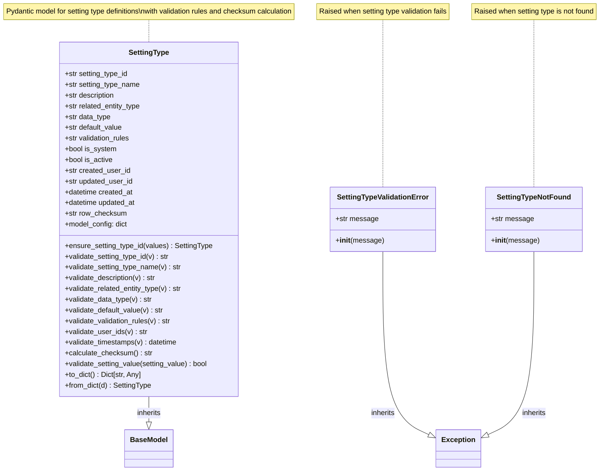

# Setting Type Model - UML Class Diagram

```mermaid
classDiagram
    class SettingType {
        +str setting_type_id
        +str setting_type_name
        +str description
        +str related_entity_type
        +str data_type
        +str default_value
        +str validation_rules
        +bool is_system
        +bool is_active
        +str created_user_id
        +str updated_user_id
        +datetime created_at
        +datetime updated_at
        +str row_checksum
        +model_config: dict
        +ensure_setting_type_id(values) SettingType
        +validate_setting_type_id(v) str
        +validate_setting_type_name(v) str
        +validate_description(v) str
        +validate_related_entity_type(v) str
        +validate_data_type(v) str
        +validate_default_value(v) str
        +validate_validation_rules(v) str
        +validate_user_ids(v) str
        +validate_timestamps(v) datetime
        +calculate_checksum() str
        +validate_setting_value(setting_value) bool
        +to_dict() Dict[str, Any]
        +from_dict(d) SettingType
    }

    class SettingTypeValidationError {
        +str message
        +__init__(message)
    }

    class SettingTypeNotFound {
        +str message
        +__init__(message)
    }

    SettingType --|> BaseModel : inherits
    SettingTypeValidationError --|> Exception : inherits
    SettingTypeNotFound --|> Exception : inherits

    note for SettingType "Pydantic model for setting type definitions\nwith validation rules and checksum calculation"
    note for SettingTypeValidationError "Raised when setting type validation fails"
    note for SettingTypeNotFound "Raised when setting type is not found"
```
