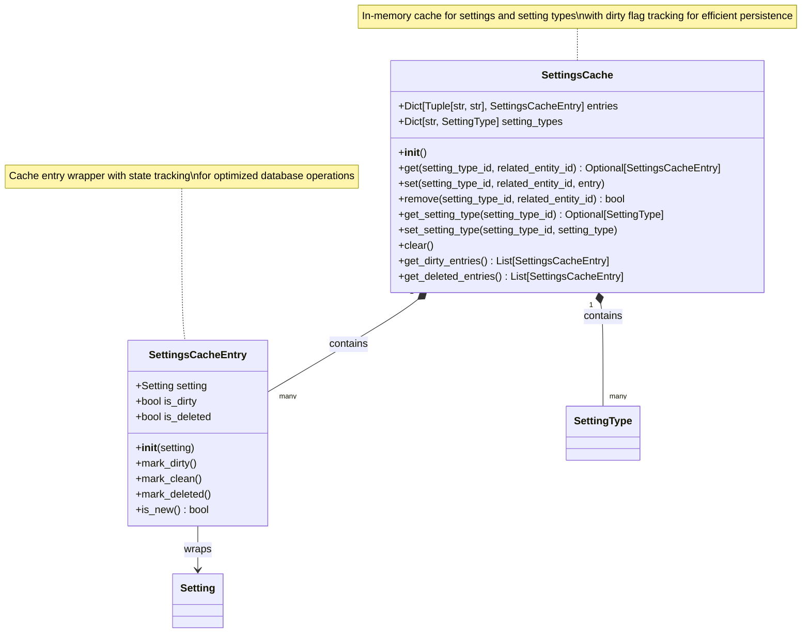

# Settings Cache - UML Class Diagram

```mermaid
classDiagram
    class SettingsCache {
        +Dict[Tuple[str, str], SettingsCacheEntry] entries
        +Dict[str, SettingType] setting_types
        +__init__()
        +get(setting_type_id, related_entity_id) Optional[SettingsCacheEntry]
        +set(setting_type_id, related_entity_id, entry)
        +remove(setting_type_id, related_entity_id) bool
        +get_setting_type(setting_type_id) Optional[SettingType]
        +set_setting_type(setting_type_id, setting_type)
        +clear()
        +get_dirty_entries() List[SettingsCacheEntry]
        +get_deleted_entries() List[SettingsCacheEntry]
    }

    class SettingsCacheEntry {
        +Setting setting
        +bool is_dirty
        +bool is_deleted
        +__init__(setting)
        +mark_dirty()
        +mark_clean()
        +mark_deleted()
        +is_new() bool
    }

    SettingsCache "1" *-- "many" SettingsCacheEntry : contains
    SettingsCache "1" *-- "many" SettingType : contains
    SettingsCacheEntry --> Setting : wraps

    note for SettingsCache "In-memory cache for settings and setting types\nwith dirty flag tracking for efficient persistence"
    note for SettingsCacheEntry "Cache entry wrapper with state tracking\nfor optimized database operations"
```
