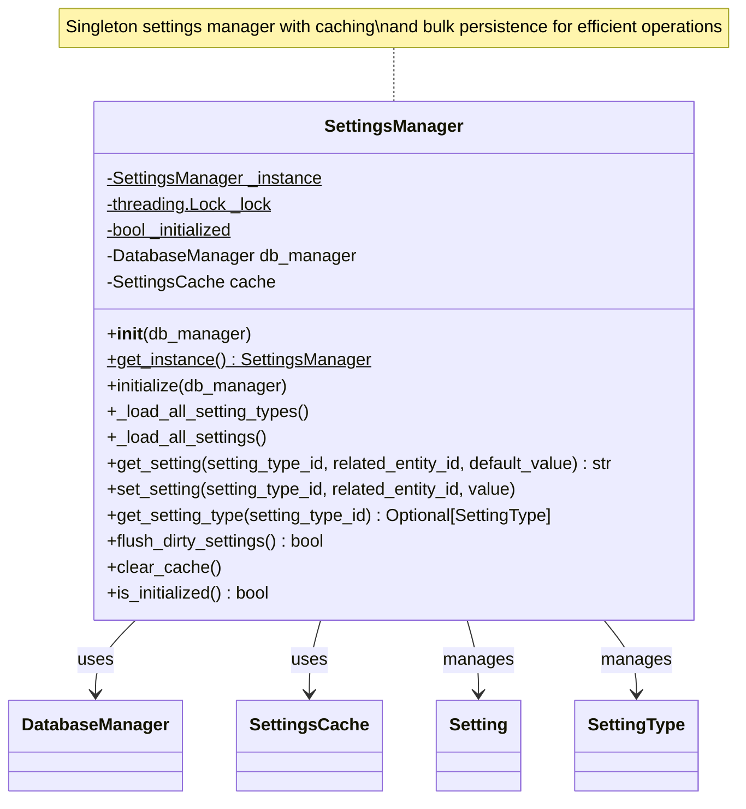

# Settings Manager (Singleton) - UML Class Diagram

```mermaid
classDiagram
    class SettingsManager {
        -SettingsManager _instance$
        -threading.Lock _lock$
        -bool _initialized$
        -DatabaseManager db_manager
        -SettingsCache cache
        +__init__(db_manager)
        +get_instance()$ SettingsManager
        +initialize(db_manager)
        +_load_all_setting_types()
        +_load_all_settings()
        +get_setting(setting_type_id, related_entity_id, default_value) str
        +set_setting(setting_type_id, related_entity_id, value)
        +get_setting_type(setting_type_id) Optional[SettingType]
        +flush_dirty_settings() bool
        +clear_cache()
        +is_initialized() bool
    }

    SettingsManager --> DatabaseManager : uses
    SettingsManager --> SettingsCache : uses
    SettingsManager --> Setting : manages
    SettingsManager --> SettingType : manages

    note for SettingsManager "Singleton settings manager with caching\nand bulk persistence for efficient operations"
```
