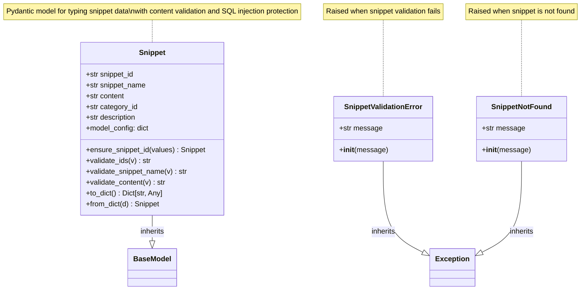

# Snippet Model - UML Class Diagram

```mermaid
classDiagram
    class Snippet {
        +str snippet_id
        +str snippet_name
        +str content
        +str category_id
        +str description
        +model_config: dict
        +ensure_snippet_id(values) Snippet
        +validate_ids(v) str
        +validate_snippet_name(v) str
        +validate_content(v) str
        +to_dict() Dict[str, Any]
        +from_dict(d) Snippet
    }

    class SnippetValidationError {
        +str message
        +__init__(message)
    }

    class SnippetNotFound {
        +str message
        +__init__(message)
    }

    Snippet --|> BaseModel : inherits
    SnippetValidationError --|> Exception : inherits
    SnippetNotFound --|> Exception : inherits

    note for Snippet "Pydantic model for typing snippet data\nwith content validation and SQL injection protection"
    note for SnippetValidationError "Raised when snippet validation fails"
    note for SnippetNotFound "Raised when snippet is not found"
```
