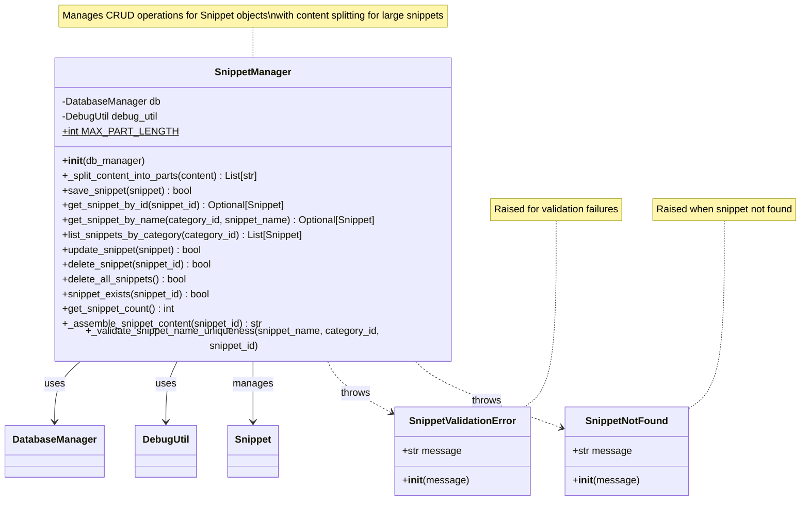

# Snippet Manager - UML Class Diagram

```mermaid
classDiagram
    class SnippetManager {
        -DatabaseManager db
        -DebugUtil debug_util
        +int MAX_PART_LENGTH$
        +__init__(db_manager)
        +_split_content_into_parts(content) List[str]
        +save_snippet(snippet) bool
        +get_snippet_by_id(snippet_id) Optional[Snippet]
        +get_snippet_by_name(category_id, snippet_name) Optional[Snippet]
        +list_snippets_by_category(category_id) List[Snippet]
        +update_snippet(snippet) bool
        +delete_snippet(snippet_id) bool
        +delete_all_snippets() bool
        +snippet_exists(snippet_id) bool
        +get_snippet_count() int
        +_assemble_snippet_content(snippet_id) str
        +_validate_snippet_name_uniqueness(snippet_name, category_id, snippet_id)
    }

    class SnippetValidationError {
        +str message
        +__init__(message)
    }

    class SnippetNotFound {
        +str message
        +__init__(message)
    }

    SnippetManager --> DatabaseManager : uses
    SnippetManager --> DebugUtil : uses
    SnippetManager --> Snippet : manages
    SnippetManager ..> SnippetValidationError : throws
    SnippetManager ..> SnippetNotFound : throws

    note for SnippetManager "Manages CRUD operations for Snippet objects\nwith content splitting for large snippets"
    note for SnippetValidationError "Raised for validation failures"
    note for SnippetNotFound "Raised when snippet not found"
```
