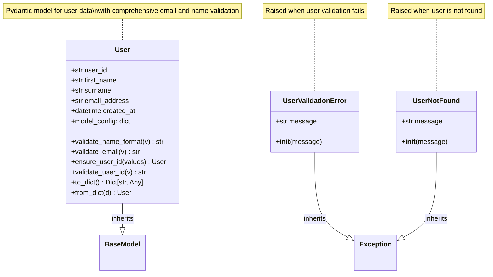

# User Model - UML Class Diagram

```mermaid
classDiagram
    class User {
        +str user_id
        +str first_name
        +str surname
        +str email_address
        +datetime created_at
        +model_config: dict
        +validate_name_format(v) str
        +validate_email(v) str
        +ensure_user_id(values) User
        +validate_user_id(v) str
        +to_dict() Dict[str, Any]
        +from_dict(d) User
    }

    class UserValidationError {
        +str message
        +__init__(message)
    }

    class UserNotFound {
        +str message
        +__init__(message)
    }

    User --|> BaseModel : inherits
    UserValidationError --|> Exception : inherits
    UserNotFound --|> Exception : inherits

    note for User "Pydantic model for user data\nwith comprehensive email and name validation"
    note for UserValidationError "Raised when user validation fails"
    note for UserNotFound "Raised when user is not found"
```
