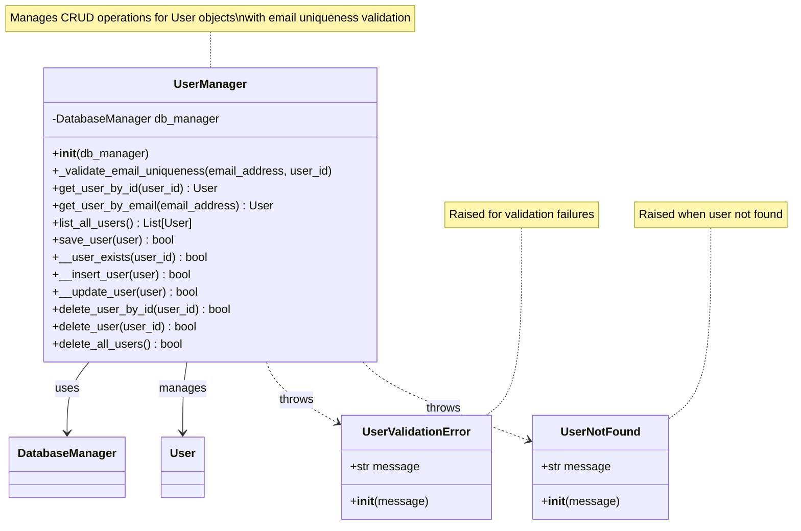

# User Manager - UML Class Diagram

```mermaid
classDiagram
    class UserManager {
        -DatabaseManager db_manager
        +__init__(db_manager)
        +_validate_email_uniqueness(email_address, user_id)
        +get_user_by_id(user_id) User
        +get_user_by_email(email_address) User
        +list_all_users() List[User]
        +save_user(user) bool
        +__user_exists(user_id) bool
        +__insert_user(user) bool
        +__update_user(user) bool
        +delete_user_by_id(user_id) bool
        +delete_user(user_id) bool
        +delete_all_users() bool
    }

    class UserValidationError {
        +str message
        +__init__(message)
    }

    class UserNotFound {
        +str message
        +__init__(message)
    }

    UserManager --> DatabaseManager : uses
    UserManager --> User : manages
    UserManager ..> UserValidationError : throws
    UserManager ..> UserNotFound : throws

    note for UserManager "Manages CRUD operations for User objects\nwith email uniqueness validation"
    note for UserValidationError "Raised for validation failures"
    note for UserNotFound "Raised when user not found"
```
