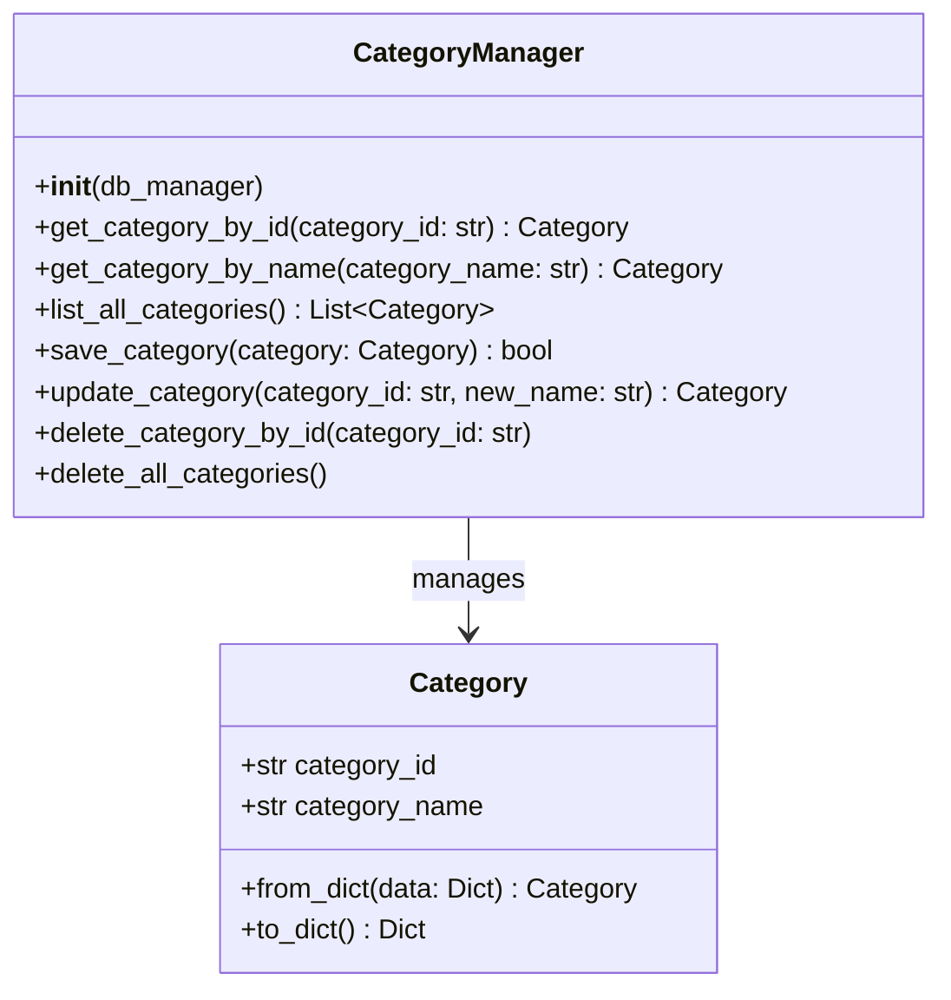
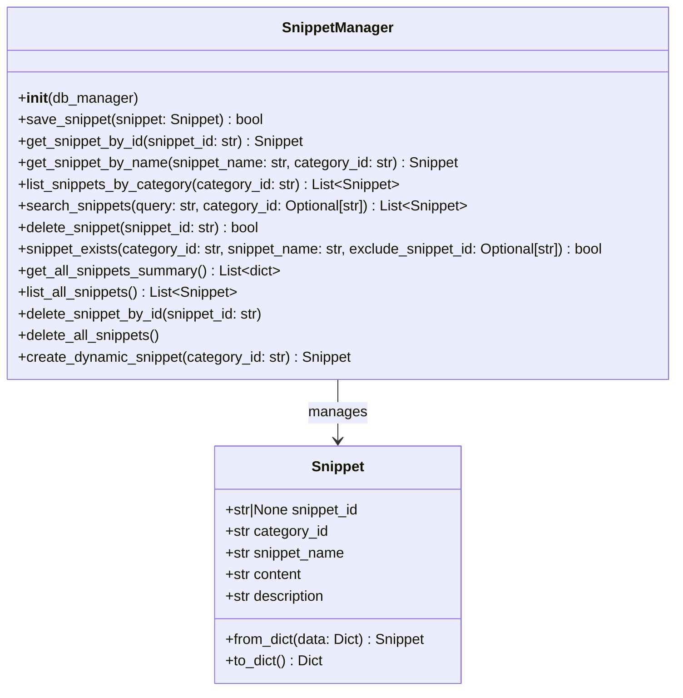
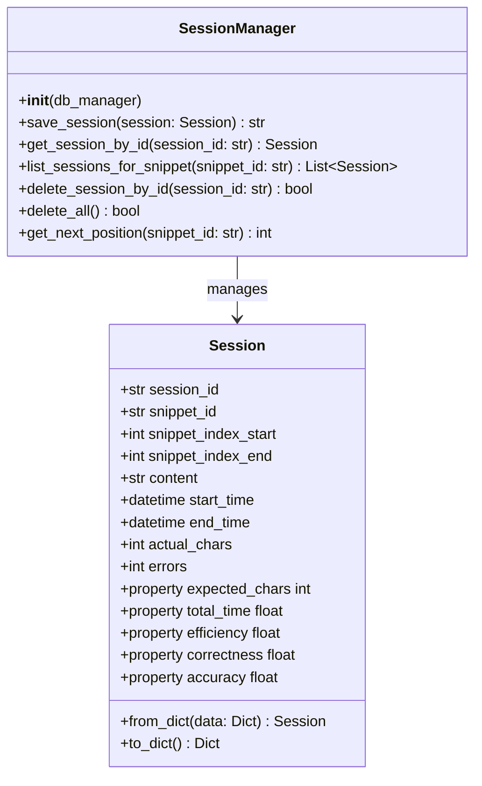
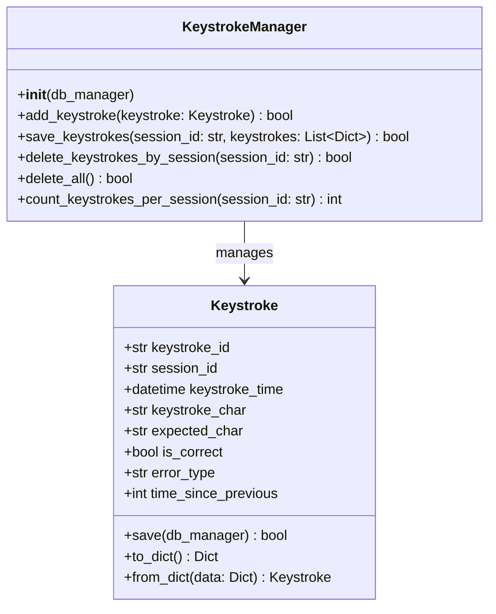
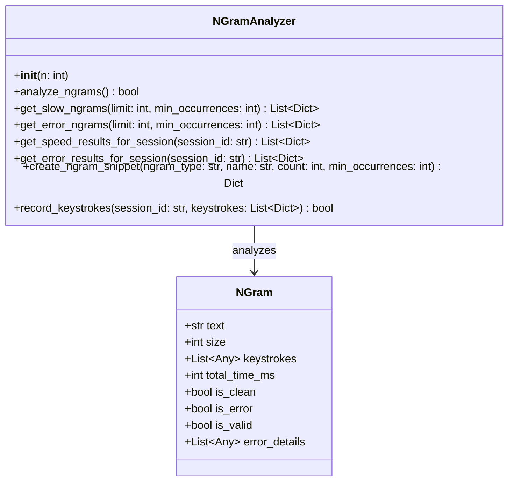
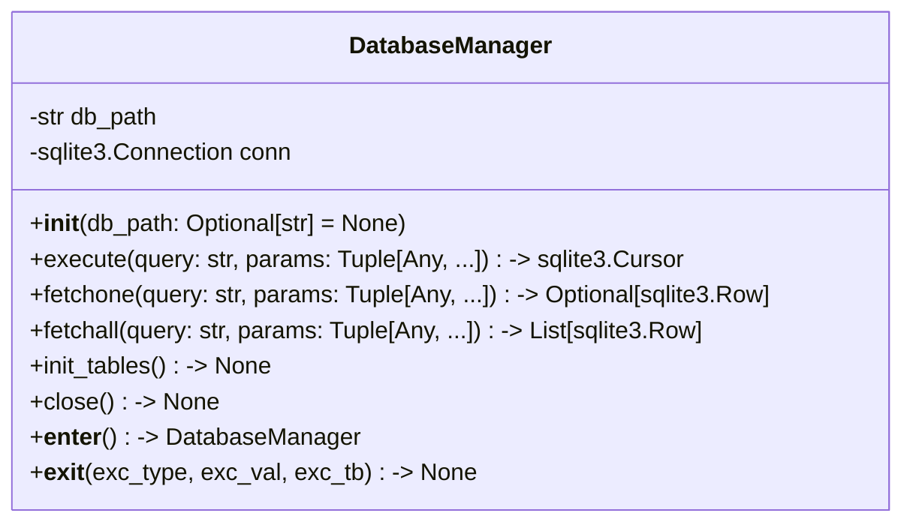
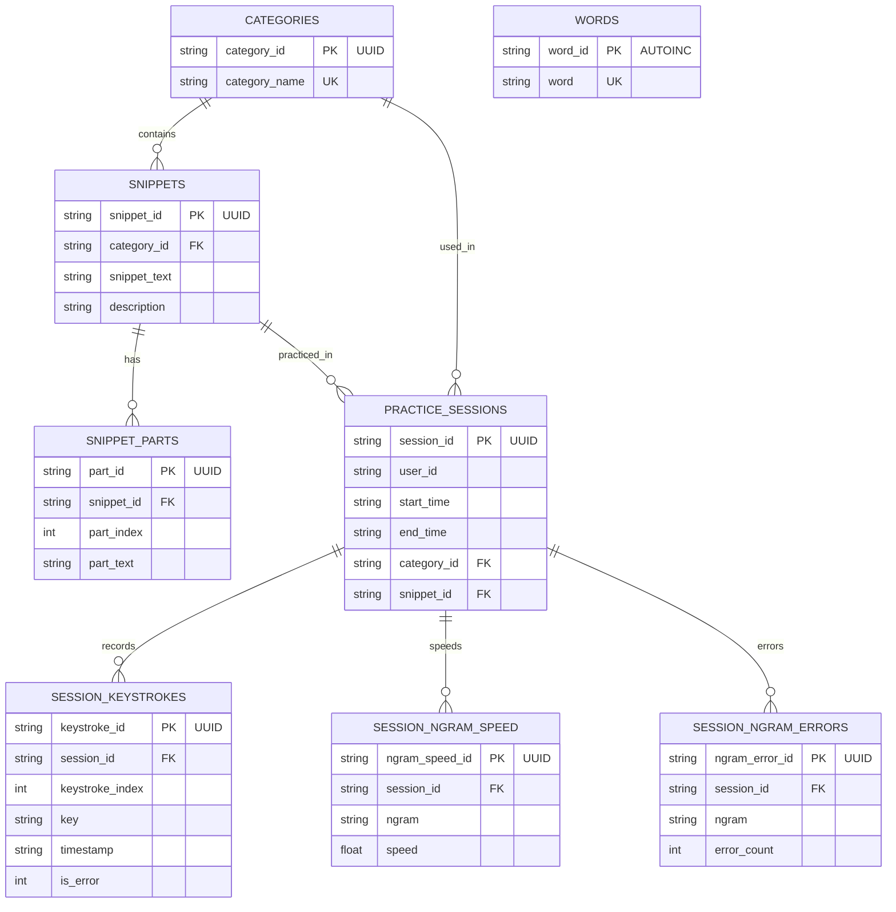

# All UML and ER Diagrams

---

## 1. Category Model and Manager UML

---
## 1a. Snippet Model and Manager UML

---

## 2. Session Model and Manager UML

---

## 3. Keystroke Model and Manager UML

---

## 4. NGram Model and Analyzer UML

---

## 5. DatabaseManager UML

---

## 6. Entity Relationship Diagram (ERD)

