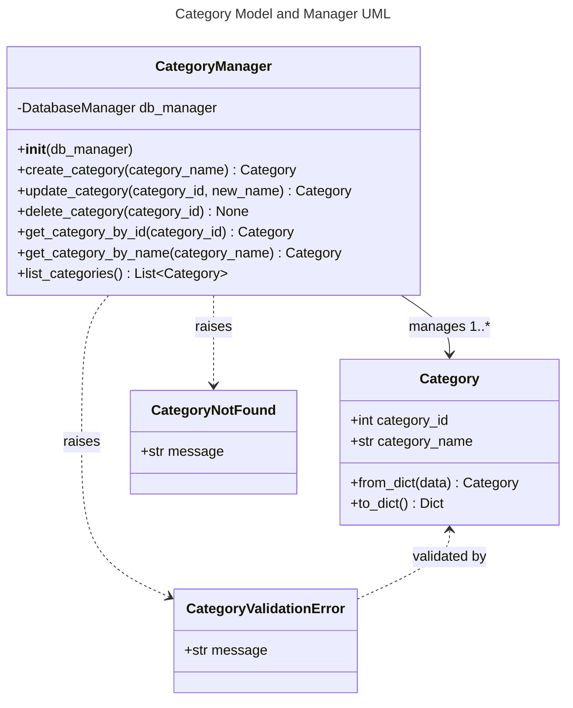

# Category Object Specification

## 1. Overview
A Category represents a logical grouping of text snippets for typing practice. Categories are used to organize content, enable targeted drills, and support reporting/analytics.

## 2. Data Model

### Database Schema

#### categories Table
- **category_id**: INTEGER PRIMARY KEY AUTOINCREMENT
- **category_name**: TEXT NOT NULL UNIQUE (ASCII-only, max 64 chars)

Categories are referenced by other tables:
- The `snippets` table has a foreign key `category_id` that references `categories.category_id`

## 3. Functional Requirements
- Categories can be created, renamed, and deleted.
- Deleting a category deletes all associated snippets and snippet parts.
- Category names must be unique and validated for ASCII and length.
- All validation is performed using Pydantic models and validators.
- Attempting to create or rename a category to a non-ASCII, blank, too-long, or duplicate name will fail with a descriptive GraphQL error.
- All database operations use parameterized queries and centralized validation to prevent SQL injection and other attacks.

## 4. API Endpoints

All category management is now handled via a unified GraphQL endpoint at `/api/graphql`.

**GraphQL Queries:**
- `categories`: List all categories
- `category(category_id: Int!)`: Get a specific category by ID

**GraphQL Mutations:**
- `createCategory(category_name: String!)`: Create a new category
- `updateCategory(category_id: Int!, category_name: String!)`: Rename a category
- `deleteCategory(category_id: Int!)`: Delete a category and all related snippets

All validation errors, such as non-ASCII, blank, too-long, or duplicate names, are surfaced as GraphQL error responses with clear, specific messages.
## 5. UI Requirements
- Category management available in both desktop (PyQt5) and web UIs
- Add/Edit/Delete dialogs must validate input and show clear errors

## 6. Testing
- Backend, API, and UI tests must cover all CRUD operations, validation, and error handling
- All tests must run on a clean DB and be independent

## 7. Security/Validation
- No SQL injection (parameterized queries)
- No sensitive data hardcoded
- All user input is validated and sanitized

---

## 8. API Implementation and Structure
- All Category API operations are implemented in `api/category_graphql.py` using Graphene and Flask.
- The GraphQL schema defines types, queries, and mutations with proper validation.
- All business logic (creation, update, deletion, DB access) is handled in `models/category.py`.
- The unified endpoint `/api/graphql` handles all operations.
- Error handling and status codes follow GraphQL conventions.
- Type hints and docstrings document all components.

## 9. Testing, Code Quality, and Security Standards
- All code is formatted with Black and follows PEP 8 style guidelines.
- Linting is enforced with flake8; all lint errors are fixed before merging.
- All code uses type hints and Pydantic for validation.
- All tests use pytest and pytest fixtures for setup/teardown, with DB isolation.
- No test uses the production DB; all tests are independent and parameterized.
- All Category CRUD operations, validation, and error handling are covered by backend, API, and UI tests.
- No sensitive data is hardcoded. All user input is validated and sanitized.
- All database operations use parameterized queries for security.

