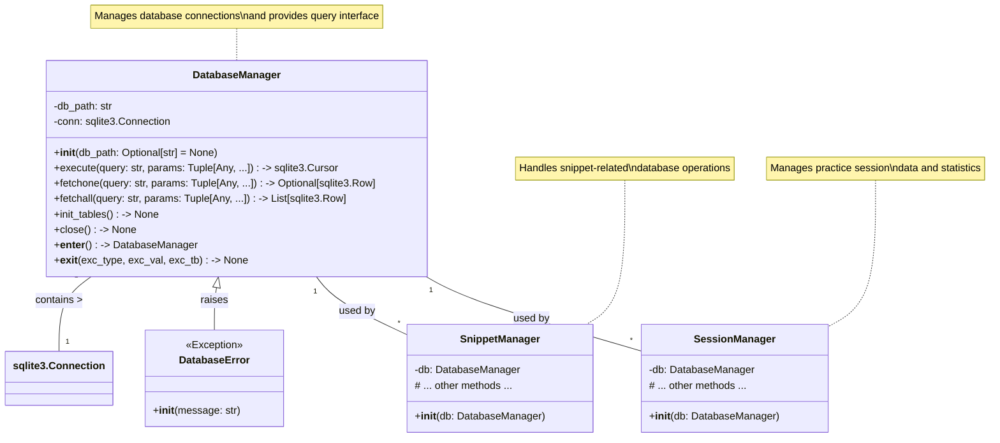
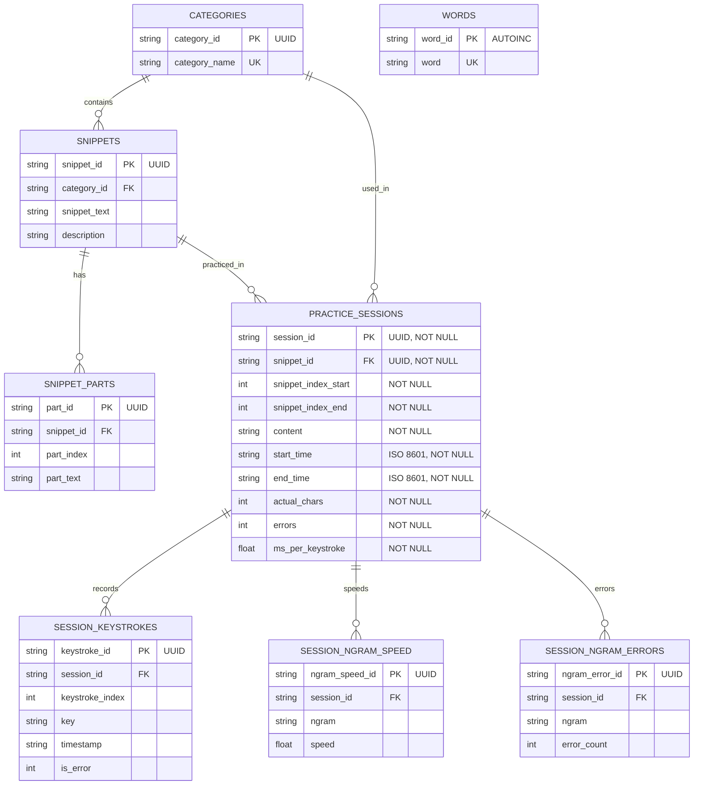

# DatabaseManager Specification

## 1. Overview

The `DatabaseManager` class is the central database access layer for the AI Typing Trainer application. It provides a clean, type-safe interface for all database operations, ensuring data integrity and consistency across the application. The manager handles connection management, query execution, and transaction control while providing robust error handling and type safety.

## 2. Class Diagram



## 3. Key Features

- **Connection Management**: Handles database connections with proper cleanup
- **Type Safety**: Full type hints and Pydantic models for data validation
- **Transaction Support**: Context manager interface for transaction handling
- **Error Handling**: Comprehensive error handling with specific exception types
- **Thread Safety**: Safe for use in multi-threaded environments
- **Database Agnostic**: Abstracted interface that can work with different database backends

## 3. Database Schema

The `DatabaseManager` is responsible for managing the following tables:

### 3.1 Core Tables
- **categories**: Stores text categories for organizing snippets
- **snippets**: Contains text snippets for typing practice
- **snippet_parts**: Stores parts of snippets for efficient loading
- **words**: Dictionary of words for word-based practice

### 3.2 Session Tables
- **practice_sessions**: Tracks typing practice sessions
- **session_keystrokes**: Records individual keystrokes during practice
- **session_ngram_speed**: Tracks typing speed for n-grams
- **session_ngram_errors**: Records common error patterns

## 3.3 Entity Relationship Diagram



## 4. API Reference

### 4.1 Initialization

```python
db_manager = DatabaseManager(db_path: Optional[str] = None)
```

**Parameters**:
- `db_path`: Path to SQLite database file or `:memory:` for in-memory database. If None, creates an in-memory database.

### 4.2 Core Methods

#### `execute(query: str, params: Tuple[Any, ...] = ()) -> sqlite3.Cursor`
Execute a SQL query with parameters and return the cursor.

#### `fetchone(query: str, params: Tuple[Any, ...] = ()) -> Optional[sqlite3.Row]`
Execute a query and return the first row, or None if no results.

#### `fetchall(query: str, params: Tuple[Any, ...] = ()) -> List[sqlite3.Row]`
Execute a query and return all rows as a list.

#### `init_tables() -> None`
Initialize all required database tables. Should be called once after instantiation.

#### `close() -> None`
Close the database connection.

### 4.3 Context Manager

```python
with DatabaseManager("path/to/db") as db:
    # Use db here
    pass  # Connection automatically closed when block exits
```

## 5. Error Handling

The following custom exceptions are raised by `DatabaseManager`:

- **ConnectionError**: Failed to connect to the database
- **SchemaError**: Missing tables or columns
- **ForeignKeyError**: Foreign key constraint violation
- **ConstraintError**: Constraint violation (NOT NULL, UNIQUE, etc.)
- **DatabaseTypeError**: Type mismatch in query parameters
- **IntegrityError**: Database integrity violation
- **DatabaseError**: Other database-related errors

## 6. Usage Examples

### Basic Usage

```python
# Initialize the database manager
db_manager = DatabaseManager("typing_data.db")
try:
    # Initialize tables (only needed once)
    db_manager.init_tables()
    
    # Execute a query
    cursor = db_manager.execute("SELECT * FROM categories")
    
    # Fetch a single row
    row = db_manager.fetchone("SELECT * FROM snippets WHERE snippet_id = ?", (1,))
    
    # Fetch all rows
    rows = db_manager.fetchall("SELECT * FROM practice_sessions ORDER BY start_time DESC")
    
finally:
    # Always close the connection
    db_manager.close()
```

### Using with Context Manager

```python
with DatabaseManager("typing_data.db") as db:
    # Tables are automatically created if they don't exist
    db.init_tables()
    
    # Execute queries
    categories = db.fetchall("SELECT * FROM categories")
    
# Connection is automatically closed when the block exits
```

## 7. Integration with Services

`DatabaseManager` is designed to be used with service classes through dependency injection:

```python
# In service initialization
db_manager = DatabaseManager("typing_data.db")
snippet_manager = SnippetManager(db_manager)
session_manager = SessionManager(db_manager)

# Or using the service initializer
from services import init_services
db_manager, snippet_manager, session_manager = init_services("typing_data.db")
```

## 8. Testing

When testing code that uses `DatabaseManager`:

1. Use an in-memory database for fast, isolated tests:
   ```python
   def test_something():
       with DatabaseManager(":memory:") as db:
           db.init_tables()
           # Run tests here
   ```

2. Use dependency injection to provide a test double when needed.

## 9. Security Considerations

- All queries use parameterized inputs to prevent SQL injection
- Database credentials (if any) should be managed securely
- Sensitive data should be encrypted at rest
- Connection strings should never be hardcoded in source files

## 10. Performance Considerations

- Connection pooling is handled automatically
- Use transactions for bulk operations
- Consider adding indexes for frequently queried columns
- Close connections when done to free resources
