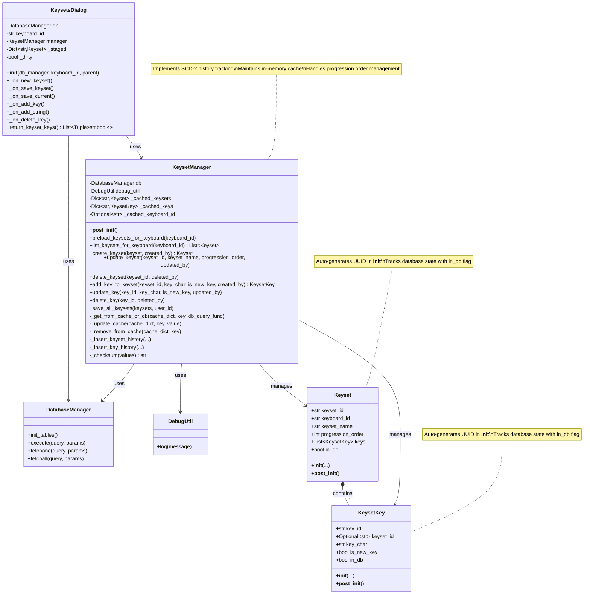

# Keysets Specification

This specification defines the data model, persistence, history (audit), UI, and tests for the Keysets feature.

---

## Overview
- Keysets are named collections of keys associated with a keyboard (e.g., QWERTY).
- Each keyset has a progression order (logical priority) so users can master keysets in sequence.
- Each key within a keyset has a flag `is_new_key` (emphasis) indicating it is newly introduced in the keyset.
- The system must maintain a temporal change history (SCD Type-2 close-update) for all keyset entities without relying on DB triggers.
- For a given keyboard, `progression_order` must be unique per keyset. Users can promote/demote keysets to change the order safely.

## Non-Goals
- Do not use DB triggers. The library/manager must implement history maintenance in application code.

---

## Data Model

### Tables

1) keysets
- keyset_id (TEXT, PK, UUID string)
- keyboard_id (TEXT, FK -> keyboards.keyboard_id)
- keyset_name (TEXT, NOT NULL)
- progression_order (INTEGER, NOT NULL)
- created_at (TEXT, NOT NULL, ISO8601)
- updated_at (TEXT, NOT NULL, ISO8601)
- row_checksum (TEXT, NOT NULL) -- SHA256 hash of business columns for no-op change detection
- UNIQUE(keyboard_id, keyset_name)
- UNIQUE(keyboard_id, progression_order)   <!-- Enforce one priority per keyboard -->

2) keysets_history (SCD-2 close-update)
- history_id (TEXT, PK, UUID)
- keyset_id (TEXT, NOT NULL)
- keyboard_id (TEXT, NOT NULL)
- keyset_name (TEXT, NOT NULL)
- progression_order (INTEGER, NOT NULL)
- action (TEXT: 'I','U','D')
- valid_from (TEXT, NOT NULL)
- valid_to (TEXT, NOT NULL, default '9999-12-31 23:59:59')
- is_current (INT, NOT NULL)
- version_no (INTEGER, NOT NULL)
- recorded_at (TEXT, NOT NULL)
- created_user_id (TEXT)
- updated_user_id (TEXT)
- row_checksum (TEXT, NOT NULL)
- Indexes: (keyset_id, is_current), (keyset_id, version_no)

3) keyset_keys
- key_id (TEXT, PK, UUID)
- keyset_id (TEXT, FK -> keysets.keyset_id)
- key_char (TEXT, NOT NULL) — one Unicode character
- is_new_key (INT, NOT NULL) — 0/1
- created_at (TEXT, NOT NULL)
- updated_at (TEXT, NOT NULL)
- row_checksum (TEXT, NOT NULL) -- SHA256 hash of business columns for no-op change detection
- UNIQUE(keyset_id, key_char)

4) keyset_keys_history (SCD-2 close-update)
- history_id (TEXT, PK, UUID)
- key_id (TEXT, NOT NULL)
- keyset_id (TEXT, NOT NULL)
- key_char (TEXT, NOT NULL)
- is_new_key (INT, NOT NULL)
- action (TEXT: 'I','U','D')
- valid_from (TEXT, NOT NULL)
- valid_to (TEXT, NOT NULL, default '9999-12-31 23:59:59')
- is_current (INT, NOT NULL)
- version_no (INTEGER, NOT NULL)
- recorded_at (TEXT, NOT NULL)
- created_user_id (TEXT)
- updated_user_id (TEXT)
- row_checksum (TEXT, NOT NULL)
- Indexes: (key_id, is_current), (key_id, version_no)

---

## Pydantic Models

- Keyset
  - keyset_id: str (auto-generated UUID in __init__ if not provided)
  - keyboard_id: str
  - keyset_name: str (1..100)
  - progression_order: int (>=1)
  - keys: list[KeysetKey]
  - in_db: bool (tracks whether this keyset exists in database)

- KeysetKey
  - key_id: str (auto-generated UUID in __init__ if not provided)
  - keyset_id: Optional[str]
  - key_char: str (exactly one Unicode character)
  - is_new_key: bool
  - in_db: bool (tracks whether this key exists in database)

Validation rules
- key_char must be exactly one Unicode code point (len(key_char) == 1).
- keyset_name non-empty, reasonable length.
- progression_order positive integer.
- **UUID Generation**: Both Keyset and KeysetKey models automatically generate UUIDs in their `__init__` methods if keyset_id/key_id are not provided.
- **Database State Tracking**: Both models track their database existence status via `in_db` boolean field.

---

## Manager / Library Responsibilities (DB independent of triggers)

- Create / Update / Delete keysets
- Add / Remove / Replace keyset keys
- Enforce uniqueness (keyset_name per keyboard, key_char per keyset)
- **Database State Management**:
  - When loading keysets/keys from database, mark them as `in_db=True`
  - When creating new keysets/keys in UI, mark them as `in_db=False`
  - When persisting to database, mark all as `in_db=True`
  - Use `in_db` flag to determine whether to INSERT (new) or UPDATE (existing) during save operations
- **Cascade Delete**: When deleting a keyset, automatically delete all associated keys first
- **Smart Persistence**: Save function must persist all keysets and keys, but skip database operations for unchanged items (use checksum comparison)
- **Progression Order Management**: When reordering keysets, update progression_order values in cache without creating duplicates (like array index manipulation)
- Maintain SCD-2 history for keysets and keyset_keys:
  - On change, insert new history version with valid_from=now, valid_to='9999-12-31...', is_current=1, version_no incremented.
  - Update previous current to valid_to=now, is_current=0 (close-update).
  - **No-op change detection**: Compute row_checksum across business columns and compare with existing checksum in main table. Skip history write if checksums match (no actual change).
  - Store row_checksum in both main tables and history tables for efficient comparison.
- Use `DatabaseManager` for all SQL. No triggers.
- Use `DebugUtil` for debug logging, honoring quiet/loud mode.
- **Initialize database tables**: The manager must ensure `init_tables()` is called on the DatabaseManager during initialization to create all required tables.
- **Performance optimization**: Implement in-memory caching with preload functionality:
  - `preload_keysets_for_keyboard(keyboard_id)` loads all keysets and keys for a specific keyboard into memory cache.
  - Cache synchronization: All CRUD operations automatically maintain cache consistency.
  - Fallback pattern: If data not in cache, query database and update cache.
- Provide ordering APIs:
  - `promote_keyset(keyboard_id, keyset_id)` and/or `set_keyset_order(keyboard_id, keyset_id, new_order)` which swap orders with adjacent entries safely (no transient uniqueness violations; use temporary order sentinel during swap).

### Explicit Delete Behavior
- `delete_keyset(keyset_id: str, deleted_by: Optional[str] = None) -> bool`
  - Must implement application-managed cascade delete without triggers:
    1) Select all child rows from `keyset_keys` for the `keyset_id`.
    2) For each child key, perform SCD-2 close-update in `keyset_keys_history`:
       - Update previous current (if any) with `valid_to = now`, `is_current = 0`.
       - Insert new history record with `action = 'D'`, `valid_from = now`, `valid_to = now`, `is_current = 0`, `version_no` incremented, `row_checksum` reflecting last business state.
    3) Delete all child rows from `keyset_keys`.
    4) For the keyset itself, perform SCD-2 close-update in `keysets_history` with the same pattern as above, using `action = 'D'`.
    5) Delete the row from `keysets`.
  - Return `True` if the keyset existed and was deleted; `False` if it did not exist.
  - Manager cache must be updated to remove the deleted keyset.

---

## Desktop UI

- Dialog: Keyset Editor
  - List keysets for the selected keyboard in left panel, ordered by progression_order
  - Create / Edit / Delete keysets with automatic progression_order assignment
  - Within a keyset, manage keys: add/remove single keys, add string of keys, add from other keysets, toggle is_new_key
  - **Save functionality**: Save button with standard icon, disabled by default, enabled when changes occur
  - **Button placement**: Save and Close buttons positioned in right panel under key action buttons for visibility
  - **Alphabetical ordering**: Keys are automatically inserted in alphabetical order within keysets
  - **Performance**: Dialog preloads all keysets/keys for the keyboard on initialization to minimize database queries
  - **Staged changes**: Changes are staged in memory until save is clicked, allowing for cancel/discard
  - Provide callable method `return_keyset_keys() -> list[tuple[str, bool]]` (key_char, is_new_key)
- **Error handling**: 
  - Prevent duplicate progression_order values through proper validation
  - Display meaningful error messages for constraint violations
  - Ensure database tables are initialized before first use
- Integration:
  - Add a button next to the "included keys" section in the dynamic config screen to launch the Keyset Editor and allow selection.

### Selection Behavior
- The left-hand keysets list drives selection and enables/disables related actions:
  - When no item is selected, the following must be disabled:
    - Delete Keyset
    - Edit Details
  - When an item is selected:
    - The selected item becomes the current keyset
    - The right-hand panel must refresh to show the selected keyset's name, order, and keys (alphabetically)
    - Delete Keyset and Edit Details must be enabled

### Edit Flow
- Pressing "Edit Details" should edit the currently selected keyset from the left list.
- On successful edit:
  - The right-hand pane is updated with the new name/order
  - The left list label for the selected item updates to reflect the new order/name
  - Changes are staged and the Save button becomes enabled

### Screenshots in Markdown
- You can embed screenshots into markdown using standard image syntax:
  - ``
- Store screenshots under a project folder (e.g., `Prompts/images/`) and reference them with a relative path:
  - ``
- Git LFS can be used if large images are expected, but regular small PNGs are fine.

---

## Testing

- Models: validation (single-char keys, required fields) and serialization.
- Manager: CRUD operations, history correctness (close-update and versioning), checksum no-op suppression, caching functionality.
- **Database initialization**: Tests must call `init_tables()` on DatabaseManager before using KeysetManager to ensure tables exist.
- **Cache testing**: Verify preload functionality, cache synchronization, and fallback to database when cache is empty.
- **Constraint testing**: Verify unique progression_order enforcement and proper error handling for duplicates.
- **State tracking testing**: Verify `in_db` flag behavior during load, create, update, and delete operations.
- **Cascade delete testing**: Verify that deleting a keyset properly removes all associated keys.
- **UUID generation testing**: Verify that models automatically generate UUIDs when not provided.
- **Smart persistence testing**: Verify that save operations correctly use INSERT for new items and UPDATE for existing items based on `in_db` flag.
- **Progression order testing**: Verify that reordering keysets maintains unique progression_order values without duplicates.
- UI: Headless tests (PySide6) with QtBot where possible; mock database layer. Verify `return_keyset_keys()` behavior and UI interactions minimally.
- **UI workflow testing**: Test save button state changes, alphabetical key ordering, staged changes, and error dialog display.
- Use pytest and the `temp_db` fixture (SQLite); do not touch the production DB.
- All tests must be order-independent and clean up after themselves.

### Additional Acceptance Test (Mixed Load/Create Persistence)
- Create one keyset and persist it.
- Instantiate a fresh `KeysetManager` and `preload_keysets_for_keyboard(keyboard_id)` (or `list_keysets_for_keyboard`).
- Create a second `Keyset` (with `in_db=False`).
- Call `save_all_keysets([loaded_keyset, new_keyset])`.
- Assert `SELECT COUNT(*) FROM keysets WHERE keyboard_id = ?` returns `2`.

---

---

## Progression Order Management

The progression_order field acts like an array index and must be managed carefully to avoid duplicates:

### Reordering Logic
When moving a keyset from position A to position B:
1. **Moving Up** (A > B): Increment progression_order for all keysets where progression_order >= B and progression_order < A
2. **Moving Down** (A < B): Decrement progression_order for all keysets where progression_order > A and progression_order <= B
3. **Set Target**: Set the moved keyset's progression_order to B

### Example
Initial state: [Keyset1=1, Keyset2=2, Keyset3=3, Keyset4=4]
Move Keyset4 (position 4) to position 2:
1. Increment keysets at positions 2,3: [Keyset1=1, Keyset2=3, Keyset3=4, Keyset4=4]
2. Set Keyset4 to position 2: [Keyset1=1, Keyset4=2, Keyset2=3, Keyset3=4]

This ensures no duplicates and maintains continuous numbering.

---

## Database State Tracking

### In-Memory State Management
- **`in_db` Flag**: Every Keyset and KeysetKey maintains a boolean flag indicating database existence
- **Load from DB**: Set `in_db=True` for all loaded entities
- **Create New**: Set `in_db=False` for new entities created in UI
- **After Save**: Set `in_db=True` for all entities after successful database persistence

### Save Operation Logic
```python
def save_keyset(keyset: Keyset):
    for keyset in all_keysets:
        if not keyset.in_db:
            # INSERT new keyset
            db.execute("INSERT INTO keysets ...")
        elif has_changes(keyset):  # Compare checksums
            # UPDATE existing keyset
            db.execute("UPDATE keysets ...")
        
        for key in keyset.keys:
            if not key.in_db:
                # INSERT new key
                db.execute("INSERT INTO keyset_keys ...")
            elif has_changes(key):  # Compare checksums
                # UPDATE existing key
                db.execute("UPDATE keyset_keys ...")
    
    # Mark all as persisted
    mark_all_as_in_db()
```

---

## Benefits of Main Table Checksums

Adding `row_checksum` to the main tables provides several advantages:

1. **Efficient No-op Detection**: Simply compare the new computed checksum with the existing one in the main table, eliminating the need to recompute and compare business column values.

2. **Faster Updates**: Skip unnecessary history writes when data hasn't actually changed, reducing database I/O and history table bloat.

3. **Consistent Data Integrity**: The checksum serves as a quick verification that the data hasn't been corrupted or unexpectedly modified.

4. **Simplified Logic**: Update operations can use a simple checksum comparison rather than complex field-by-field comparisons.

5. **Performance**: Particularly beneficial when dealing with bulk operations or frequent updates where many might be no-ops.

Example workflow:
```python
# Compute new checksum
new_checksum = _checksum([keyboard_id, keyset_name, str(progression_order)])

# Get existing checksum from main table
existing = db.fetchone("SELECT row_checksum FROM keysets WHERE keyset_id = ?", (keyset_id,))

# Skip update if no actual change
if existing and existing['row_checksum'] == new_checksum:
    return  # No-op, skip history write

# Proceed with update and history write
```

---

---

## Class Diagram



---

## Acceptance Criteria

### Database Operations
**AC-1: CRUD Operations Database Persistence**
- ✅ **GIVEN** any keyset CRUD operation (create, update, delete)
- ✅ **WHEN** the operation is performed through KeysetManager
- ✅ **THEN** the corresponding rows must be inserted/updated/deleted in the `keysets` table

**AC-2: CRUD Operations for Keys Database Persistence**
- ✅ **GIVEN** any keyset key CRUD operation (create, update, delete)
- ✅ **WHEN** the operation is performed through KeysetManager
- ✅ **THEN** the corresponding rows must be inserted/updated/deleted in the `keyset_keys` table

### History Tracking (SCD-2)
**AC-3: Keyset History on Changes**
- ✅ **GIVEN** a keyset is created, updated, or deleted
- ✅ **WHEN** the operation changes business data (keyset_name, progression_order)
- ✅ **THEN** a new history record must be inserted in `keysets_history` table with:
  - New version_no (incremented)
  - valid_from = current timestamp
  - valid_to = '9999-12-31 23:59:59'
  - is_current = 1
  - Previous current record (if any) updated with valid_to = current timestamp, is_current = 0

**AC-4: Key History on Changes**
- ✅ **GIVEN** a keyset key is created, updated, or deleted
- ✅ **WHEN** the operation changes business data (key_char, is_new_key)
- ✅ **THEN** a new history record must be inserted in `keyset_keys_history` table with:
  - New version_no (incremented)
  - valid_from = current timestamp
  - valid_to = '9999-12-31 23:59:59'
  - is_current = 1
  - Previous current record (if any) updated with valid_to = current timestamp, is_current = 0

### No-Op Change Detection
**AC-5: No-Op Keyset Updates**
- ✅ **GIVEN** a keyset update operation
- ✅ **WHEN** the new data has the same row_checksum as existing data
- ✅ **THEN** NO new history record is created in `keysets_history`
- ✅ **AND** NO update is made to the `keysets` table
- ✅ **AND** the operation completes successfully

### Persistence After Mixed Load/Create
**AC-11: Load One, Add Another, Persist Both**
- ✅ **GIVEN** one keyset already persisted in DB for a keyboard
- ✅ **WHEN** the manager loads keysets for that keyboard, then a new keyset for the same keyboard is created in memory and `save_all_keysets([loaded_keyset, new_keyset])` is executed
- ✅ **THEN** both keysets must exist in `keysets` table after persistence (count == 2 for that keyboard)

**AC-6: No-Op Key Updates**
- ✅ **GIVEN** a keyset key update operation
- ✅ **WHEN** the new data has the same row_checksum as existing data
- ✅ **THEN** NO new history record is created in `keyset_keys_history`
- ✅ **AND** NO update is made to the `keyset_keys` table
- ✅ **AND** the operation completes successfully

### Data Integrity
**AC-7: Cascade Delete**
- ✅ **GIVEN** a keyset is deleted
- ✅ **WHEN** the delete operation is performed
- ✅ **THEN** all associated keys in `keyset_keys` table must be deleted first
- ✅ **AND** history records must be created for all deleted keys
- ✅ **AND** then the keyset is deleted with its history record

**AC-7b: Delete Method Availability**
- ✅ `KeysetManager` MUST expose a `delete_keyset(keyset_id: str, deleted_by: Optional[str] = None) -> bool` method implementing the delete behavior described above.

**AC-8: Progression Order Uniqueness**
- ✅ **GIVEN** keysets for a specific keyboard
- ✅ **WHEN** progression_order values are assigned or changed
- ✅ **THEN** no two keysets for the same keyboard can have duplicate progression_order values
- ✅ **AND** reordering operations maintain continuous numbering without gaps or duplicates

### State Management
**AC-9: Database State Tracking**
- ✅ **GIVEN** keysets and keys loaded from database
- ✅ **WHEN** they are loaded
- ✅ **THEN** they must be marked with `in_db = True`
- ✅ **GIVEN** new keysets/keys created in UI
- ✅ **WHEN** they are created
- ✅ **THEN** they must be marked with `in_db = False`
- ✅ **GIVEN** keysets/keys after save operation
- ✅ **WHEN** save completes successfully
- ✅ **THEN** all items must be marked with `in_db = True`

**AC-10: Smart Persistence**
- ✅ **GIVEN** a save operation
- ✅ **WHEN** items with `in_db = False` are saved
- ✅ **THEN** INSERT operations must be used
- ✅ **GIVEN** items with `in_db = True` and changes detected
- ✅ **WHEN** they are saved
- ✅ **THEN** UPDATE operations must be used
- ✅ **GIVEN** items with `in_db = True` and no changes (same checksum)
- ✅ **WHEN** they are processed during save
- ✅ **THEN** no database operations are performed

---

## Common Issues and Solutions

- **Duplicate progression_order error**: Occurs when the keysets table hasn't been initialized. Ensure `DatabaseManager.init_tables()` is called before creating KeysetManager instances.
- **Cache attribute errors**: The KeysetManager uses specific cache variable names (`_cached_keysets`, `_cached_keys`, `_cached_keyboard_id`). Ensure these are properly initialized in `__post_init__()`.
- **Performance with large datasets**: Use the preload functionality to load all keysets/keys into memory cache when opening the dialog to avoid repeated database queries.
- **UI responsiveness**: Save button should only be enabled when changes are detected, and changes should be staged in memory until save is clicked.
- **Key ordering**: Always maintain alphabetical order when inserting keys to provide consistent user experience.

---

## Compliance

- Follow `MemoriesAndRules/code_generation_standards.md` and `MemoriesAndRules/python_coding_standards.md`.
- Pass `ruff` and `mypy` with zero errors.
- Use PEP 8 naming and formatting.
- Use Pydantic for data validation.
