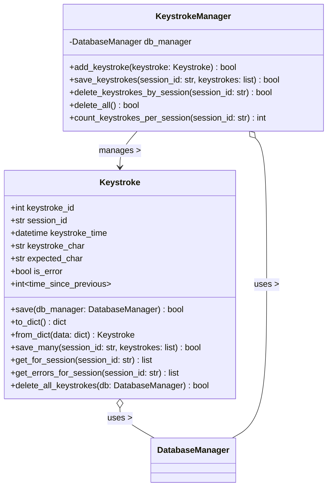

# Keystroke Object Specification

> **NOTE:** `session_id` is always an **integer** throughout the application and database. All APIs, models, and DB tables use integer session IDs. Any previous references to string/UUID session IDs are obsolete.

## 1. Overview
A Keystroke records each key press during a typing session, including timing, correctness, and expected character. Used for detailed analytics and error reporting.

## 2. Data Model
- **keystroke_id**: Integer (Primary Key)
- **session_id**: UUID String (Foreign Key to practice_sessions)
- **keystroke_time**: DateTime
- **keystroke_char**: String
- **expected_char**: String
- **is_error**: Boolean

## 3. Functional Requirements
- Keystrokes are recorded in real time during drills
- Linked to sessions for analytics and error reporting

## 4. API Endpoints
- `POST /api/keystrokes`: Record a keystroke
- `GET /api/keystrokes?session_id=<id>`: List keystrokes for a session

## 5. UI Requirements
- Keystrokes are managed automatically by TypingDrill UIs
- Used for real-time feedback and post-drill analytics

## 6. Testing
- Backend, API, and UI tests must cover all keystroke recording and retrieval
- All tests must run on a clean DB and be independent

## 7. Security/Validation
- No SQL injection (parameterized queries)
- No sensitive data hardcoded
- All user input is validated and sanitized

---

## 8. API Implementation and Structure
- All Keystroke API endpoints are implemented in `keystroke_api.py` using a Flask Blueprint (`keystroke_api`).
- Endpoints only handle request/response, validation, and error handling.
- All business logic (creation, retrieval, DB access) is handled in `db/models/keystroke.py`.
- Endpoints:
  - `POST /api/keystrokes`: Record a keystroke
  - `GET /api/keystrokes?session_id=<id>`: List keystrokes for a session

## 9. Database Structure
### 9.1 session_keystrokes Table
- **keystroke_id**: Integer (Primary Key)
- **session_id**: UUID String (Foreign Key to practice_sessions)
- **keystroke_time**: DateTime
- **keystroke_char**: String
- **expected_char**: String
- **is_error**: Boolean

### 9.2 Error Tracking
- Errors are tracked directly in the session_keystrokes table using the is_error field:
    - When is_error = 0: The keystroke was typed correctly
    - When is_error = 1: The keystroke represents an error

## 10. UML Class Diagram (Keystroke Domain)

**Legend:**
- `+` public, `-` private/protected, `~` optional/nullable
- Types shown for clarity; actual implementation may use type hints or docstrings
- All DB operations use parameterized queries for security

---
