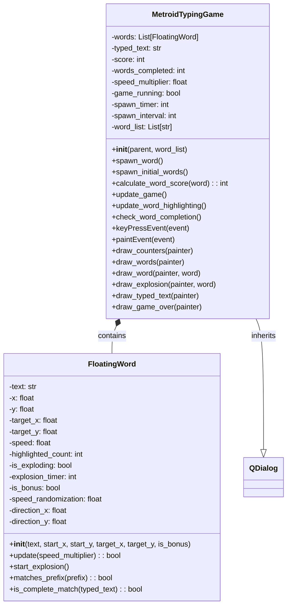
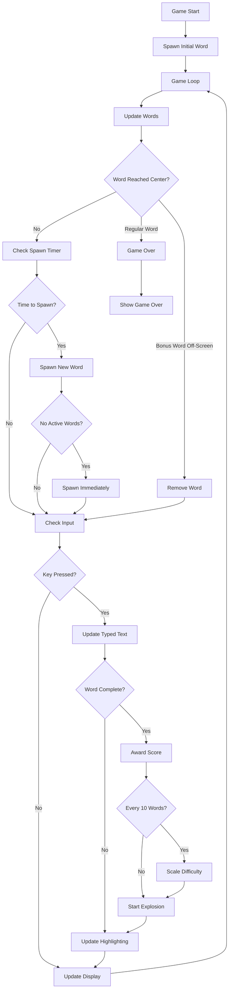

# Metroid Typing Game Specification

## 1. Overview

The Metroid Typing Game is an action-packed typing game inspired by the classic Metroid series. Words float in from the edges of the screen toward the center, and players must type them to destroy them before they reach the center. The game features exponential scoring, difficulty scaling, bonus words, and continues until the player dies or presses escape.

## 2. Game Mechanics

### 2.1 Core Gameplay
- **Objective**: Type words to destroy them before they reach the center of the screen
- **Game Over**: Occurs when any regular word reaches the center (within 30 pixels)
- **Victory**: There is no victory condition - the game continues indefinitely until death or escape
- **Controls**: 
  - Type letters to target and destroy words
  - ESC key to quit the game
  - Automatic word targeting based on typed prefix

### 2.2 Word Movement System
- **Regular Words**: Move from screen edges toward the center in straight lines
- **Bonus Words**: Move at tangent angles (perpendicular to radial direction) across the screen
- **Speed Randomization**: Each word has ±10% speed variation from base speed
- **Difficulty Scaling**: Every 10 completed words:
  - Word movement speed increases by 10%
  - Time between new word spawns decreases by 5%

### 2.3 Word Spawning System
- **Initial State**: Game starts with exactly one word on screen
- **Spawn Timing**: New words spawn at regular intervals (initially 6 seconds at 20 FPS)
- **Immediate Spawning**: If no active words remain on screen, spawn next word immediately
- **Bonus Words**: 1% chance for each spawn to be a bonus word
- **Spawn Locations**: Words spawn from random positions along screen edges (top, right, bottom, left)

### 2.4 Bonus Word System
- **Frequency**: 1% chance per word spawn
- **Selection**: Chosen from the 5 longest available words
- **Movement**: Travel at tangent angles across screen (30% faster than regular words)
- **Visual**: Displayed in yellow color to differentiate from regular words
- **Scoring**: Award triple points when completed
- **Removal**: Removed when they go off-screen (no penalty)

### 2.5 Scoring System
- **Base Formula**: Score = 1.5^(word_length) for regular words
- **Bonus Multiplier**: Bonus words award 3x the base score
- **Progressive Difficulty**: No score penalties, only increasing challenge

### 2.6 Visual Feedback
- **Word Highlighting**: 
  - Typed letters appear in orange
  - Remaining letters in white (regular words) or yellow (bonus words)
- **Real-time Metrics**: 
  - Current score
  - Words completed count
  - Speed multiplier
  - Time to next word arrival
- **Game Over Screen**: Shows final score, words completed, and instructions

## 3. Technical Architecture

### 3.1 Class Diagram



### 3.2 Data Flow



## 4. Functional Requirements

### 4.1 Game Initialization
- **FR-1**: Game window shall be 1000x700 pixels and centered on screen
- **FR-2**: Game shall start with exactly one word spawned from a random edge
- **FR-3**: Game shall use provided word list or default Metroid-themed words
- **FR-4**: Game shall filter word list to only include typable ASCII characters
- **FR-5**: Game shall run at 20 FPS using QTimer

### 4.2 Word Management
- **FR-6**: Words shall spawn from random positions along screen edges
- **FR-7**: Regular words shall move toward screen center in straight lines
- **FR-8**: Bonus words (1% chance) shall move at tangent angles across screen
- **FR-9**: Each word shall have ±10% speed randomization
- **FR-10**: Bonus words shall be 30% faster than regular words
- **FR-11**: Words shall be removed when reaching center (regular) or going off-screen (bonus)

### 4.3 Player Interaction
- **FR-12**: Player shall type letters to target words starting with typed prefix
- **FR-13**: First word matching typed prefix shall be highlighted
- **FR-14**: Completing a word shall award score and start explosion animation
- **FR-15**: ESC key shall quit the game immediately
- **FR-16**: Backspace shall remove last typed character

### 4.4 Difficulty Scaling
- **FR-17**: Every 10 completed words shall increase movement speed by 10%
- **FR-18**: Every 10 completed words shall decrease spawn interval by 5%
- **FR-19**: Game shall continue indefinitely until death or quit
- **FR-20**: No maximum word limit shall be enforced

### 4.5 Scoring System
- **FR-21**: Regular words shall award 1.5^(word_length) points
- **FR-22**: Bonus words shall award triple the base score
- **FR-23**: Score shall be displayed in real-time
- **FR-24**: Words completed count shall be tracked and displayed

### 4.6 Visual Display
- **FR-25**: Typed letters shall appear in orange highlighting
- **FR-26**: Regular words shall appear in white text
- **FR-27**: Bonus words shall appear in yellow text
- **FR-28**: Time to next word arrival shall be displayed
- **FR-29**: Current speed multiplier shall be displayed
- **FR-30**: Game over screen shall show final statistics

## 5. User Interface Requirements

### 5.1 Game Screen Layout
- **UI-1**: Score display in top-left corner
- **UI-2**: Words completed count below score
- **UI-3**: Speed multiplier below words count
- **UI-4**: Time to next arrival below speed multiplier
- **UI-5**: Typed text display at bottom center with background box
- **UI-6**: Words floating across screen with appropriate colors

### 5.2 Visual Feedback
- **UI-7**: Explosion animation for completed words (orange sparks)
- **UI-8**: Real-time highlighting of typed letters in orange
- **UI-9**: Different colors for regular (white) and bonus (yellow) words
- **UI-10**: Semi-transparent overlay for game over screen

### 5.3 Typography
- **UI-11**: Arial font family for all text
- **UI-12**: 16pt bold for floating words
- **UI-13**: 14pt bold for counters
- **UI-14**: 18pt bold for typed text
- **UI-15**: 36pt bold for game over message

## 6. Performance Requirements

### 6.1 Timing
- **PERF-1**: Game shall maintain 20 FPS (50ms frame time)
- **PERF-2**: Input response time shall be < 50ms
- **PERF-3**: Word spawning shall be accurate to within 1 frame

### 6.2 Resource Usage
- **PERF-4**: Memory usage shall not exceed 100MB during normal gameplay
- **PERF-5**: CPU usage shall not exceed 25% on modern systems
- **PERF-6**: Game shall handle up to 50 simultaneous words without performance degradation

## 7. Acceptance Criteria

### 7.1 Core Gameplay
- **AC-1**: ✅ Game starts with exactly one word on screen
- **AC-2**: ✅ Words move from edges toward center at randomized speeds
- **AC-3**: ✅ Typing letters highlights matching words in orange
- **AC-4**: ✅ Completing words awards exponential score (1.5^length)
- **AC-5**: ✅ Game ends when regular word reaches center
- **AC-6**: ✅ ESC key quits game immediately

### 7.2 Difficulty Scaling
- **AC-7**: ✅ Every 10 words increases speed by 10%
- **AC-8**: ✅ Every 10 words decreases spawn time by 5%
- **AC-9**: ✅ Game continues indefinitely (no 50-word limit)
- **AC-10**: ✅ Speed randomization varies each word by ±10%

### 7.3 Bonus Word System
- **AC-11**: ✅ 1% chance for bonus words from longest 5 words
- **AC-12**: ✅ Bonus words move at tangent angles
- **AC-13**: ✅ Bonus words are 30% faster than regular words
- **AC-14**: ✅ Bonus words appear in yellow color
- **AC-15**: ✅ Bonus words award triple score
- **AC-16**: ✅ Bonus words don't cause game over when off-screen

### 7.4 User Interface
- **AC-17**: ✅ Time-to-next arrival displayed and updates in real-time
- **AC-18**: ✅ Score, words completed, and speed multiplier shown
- **AC-19**: ✅ Immediate word spawning when no active words remain
- **AC-20**: ✅ Game over screen shows final statistics

### 7.5 Visual Polish
- **AC-21**: ✅ Explosion animations for completed words
- **AC-22**: ✅ Proper color coding for different word types
- **AC-23**: ✅ Smooth word movement and highlighting
- **AC-24**: ✅ Professional game over screen with instructions

## 8. Testing Requirements

### 8.1 Unit Tests
- **TEST-1**: FloatingWord class initialization and movement
- **TEST-2**: Scoring calculation for regular and bonus words
- **TEST-3**: Word targeting and completion logic
- **TEST-4**: Difficulty scaling calculations
- **TEST-5**: Spawn timing and interval management

### 8.2 Integration Tests
- **TEST-6**: Game loop timing and frame rate consistency
- **TEST-7**: Keyboard input handling and response
- **TEST-8**: Word collision detection and removal
- **TEST-9**: Score accumulation and display updates
- **TEST-10**: Game state transitions (running/game over)

### 8.3 User Experience Tests
- **TEST-11**: Game responsiveness under high word counts
- **TEST-12**: Visual clarity of different word types
- **TEST-13**: Intuitive controls and feedback
- **TEST-14**: Smooth difficulty progression
- **TEST-15**: Clear game over conditions and recovery

## 9. Implementation Notes

### 9.1 Key Design Decisions
- **PySide6**: Chosen for cross-platform GUI compatibility
- **Custom QPainter**: Used for smooth graphics and animations
- **Timer-based Updates**: 20 FPS provides smooth gameplay without excessive CPU usage
- **Exponential Scoring**: Creates meaningful progression and challenge
- **Tangent Movement**: Bonus words provide unique visual and gameplay variety

### 9.2 Future Enhancements
- **Power-ups**: Temporary abilities like slow-motion or multi-target
- **Word Categories**: Theme-based word sets (space, technology, etc.)
- **Difficulty Modes**: Preset configurations for different skill levels
- **Leaderboards**: High score tracking and comparison
- **Sound Effects**: Audio feedback for typing, explosions, and game events
- **Particle Effects**: Enhanced visual effects for explosions and word destruction

### 9.3 Known Limitations
- **Word List Dependency**: Game requires pre-defined word list
- **Single Player Only**: No multiplayer or cooperative modes
- **Fixed Window Size**: No dynamic resizing support
- **ASCII Only**: Limited to printable ASCII character set
- **No Persistence**: Scores and progress not saved between sessions

## 10. File Structure

```
desktop_ui/
├── metroid_typing_game.py          # Main game implementation
├── games_menu.py                   # Game selection menu
└── main_menu.py                    # Main application menu

Prompts/
└── MetroidTypingGame.md           # This specification document
```

## 11. Dependencies

### 11.1 Required Libraries
- **PySide6**: GUI framework and event handling
- **typing**: Type hints and annotations
- **math**: Mathematical calculations for movement and scoring
- **random**: Random number generation for spawning and bonus words
- **sys**: System-specific parameters and functions

### 11.2 Python Version
- **Minimum**: Python 3.8+
- **Recommended**: Python 3.10+
- **Tested**: Python 3.11

## 12. Deployment

### 12.1 Integration Points
- **Main Menu**: Accessible via "Games" → "Metroid Typing"
- **Typing Drill**: Accessible via "🎮 Games" button
- **Word Lists**: Uses same word filtering as main application
- **Styling**: Consistent with application theme and fonts

### 12.2 Error Handling
- **Word List Validation**: Filters non-typable characters
- **Input Sanitization**: Handles special keys and invalid input
- **Resource Management**: Proper cleanup of timers and objects
- **Graceful Degradation**: Continues operation with reduced word sets
