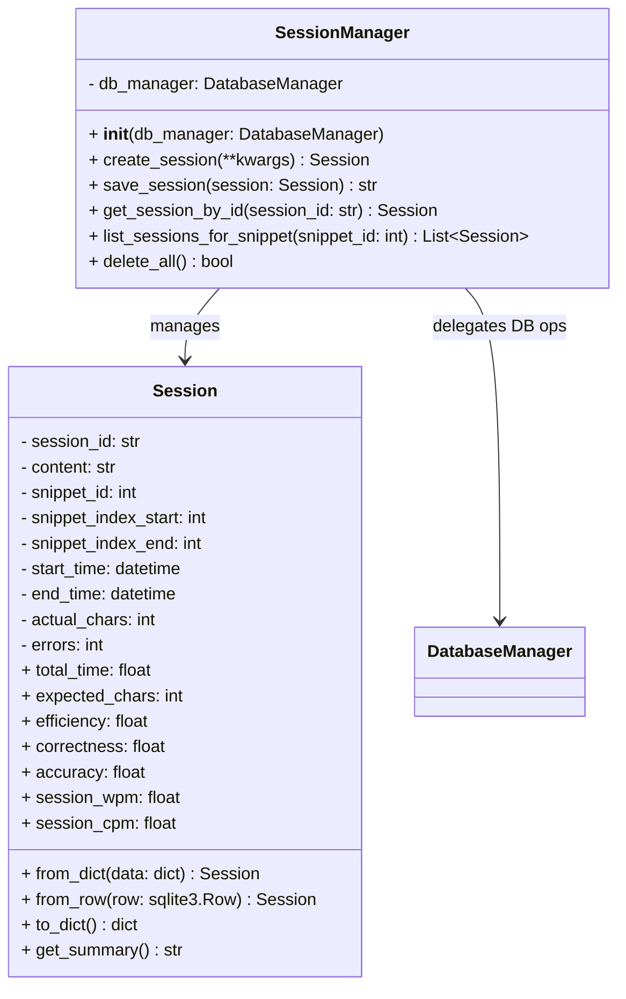

# PracticeSession Object Specification

> **NOTE:** `session_id` is always a **UUID string** throughout the application and database. All APIs, models, and DB tables use UUID session IDs. Any previous references to integer session IDs are obsolete.

## 1. Overview
A PracticeSession tracks a user's typing drill, including timing, indices, stats, and results. Sessions are the core entity for analytics and progress tracking. All business logic, validation, and calculations are strictly enforced in the model layer.

## 2. Data Model
- **session_id**: UUID String (Primary Key, validated)
- **snippet_id**: Integer (Foreign Key to Snippet, required)
- **snippet_index_start**: Integer (>= 0, < snippet_index_end)
- **snippet_index_end**: Integer (> snippet_index_start)
- **start_time**: DateTime (ISO 8601, required)
- **end_time**: DateTime (ISO 8601, required, >= start_time)
- **total_time**: Float (seconds, computed as (end_time - start_time).total_seconds())
- **session_wpm**: Float (computed, read-only)
- **session_cpm**: Float (computed, read-only)
- **expected_chars**: Integer (computed, read-only)
- **actual_chars**: Integer (required)
- **errors**: Integer (>= expected_chars - actual_chars)
- **efficiency**: Float (computed, read-only)
- **correctness**: Float (computed, read-only)
- **accuracy**: Float (computed as correctness * efficiency, read-only)

## 3. Functional Requirements
- Sessions are created at drill start and updated on completion
- All relevant stats and indices are recorded and validated
- All calculated fields are read-only and computed per business rules
- Linked to keystrokes, errors, and ngram results
- All user input is validated and sanitized; all DB operations use parameterized queries

### 3.1 Session Creation
- **session_id**: Unique UUID string generated by the application (if not provided)
- **snippet_id**: Foreign key to Snippet
- **snippet_index_start**: Start index of snippet (>= 0)
- **snippet_index_end**: End index of snippet (> start)
- **start_time**: Time when session starts (ISO 8601)
- **end_time**: Time when session ends (ISO 8601, >= start_time)
- **actual_chars**: Number of characters typed
- **errors**: Number of errors (>= expected_chars - actual_chars)
- All other fields are computed by the model

### 3.2 Session Update
- **end_time**: Time when session ends
- **actual_chars**: Number of characters typed
- **errors**: Number of errors
- All computed fields are updated automatically

## 4. API Endpoints
- `POST /api/sessions`: Start a new session
- `PUT /api/sessions/<id>`: Update session with results
- `GET /api/sessions/<id>`: Fetch session details
- `GET /api/session/info?snippet_id=<id>`: Get most recent session indices for a snippet_id

## 5. UI Requirements
- Sessions are created/managed automatically by the DrillConfig and TypingDrill UIs
- Session summaries shown at drill completion

## 6. Testing
- Backend, API, and UI tests must cover all session creation, update, and retrieval
- All tests must run on a clean DB and be independent
- All model, manager, and API logic is covered by destructive and parameterized tests
- No test uses the production DB; all tests are independent and parameterized

## 7. Security/Validation
- No SQL injection (parameterized queries)
- No sensitive data hardcoded
- All user input is validated and sanitized
- All UUIDs, datetimes, and numeric fields are strictly validated

---

## 8. Implementation Structure
- All PracticeSession API endpoints are implemented in `session_api.py` using a Flask Blueprint (`session_api`).
- Endpoints only handle request/response, validation, and error handling.
- All business logic (creation, update, retrieval, DB access, validation, and calculations) is handled in `models/session.py` and `models/session_manager.py`.
- All DB schema is defined in `db/database_manager.py` and kept in sync with the model.

## 9. Database Structure

### 9.1 practice_sessions Table
- **session_id**: UUID String (Primary Key)
- **snippet_id**: Integer (Foreign Key to Snippet)
- **snippet_index_start**: Integer
- **snippet_index_end**: Integer
- **start_time**: DateTime
- **end_time**: DateTime
- **total_time**: Float (seconds)
- **session_wpm**: Float
- **session_cpm**: Float
- **expected_chars**: Integer
- **actual_chars**: Integer
- **errors**: Integer
- **efficiency**: Float
- **correctness**: Float
- **accuracy**: Float

> See `Prompts/Keystroke.md` for the keystroke table structure and error tracking details.
> See `Prompts/ngram.md` for the n-gram table structure and analysis requirements.

---

## 10. UML Class Diagram (Refreshed May 2025)

