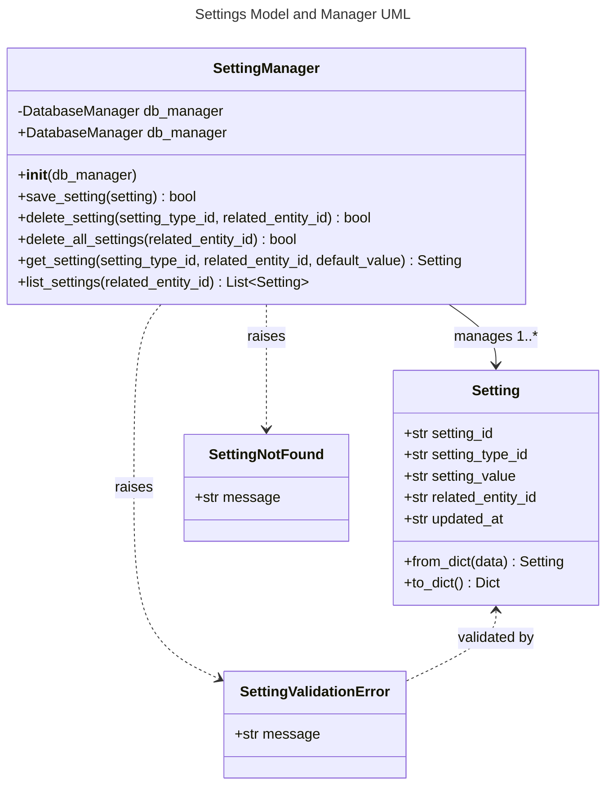

# Settings Object Specification

## 1. Overview
Settings represents a system for storing and retrieving configuration settings associated with entities in the system (users, keyboards, etc.). Each setting is identified by a setting type ID and a related entity ID, with a text value. This enables personalized experiences and preferences across the application.

## 2. Data Model

### Database Schema

#### settings Table
- **setting_id**: TEXT PRIMARY KEY (UUID string, auto-generated if not provided or None)
- **setting_type_id**: TEXT NOT NULL (6-character key identifying the setting type)
- **setting_value**: TEXT NOT NULL (The setting value stored as text)
- **related_entity_id**: TEXT NOT NULL (UUID string, identifying the related entity like a user or keyboard)
- **updated_at**: TEXT NOT NULL (ISO datetime indicating when the setting was last updated)

Constraints:
- UNIQUE (setting_type_id, related_entity_id): Each setting type must be unique per entity

#### settings_history Table
- **history_id**: TEXT PRIMARY KEY (UUID string, auto-generated)
- **setting_id**: TEXT NOT NULL (References settings.setting_id)
- **setting_type_id**: TEXT NOT NULL (6-character key identifying the setting type)
- **setting_value**: TEXT NOT NULL (The setting value stored as text)
- **related_entity_id**: TEXT NOT NULL (UUID string, identifying the related entity)
- **updated_at**: TEXT NOT NULL (ISO datetime when the change was made)

## 3. Functional Requirements
- Settings can be created, updated, retrieved, and deleted
- Each setting is associated with a specific entity via related_entity_id
- Settings have a type ID (6-character identifier) and value (stored as text)
- When retrieving a specific setting by type ID and entity ID, a default value can be provided if the setting doesn't exist
- All validation is performed using Pydantic models and validators
- All database operations use parameterized queries and centralized validation to prevent SQL injection and other attacks
- If setting_id is omitted or None, a new UUID is auto-generated by the model
- Every change to a setting creates a new entry in the settings_history table

## 4. API Endpoints

All settings management is handled via a unified GraphQL endpoint at `/api/graphql`.

**GraphQL Queries:**
- `settings(related_entity_id: String!)`: List all settings for a specific entity
- `setting(setting_type_id: String!, related_entity_id: String!)`: Get a specific setting by type ID and entity ID

**GraphQL Mutations:**
- `saveSetting(setting: SettingInput!)`: Save (insert or update) a setting
- `deleteSetting(setting_type_id: String!, related_entity_id: String!)`: Delete a specific setting
- `deleteAllSettings(related_entity_id: String!)`: Delete all settings for a specific entity

All validation errors are surfaced as GraphQL error responses with clear, specific messages.

## 5. UI Requirements
- Settings management available in both desktop and web UIs
- Add/Edit dialogs must validate input and show clear errors

## 6. Testing
- Backend, API, and UI tests must cover all CRUD operations, validation, and error handling
- All tests must run on a clean DB and be independent
- Model-level tests must cover all field validations and auto-generation of IDs
- Manager-level tests must cover all CRUD, validation, error, and edge cases (including DB error simulation)
- History tracking must be tested thoroughly

## 7. Security/Validation
- No SQL injection (parameterized queries)
- No sensitive data hardcoded
- All user input is validated and sanitized

---

## 8. API Implementation and Structure
- All Settings API operations are implemented in `api/settings_graphql.py` using Graphene and Flask
- The GraphQL schema defines types, queries, and mutations with proper validation
- All business logic (creation, update, deletion, DB access) is handled in `models/setting.py` and `models/setting_manager.py`
- The unified endpoint `/api/graphql` handles all operations
- Error handling and status codes follow GraphQL conventions
- Type hints and docstrings document all components

## 9. Testing, Code Quality, and Security Standards
- All code is formatted with Black and follows PEP 8 style guidelines
- Linting is enforced with flake8; all lint errors are fixed before merging
- All code uses type hints and Pydantic for validation
- All tests use pytest and pytest fixtures for setup/teardown, with DB isolation
- No test uses the production DB; all tests are independent and parameterized
- All Settings CRUD operations, validation, and error handling are covered by backend, API, and UI tests
- No sensitive data is hardcoded. All user input is validated and sanitized
- All database operations use parameterized queries for security

---

## 10. UML Class Diagram

