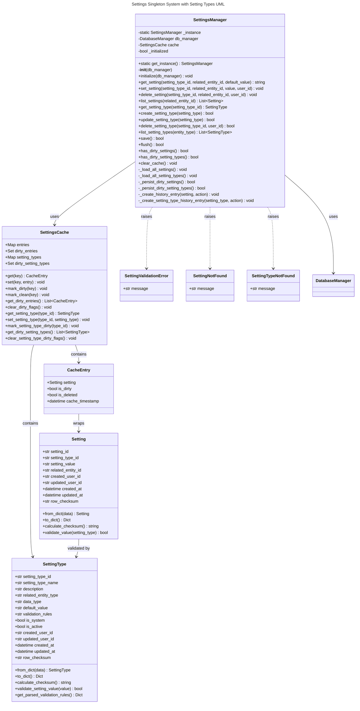

# Settings System Specification

## 1. Main Objective

### Purpose
The Settings System provides a globally accessible, singleton-based configuration management system for storing and retrieving user prefe### 3.6 History Tracking
- **Automatic History**: Every setting and setting type change creates history entry following SCD-2 pattern
- **History Tables**: Separate settings_history and setting_types_history tables with audit columns per history_standards.md
- **Change Detection**: Use row checksums on both base tables and history tables to prevent no-op history entries
- **Version Tracking**: Maintain version numbers for each setting and setting type change
- **Audit Trail**: Complete record of who changed what and when
- **No-Op Prevention**: Compare row checksums before creating history entries to avoid unnecessary audit records and application settings. The system maintains settings in a cached layer with bulk persistence capabilities, enabling efficient read/write operations while preserving a complete audit trail of all changes.

### Scope
- Global singleton access to settings across the entire application
- In-memory caching with dirty flag tracking for optimal performance
- Bulk persistence operations for efficient database writes
- Complete audit trail using SCD-2 history tables
- Support for user-specific and keyboard-specific settings
- Platform-agnostic implementation (desktop, cloud, web)

## 2. User Stories & Use Cases

### User Stories
- As a user, I want my settings to be remembered across sessions so I have a consistent experience
- As a user, I want my changes to be saved efficiently without blocking the UI
- As a developer, I want to access settings from any module without dependency injection
- As an administrator, I want to see a complete history of setting changes for audit purposes
- As an administrator, I want to manage setting types through a dedicated UI interface
- As an administrator, I want to define new setting types with validation rules and defaults
- As an administrator, I want to view the history of changes to setting type definitions

### Use Cases
1. **Application Startup**: Load all settings and setting types into cache for fast access
2. **Setting Retrieval**: Get setting values from cache with optional defaults from setting type
3. **Setting Modification**: Update settings in cache with validation against setting type rules
4. **Bulk Persistence**: Save all modified settings to database in a single transaction
5. **History Tracking**: Maintain complete audit trail of all setting and setting type changes
6. **Cross-Module Access**: Access settings from any application module without coupling
7. **Setting Type Management**: Create, edit, and manage setting type definitions through admin UI
8. **Setting Type Validation**: Validate setting values against their type definitions
9. **Setting Type History**: Track changes to setting type definitions for compliance

### Personas
- **End Users**: Need consistent, personalized application behavior
- **Developers**: Need simple, global access to configuration data
- **System Administrators**: Need audit capabilities for compliance and troubleshooting

## 5. Data Model & Design

### 5.1 Database Schema

#### setting_types Table
- **setting_type_id**: TEXT PRIMARY KEY (6-character key identifying the setting type)
- **setting_type_name**: TEXT NOT NULL (Human-readable name for the setting type)
- **description**: TEXT NOT NULL (Detailed description of what this setting controls)
- **related_entity_type**: TEXT NOT NULL (Type of entity this setting applies to: 'user', 'keyboard', 'global')
- **data_type**: TEXT NOT NULL (Expected data type: 'string', 'integer', 'boolean', 'decimal')
- **default_value**: TEXT (Default value as text, null if no default)
- **validation_rules**: TEXT (JSON string with validation rules like min/max, regex pattern, etc.)
- **is_system**: BOOLEAN NOT NULL DEFAULT false (True for system settings that cannot be deleted)
- **is_active**: BOOLEAN NOT NULL DEFAULT true (False to disable a setting type)
- **created_user_id**: UUID NOT NULL (User who created this setting type)
- **updated_user_id**: UUID NOT NULL (User who last updated this setting type)
- **created_at**: TIMESTAMPTZ NOT NULL (When setting type was first created)
- **updated_at**: TIMESTAMPTZ NOT NULL (When setting type was last updated)
- **row_checksum**: TEXT NOT NULL (SHA-256 hash of business columns for no-op detection)

Constraints:
- CHECK (setting_type_id ~ '^[A-Z0-9]{6}$'): Setting type ID must be 6 uppercase characters/digits
- CHECK (related_entity_type IN ('user', 'keyboard', 'global')): Valid entity types only
- CHECK (data_type IN ('string', 'integer', 'boolean', 'decimal')): Valid data types only

#### setting_types_history Table (SCD-2 Pattern)
Following the standards defined in history_standards.md:

- **audit_id**: BIGINT IDENTITY PRIMARY KEY (Surrogate key for history row)
- **setting_type_id**: TEXT NOT NULL (References setting_types.setting_type_id)
- **setting_type_name**: TEXT NOT NULL (Human-readable name for the setting type)
- **description**: TEXT NOT NULL (Detailed description of what this setting controls)
- **related_entity_type**: TEXT NOT NULL (Type of entity this setting applies to)
- **data_type**: TEXT NOT NULL (Expected data type)
- **default_value**: TEXT (Default value as text)
- **validation_rules**: TEXT (JSON string with validation rules)
- **is_system**: BOOLEAN NOT NULL (True for system settings)
- **is_active**: BOOLEAN NOT NULL (False to disable a setting type)
- **created_user_id**: UUID NOT NULL (User who created this setting type)
- **updated_user_id**: UUID NOT NULL (User who last updated this setting type)
- **action**: TEXT NOT NULL CHECK (action IN ('I','U','D')) (Insert, Update, Delete)
- **version_no**: INTEGER NOT NULL (Version number per setting type, starts at 1)
- **valid_from**: TIMESTAMPTZ NOT NULL (When this version becomes effective)
- **valid_to**: TIMESTAMPTZ NOT NULL DEFAULT '9999-12-31' (Exclusive end date)
- **is_current**: BOOLEAN NOT NULL (True for current version)
- **recorded_at**: TIMESTAMPTZ NOT NULL DEFAULT now() (When history row was inserted)
- **row_checksum**: TEXT NOT NULL (Hash of business columns to detect no-ops)

Constraints:
- UNIQUE (setting_type_id, version_no): Version numbers are unique per setting type
- At most one row per setting_type_id where is_current = true

#### settings Table
- **setting_id**: TEXT PRIMARY KEY (UUID string, auto-generated if not provided or None)
- **setting_type_id**: TEXT NOT NULL REFERENCES setting_types(setting_type_id) (Foreign key to setting types)
- **setting_value**: TEXT NOT NULL (The setting value stored as text)
- **related_entity_id**: TEXT NOT NULL (UUID string, identifying the related entity like a user or keyboard)
- **created_user_id**: UUID NOT NULL (User who created this setting)
- **updated_user_id**: UUID NOT NULL (User who last updated this setting)
- **created_at**: TIMESTAMPTZ NOT NULL (ISO datetime when setting was first created)
- **updated_at**: TIMESTAMPTZ NOT NULL (ISO datetime when setting was last updated)
- **row_checksum**: TEXT NOT NULL (SHA-256 hash of business columns for no-op detection)

Constraints:
- UNIQUE (setting_type_id, related_entity_id): Each setting type must be unique per entity
- FOREIGN KEY (setting_type_id) REFERENCES setting_types(setting_type_id)

#### settings_history Table (SCD-2 Pattern)
Following the standards defined in history_standards.md:

- **audit_id**: BIGINT IDENTITY PRIMARY KEY (Surrogate key for history row)
- **setting_id**: TEXT NOT NULL (References settings.setting_id)
- **setting_type_id**: TEXT NOT NULL (6-character key identifying the setting type)
- **setting_value**: TEXT NOT NULL (The setting value stored as text)
- **related_entity_id**: TEXT NOT NULL (UUID string, identifying the related entity)
- **created_user_id**: UUID NOT NULL (User who created this setting)
- **updated_user_id**: UUID NOT NULL (User who last updated this setting)
- **action**: TEXT NOT NULL CHECK (action IN ('I','U','D')) (Insert, Update, Delete)
- **version_no**: INTEGER NOT NULL (Version number per setting, starts at 1)
- **valid_from**: TIMESTAMPTZ NOT NULL (When this version becomes effective)
- **valid_to**: TIMESTAMPTZ NOT NULL DEFAULT '9999-12-31' (Exclusive end date)
- **is_current**: BOOLEAN NOT NULL (True for current version)
- **recorded_at**: TIMESTAMPTZ NOT NULL DEFAULT now() (When history row was inserted)
- **row_checksum**: TEXT NOT NULL (Hash of business columns to detect no-ops)

Constraints:
- UNIQUE (setting_id, version_no): Version numbers are unique per setting
- At most one row per setting_id where is_current = true

### 5.2 Cache Structure
```pseudocode
SettingType {
    setting_type_id: string
    setting_type_name: string
    description: string
    related_entity_type: string
    data_type: string
    default_value: string
    validation_rules: string
    is_system: boolean
    is_active: boolean
    created_user_id: string
    updated_user_id: string
    created_at: datetime
    updated_at: datetime
    row_checksum: string
}

CacheEntry {
    setting_id: string
    setting_type_id: string
    setting_value: string
    related_entity_id: string
    created_user_id: string
    updated_user_id: string
    created_at: datetime
    updated_at: datetime
    row_checksum: string
    is_dirty: boolean
    is_deleted: boolean
}

SettingsCache {
    entries: Map<(setting_type_id, related_entity_id), CacheEntry>
    dirty_entries: Set<(setting_type_id, related_entity_id)>
    setting_types: Map<setting_type_id, SettingType>
    dirty_setting_types: Set<setting_type_id>
}
```

## 3. Functional Requirements

### 3.1 Singleton Pattern
- **Global Instance**: Single SettingsManager instance accessible throughout the application
- **Thread Safety**: Singleton implementation must be thread-safe for concurrent access
- **Initialization**: Automatic initialization on first access with database preloading
- **Global Access Method**: `SettingsManager.get_instance()` returns the singleton instance

### 3.2 Caching System
- **Cache Loading**: On initialization, load all settings and setting types from database into memory cache
- **Cache Structure**: Dictionary-based cache keyed by (setting_type_id, related_entity_id) for settings and setting_type_id for types
- **Dirty Flag Tracking**: Each cached setting and setting type maintains a dirty flag indicating unsaved changes
- **Read Operations**: All get operations read from cache for optimal performance
- **Cache Consistency**: Cache remains consistent with database through controlled write operations

### 3.3 Setting Type Management
- **Setting Type CRUD**: Create, read, update, and delete setting type definitions
- **Type Validation**: Validate setting type definitions including data types and validation rules
- **Default Values**: Support default values for setting types that are applied when no setting exists
- **Entity Type Association**: Associate setting types with specific entity types (user, keyboard, global)
- **System Protection**: Prevent deletion or modification of system-defined setting types
- **Active/Inactive States**: Support enabling/disabling setting types without deletion

### 3.4 Setting Operations
- **Get Setting**: Retrieve setting value from cache with fallback to setting type default if not found
- **Set Setting**: Update setting value in cache with validation against setting type rules and mark as dirty
- **Delete Setting**: Mark setting for deletion in cache
- **List Settings**: Return all settings for a specific entity from cache
- **Setting Validation**: Validate setting values against their setting type definitions using data type and validation rules

### 3.5 Bulk Persistence
- **Save Method**: `save()` or `flush()` persists all dirty settings and setting types to database
- **Bulk Operations**: Use DatabaseManager's execute_many() for efficient batch writes
- **Transaction Safety**: All persistence operations wrapped in database transactions
- **Dirty Flag Reset**: Clear all dirty flags after successful database write
- **Error Handling**: On persistence failure, maintain dirty flags for retry capability

### 3.6 History Tracking
- **Automatic History**: Every setting and setting type change creates history entry following SCD-2 pattern
- **History Tables**: Separate settings_history and setting_types_history tables with audit columns per history_standards.md
- **Change Detection**: Use row checksums to prevent no-op history entries
- **Version Tracking**: Maintain version numbers for each setting change
- **Audit Trail**: Complete record of who changed what and when

## 4. Non-Functional Requirements

### Performance
- **Cache Response Time**: Setting retrieval from cache < 1ms
- **Bulk Write Performance**: Support batch writes of 1000+ settings efficiently
- **Memory Usage**: Cache size reasonable relative to total application memory
- **Startup Time**: Initial cache loading < 2 seconds for typical datasets

### Security
- **Input Validation**: All setting values validated and sanitized
- **SQL Injection Prevention**: Parameterized queries for all database operations
- **Access Control**: Entity-based access control for setting modifications
- **Audit Compliance**: Complete audit trail for security and compliance requirements

### Reliability
- **Data Consistency**: Cache and database remain consistent through controlled writes
- **Error Recovery**: Failed operations maintain cache state for retry
- **Transaction Integrity**: Database writes use transactions to ensure consistency
- **Graceful Degradation**: System continues functioning if cache operations fail

### Portability
- **Platform Independence**: Works on desktop, cloud, and web implementations
- **Database Agnostic**: Compatible with both SQLite and PostgreSQL backends
- **Framework Independence**: Core functionality not tied to specific UI frameworks

### 5.3 UML Class Diagram



## 6. Acceptance Criteria

### 6.1 Singleton Implementation
- ✅ Only one SettingsManager instance exists per application lifecycle
- ✅ Multiple calls to get_instance() return the same object
- ✅ Thread-safe initialization in concurrent environments
- ✅ Automatic initialization on first access

### 6.2 Caching Functionality
- ✅ All settings and setting types loaded into cache on initialization
- ✅ Get operations return values from cache (not database)
- ✅ Set operations update cache and mark entries as dirty
- ✅ Cache remains consistent with database after save operations

### 6.3 Setting Type Management
- ✅ Create new setting types with validation rules and defaults
- ✅ Update existing setting types (except system-protected ones)
- ✅ Delete non-system setting types when no settings reference them
- ✅ List setting types filtered by entity type
- ✅ Validate setting values against their type definitions
- ✅ Setting type changes create appropriate history entries

### 6.4 Bulk Persistence
- ✅ save() method persists all dirty settings and setting types in a single transaction
- ✅ Dirty flags cleared only after successful database write
- ✅ Failed saves preserve dirty flags for retry capability
- ✅ Uses DatabaseManager's execute_many for efficiency

### 6.5 History Tracking
- ✅ Every setting and setting type change creates appropriate history entry
- ✅ History follows SCD-2 pattern with version tracking
- ✅ No-op updates (identical values) do not create history entries
- ✅ Complete audit trail with user attribution

### 6.6 Performance Criteria
- ✅ Setting retrieval from cache completes in < 1ms
- ✅ Setting type retrieval from cache completes in < 1ms
- ✅ Bulk save of 100 settings completes in < 500ms
- ✅ Initial cache loading completes in < 2 seconds
- ✅ Memory usage scales reasonably with setting count

### 6.7 Error Handling
- ✅ Invalid setting types raise SettingValidationError
- ✅ Missing settings return defaults from setting type definitions
- ✅ Setting values validated against type rules before saving
- ✅ Database errors preserve cache state
- ✅ Graceful handling of concurrent access scenarios

## 7. User Interface & Experience

### 7.1 Developer Interface
```pseudocode
// Global access pattern
settings = SettingsManager.get_instance()

// Reading settings with defaults from setting type
keyboard_id = settings.get_setting("LSTKBD", user_id)  // Uses setting type default if not found
drill_length = settings.get_setting("DRILEN", keyboard_id)  // Uses setting type default

// Updating settings (validated against setting type)
settings.set_setting("LSTKBD", user_id, new_keyboard_id, current_user_id)
settings.set_setting("DRILEN", keyboard_id, "300", current_user_id)  // Validates as integer

// Working with setting types
setting_type = settings.get_setting_type("LSTKBD")
print(f"Default: {setting_type.default_value}, Type: {setting_type.data_type}")

// Bulk persistence
success = settings.save()
```

### 7.2 Administrative Interface

#### Setting Type Management UI
- **Setting Type List View**: Grid showing all setting types with columns for ID, name, entity type, data type, and active status
- **Setting Type Create/Edit Dialog**: Form with fields for:
  - Setting Type ID (6-character code, auto-generated or manual)
  - Setting Type Name (human-readable name)
  - Description (detailed explanation of purpose)
  - Related Entity Type (dropdown: user, keyboard, global)
  - Data Type (dropdown: string, integer, boolean, decimal)
  - Default Value (optional, validated against data type)
  - Validation Rules (JSON editor for complex rules)
  - Is System (checkbox, prevents deletion when checked)
  - Is Active (checkbox, enables/disables the setting type)
- **Setting Type History View**: Timeline showing all changes to setting type definitions
- **Setting Type Validation**: Real-time validation of forms with clear error messages
- **Bulk Operations**: Export/import setting type definitions for environment promotion

#### Settings Management UI
- **Settings Overview**: Dashboard showing settings grouped by entity type
- **Settings History**: Complete audit trail with filtering by user, entity, and time range
- **Bulk Export/Import**: Configuration management for environment synchronization
- **Setting Validation**: Display validation errors when setting values don't match type rules

#### Navigation & Security
- **Admin Menu**: Dedicated admin section accessible only to authorized users
- **Permission Checks**: Role-based access control for setting type management
- **Confirmation Dialogs**: Require confirmation for destructive operations
- **Help Documentation**: Context-sensitive help explaining setting types and validation rules

## 8. Integration & Interoperability

### 8.1 Database Integration
- **DatabaseManager Dependency**: Uses existing DatabaseManager for all persistence operations
- **Bulk Operations**: Leverages DatabaseManager's execute_many() method for efficient batch writes
- **Transaction Support**: Wraps all write operations in database transactions
- **Backend Compatibility**: Works with both SQLite (local) and PostgreSQL (cloud) backends

### 8.2 API Integration
- **GraphQL Endpoint**: Unified `/api/graphql` endpoint for all settings operations
- **REST Compatibility**: Can be extended to support REST endpoints if needed
- **Authentication**: Integrates with existing user authentication system
- **Validation**: Uses Pydantic models for consistent validation across API layers

### 8.3 Module Integration
- **Global Access**: Available to all modules without explicit dependency injection
- **Initialization**: Automatic initialization with application startup
- **Event System**: Can publish setting change events for reactive components
- **Configuration Loading**: Integrates with application configuration management

## 9. Constraints & Assumptions

### 9.1 Technical Constraints
- **Memory Limitations**: Cache size must be reasonable for application memory constraints
- **Database Performance**: Bulk write operations must not block application for extended periods
- **Thread Safety**: Must support concurrent access in multi-threaded environments
- **Startup Dependencies**: DatabaseManager must be available before first settings access

### 9.2 Business Constraints
- **Setting Types**: Limited to predefined 6-character setting type codes
- **Value Storage**: All values stored as text requiring type conversion at application layer
- **Entity Association**: Settings must be associated with valid entity IDs
- **User Attribution**: All changes must be attributed to authenticated users

### 9.3 Assumptions
- **Database Availability**: Database connection is stable and available during operations
- **Setting Volume**: Total number of settings remains reasonable for in-memory caching
- **Change Frequency**: Setting changes are relatively infrequent compared to reads
- **Entity Lifecycle**: Related entities (users, keyboards) have longer lifecycle than settings

The following table contains all currently defined setting keys used in the application:

| Key    | Description                                      | Related Entity ID         | Value (setting_value)         | Default Value               |
|--------|--------------------------------------------------|--------------------------|-------------------------------|-----------------------------|
| LSTKBD | Last used keyboard for a user in the desktop UI  | user_id                  | keyboard_id (UUID string)     | None                        |
| DRICAT | Last selected drill category                     | keyboard_id              | category_name (string)        | None                        |
| DRISNP | Last selected drill snippet                      | keyboard_id              | snippet_name (string)         | None                        |
| DRILEN | Drill length (characters to type)                | keyboard_id              | length (integer as string)    | None                        |
| NGRSZE | N-gram Size                                      | keyboard_id              | size (integer as string)      | "4"                         |
| NGRCNT | N-gram Count                                     | keyboard_id              | count (integer as string)     | "5"                         |
| NGRMOC | N-gram Minimum Occurrences                       | keyboard_id              | count (integer as string)     | "5"                         |
| NGRLEN | N-gram Practice Length                           | keyboard_id              | length (integer as string)    | "200"                       |
| NGRKEY | N-gram Included Keys                             | keyboard_id              | keys (string)                 | "ueocdtsn"                  |
| NGRTYP | N-gram Practice Type                             | keyboard_id              | type (string)                 | "pure ngram"                |
| NGRFST | Focus on Speed Target (filter slower than target)| keyboard_id              | boolean ("true"/"false")      | "false"                     |

### 11.1 User Settings

#### LSTKBD - Last Used Keyboard
- **Description**: Stores the last keyboard used by a specific user in the desktop UI
- **Related Entity ID**: user_id (UUID string)
- **Setting Value**: keyboard_id (UUID string)
- **Default Value**: None
- **Purpose**: Provides a personalized experience by remembering the user's last selected keyboard in the UI

### 11.2 Drill Configuration Settings

#### DRICAT - Last Selected Drill Category
- **Description**: Stores the last used category in the drill configuration screen
- **Related Entity ID**: keyboard_id (UUID string)
- **Setting Value**: category_name (string)
- **Default Value**: None
- **Purpose**: Remembers the user's category selection for a specific keyboard

#### DRISNP - Last Selected Drill Snippet
- **Description**: Stores the last used snippet in the drill configuration screen
- **Related Entity ID**: keyboard_id (UUID string)
- **Setting Value**: snippet_name (string)
- **Default Value**: None
- **Purpose**: Remembers the user's snippet selection for a specific keyboard

#### DRILEN - Drill Length
- **Description**: Stores the last used drill length in the drill configuration screen
- **Related Entity ID**: keyboard_id (UUID string)
- **Setting Value**: length (integer as string)
- **Default Value**: None
- **Purpose**: Remembers the user's preferred drill length for a specific keyboard

### 11.3 N-gram Practice Settings

#### NGRSZE - N-gram Size
- **Description**: The size of n-grams to analyze and practice
- **Related Entity ID**: keyboard_id (UUID string)
- **Setting Value**: size (integer as string)
- **Default Value**: "4"
- **Purpose**: Configures the size of n-grams in the Dynamic N-gram Practice Configuration

#### NGRCNT - N-gram Count
- **Description**: Number of top problematic n-grams to focus on
- **Related Entity ID**: keyboard_id (UUID string)
- **Setting Value**: count (integer as string)
- **Default Value**: "5"
- **Purpose**: Configures how many top problematic n-grams to include in practice

#### NGRLEN - N-gram Practice Length
- **Description**: Length of generated practice content in characters
- **Related Entity ID**: keyboard_id (UUID string)
- **Setting Value**: length (integer as string)
- **Default Value**: "200"
- **Purpose**: Determines the total length of the generated practice content

#### NGRKEY - N-gram Included Keys
- **Description**: Characters to include in practice content
- **Related Entity ID**: keyboard_id (UUID string)
- **Setting Value**: keys (string)
- **Default Value**: "ueocdtsn"
- **Purpose**: Specifies which characters should be included in the generated practice content

#### NGRTYP - N-gram Practice Type
- **Description**: Type of practice content generation
- **Related Entity ID**: keyboard_id (UUID string)
- **Setting Value**: type (string)
- **Default Value**: "pure ngram"
- **Valid Values**: "pure ngram", "words", "both"
- **Purpose**: Determines how practice content should be generated

#### NGRFST - Focus on Speed Target
- **Description**: When enabled, practice focuses only on n-grams that are currently slower than the keyboard's target speed.
- **Related Entity ID**: keyboard_id (UUID string)
- **Setting Value**: boolean ("true"/"false")
- **Default Value**: "false"
- **Purpose**: Filters the n-gram candidates to those not meeting the target speed using the precomputed `meets_target` flag from `ngram_speed_summary_curr`. This is passed to `NGramAnalyticsService.slowest_n(..., focus_on_speed_target=True)` and reflected in the Dynamic N-gram configuration checkbox "Focus on speed target".

### 11.4 General Application Settings
Additional setting type IDs may be defined here as the application grows.

---

## 13. Implementation Guidelines

### 13.1 Singleton Implementation Pattern
```pseudocode
class SettingsManager:
    private static instance = null
    private static lock = threading.Lock()
    
    public static get_instance():
        if instance is null:
            with lock:
                if instance is null:  // Double-checked locking
                    instance = new SettingsManager()
        return instance
```

### 13.2 Cache Management Pattern
```pseudocode
class SettingsCache:
    private entries = Map<(type_id, entity_id), CacheEntry>
    private dirty_entries = Set<(type_id, entity_id)>
    
    public get(type_id, entity_id, default_value):
        key = (type_id, entity_id)
        if key in entries and not entries[key].is_deleted:
            return entries[key].setting.value
        return default_value
    
    public set(type_id, entity_id, value, user_id):
        key = (type_id, entity_id)
        entry = entries.get(key) or create_new_entry()
        entry.setting.value = value
        entry.setting.updated_user_id = user_id
        entry.is_dirty = true
        entries[key] = entry
        dirty_entries.add(key)
```

### 13.3 Bulk Persistence Pattern
```pseudocode
public save():
    dirty_settings = cache.get_dirty_entries()
    if dirty_settings.is_empty():
        return true
    
    try:
        begin_transaction()
        
        // Prepare bulk insert/update data
        insert_data = []
        update_data = []
        history_data = []
        
        for entry in dirty_settings:
            // Calculate row checksum before save
            new_checksum = entry.setting.calculate_checksum()
            
            // Check for no-op updates
            if entry.is_existing() and entry.setting.row_checksum == new_checksum:
                continue  // Skip no-op updates
            
            entry.setting.row_checksum = new_checksum
            
            if entry.is_new():
                insert_data.append(entry.to_insert_params())
            else:
                update_data.append(entry.to_update_params())
            history_data.append(entry.to_history_params())
        
        // Execute bulk operations
        if insert_data:
            db_manager.execute_many(INSERT_SQL, insert_data)
        if update_data:
            db_manager.execute_many(UPDATE_SQL, update_data)
        if history_data:
            db_manager.execute_many(HISTORY_INSERT_SQL, history_data)
        
        commit_transaction()
        cache.clear_dirty_flags()
        return true
        
    except Exception as e:
        rollback_transaction()
        log_error(e)
        return false
```

### 13.4 Row Checksum Calculation Pattern
```pseudocode
class Setting:
    public calculate_checksum():
        // Include all business columns except audit fields
        business_data = concatenate(
            setting_type_id,
            setting_value,
            related_entity_id
        )
        return sha256_hash(business_data)

class SettingType:
    public calculate_checksum():
        // Include all business columns except audit fields
        business_data = concatenate(
            setting_type_id,
            setting_type_name,
            description,
            related_entity_type,
            data_type,
            default_value,
            validation_rules,
            is_system,
            is_active
        )
        return sha256_hash(business_data)
```

---

This comprehensive specification defines a robust, singleton-based settings system with caching, bulk persistence, and complete audit trail capabilities suitable for implementation across desktop, cloud, and web platforms.

## 10. Testing Requirements

### 10.1 Unit Tests
**Singleton Pattern Tests:**
- ✅ Test that get_instance() always returns the same object
- ✅ Test thread-safe initialization in concurrent scenarios
- ✅ Test that multiple initialization calls don't corrupt state

**Cache Management Tests:**
- ✅ Test cache loading from database on initialization (settings and setting types)
- ✅ Test cache hit/miss scenarios for get operations
- ✅ Test dirty flag management for set operations
- ✅ Test cache consistency after save operations

**Setting Type Management Tests:**
- ✅ Test create_setting_type with valid and invalid data
- ✅ Test update_setting_type with validation rules
- ✅ Test delete_setting_type with foreign key constraints
- ✅ Test list_setting_types filtered by entity type
- ✅ Test setting type validation rule parsing and application
- ✅ Test system setting type protection from deletion

**Setting Operations Tests:**
- ✅ Test get_setting with existing values, setting type defaults, and missing keys
- ✅ Test set_setting with validation against setting type rules
- ✅ Test setting value validation against data type constraints
- ✅ Test delete_setting and soft delete behavior
- ✅ Test list_settings for specific entities

**Bulk Persistence Tests:**
- ✅ Test save() with multiple dirty settings and setting types
- ✅ Test transaction rollback on persistence failures
- ✅ Test dirty flag clearing after successful saves
- ✅ Test retry capability after failed saves

### 10.2 Integration Tests
**Database Integration:**
- ✅ Test with both SQLite and PostgreSQL backends
- ✅ Test DatabaseManager execute_many integration
- ✅ Test transaction boundary management
- ✅ Test database error handling and recovery
- ✅ Test foreign key constraints between settings and setting_types tables

**History Table Tests:**
- ✅ Test history entry creation for settings (INSERT, UPDATE, DELETE operations)
- ✅ Test history entry creation for setting types (INSERT, UPDATE, DELETE operations)
- ✅ Test SCD-2 pattern with version tracking and validity periods
- ✅ Test no-op detection using row checksums for both tables
- ✅ Test history query operations (current, as-of, change log)

### 10.3 Performance Tests
- ✅ Test cache response time under load (target: < 1ms for gets)
- ✅ Test bulk save performance with varying batch sizes
- ✅ Test memory usage scaling with setting count
- ✅ Test initialization time with large setting datasets

### 10.4 Error Handling Tests
- ✅ Test validation error scenarios with invalid inputs
- ✅ Test database connection failure handling
- ✅ Test concurrent access conflict resolution
- ✅ Test graceful degradation when cache operations fail

### 10.5 Security Tests
- ✅ Test SQL injection prevention with malformed inputs
- ✅ Test access control for entity-specific settings
- ✅ Test audit trail completeness for compliance
- ✅ Test data sanitization and validation

### 10.6 User Interface Tests
**Setting Type Management UI:**
- ✅ Test setting type list view with sorting and filtering
- ✅ Test setting type create/edit dialog validation
- ✅ Test setting type deletion with foreign key constraints
- ✅ Test setting type history view with timeline navigation
- ✅ Test validation rule editor with JSON syntax validation
- ✅ Test bulk export/import functionality

**Settings Management UI:**
- ✅ Test settings overview dashboard with entity grouping
- ✅ Test settings history audit trail with filtering
- ✅ Test setting value validation against type rules in real-time
- ✅ Test bulk configuration management operations

**Administrative Interface:**
- ✅ Test role-based access control for admin functions
- ✅ Test confirmation dialogs for destructive operations
- ✅ Test context-sensitive help system
- ✅ Test responsive design across desktop, tablet, and mobile

## 11. Glossary & References

### 11.1 Glossary
- **Cache Entry**: In-memory representation of a setting with metadata
- **Dirty Flag**: Boolean indicator that a cached setting or setting type has unsaved changes
- **Entity ID**: UUID identifying the owner of settings (user, keyboard, etc.)
- **Entity Type**: Category of entity that owns settings (user, keyboard, global)
- **Setting Type**: Definition template that describes validation rules, data types, and defaults for settings
- **Setting Type ID**: 6-character code identifying the type of setting
- **SCD-2**: Slowly Changing Dimension Type 2 - history pattern with versioning
- **Singleton**: Design pattern ensuring only one instance exists globally
- **System Setting Type**: Built-in setting type that cannot be deleted or modified
- **Validation Rules**: JSON-encoded rules that define constraints for setting values

### 11.2 References
- **DatabaseManager**: `db/database_manager.py` - Database abstraction layer
- **History Standards**: `MemoriesAndRules/history_standards.md` - Audit table standards
- **Requirement Standards**: `MemoriesAndRules/RequirementDocuments.md` - Documentation template

---

## 12. Defined Setting Keys
