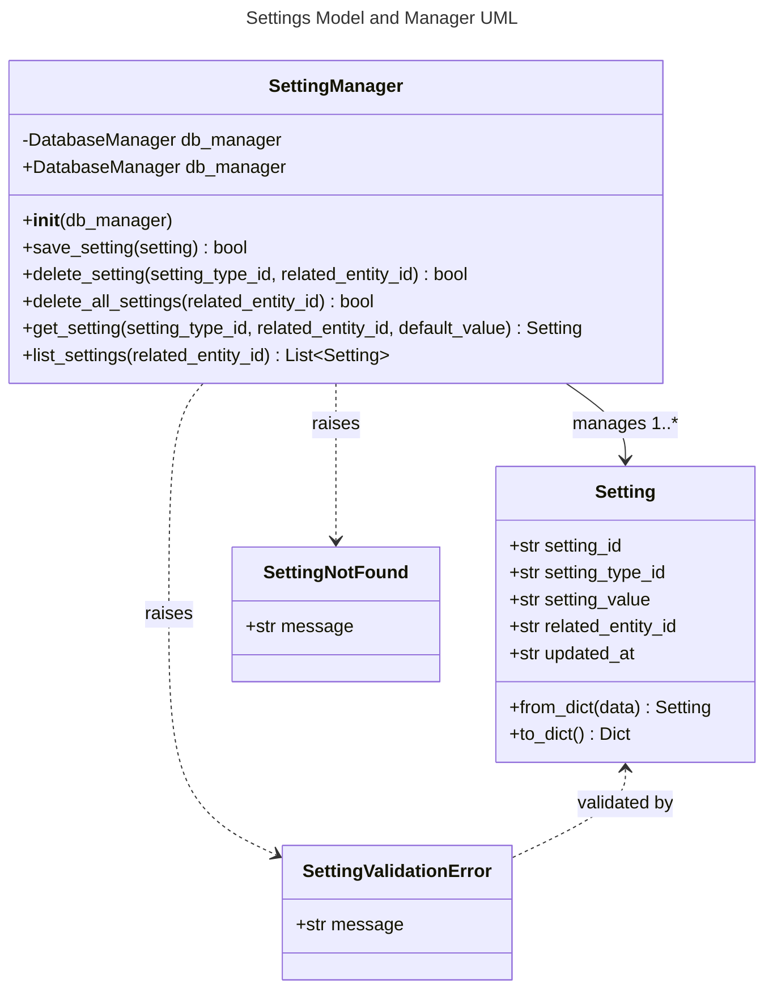

# Settings Object Specification

## 1. Overview
Settings represents a system for storing and retrieving configuration settings associated with entities in the system (users, keyboards, etc.). Each setting is identified by a setting type ID and a related entity ID, with a text value. This enables personalized experiences and preferences across the application.

## 2. Data Model

### Database Schema

#### settings Table
- **setting_id**: TEXT PRIMARY KEY (UUID string, auto-generated if not provided or None)
- **setting_type_id**: TEXT NOT NULL (6-character key identifying the setting type)
- **setting_value**: TEXT NOT NULL (The setting value stored as text)
- **related_entity_id**: TEXT NOT NULL (UUID string, identifying the related entity like a user or keyboard)
- **updated_at**: TEXT NOT NULL (ISO datetime indicating when the setting was last updated)

Constraints:
- UNIQUE (setting_type_id, related_entity_id): Each setting type must be unique per entity (attempting to save a duplicate will update the existing setting)

#### settings_history Table
- **history_id**: TEXT PRIMARY KEY (UUID string, auto-generated)
- **setting_id**: TEXT NOT NULL (References settings.setting_id)
- **setting_type_id**: TEXT NOT NULL (6-character key identifying the setting type)
- **setting_value**: TEXT NOT NULL (The setting value stored as text)
- **related_entity_id**: TEXT NOT NULL (UUID string, identifying the related entity)
- **updated_at**: TEXT NOT NULL (ISO datetime when the change was made)

## 3. Functional Requirements
- Settings can be created, updated, retrieved, and deleted
- Each setting is associated with a specific entity via related_entity_id
- Settings have a type ID (6-character identifier) and value (stored as text)
- When retrieving a specific setting by type ID and entity ID, a default value can be provided if the setting doesn't exist
- If a setting with the same type_id and related_entity_id already exists, saving a new setting with those identifiers will update the existing setting
- All validation is performed using Pydantic models and validators
- All database operations use parameterized queries and centralized validation to prevent SQL injection and other attacks
- If setting_id is omitted or None, a new UUID is auto-generated by the model
- Every change to a setting (creation or update) creates a new entry in the settings_history table with the appropriate setting_id

## 4. API Endpoints

All settings management is handled via a unified GraphQL endpoint at `/api/graphql`.

**GraphQL Queries:**
- `settings(related_entity_id: String!)`: List all settings for a specific entity
- `setting(setting_type_id: String!, related_entity_id: String!)`: Get a specific setting by type ID and entity ID

**GraphQL Mutations:**
- `saveSetting(setting: SettingInput!)`: Save (insert or update) a setting. If a setting with the same type_id and related_entity_id already exists, it will be updated with the new value.
- `deleteSetting(setting_type_id: String!, related_entity_id: String!)`: Delete a specific setting
- `deleteAllSettings(related_entity_id: String!)`: Delete all settings for a specific entity

All validation errors are surfaced as GraphQL error responses with clear, specific messages.

## 5. UI Requirements
- Settings management available in both desktop and web UIs
- Add/Edit dialogs must validate input and show clear errors

## 6. Testing
- Backend, API, and UI tests must cover all CRUD operations, validation, and error handling
- All tests must run on a clean DB and be independent
- Model-level tests must cover all field validations and auto-generation of IDs
- Manager-level tests must cover all CRUD, validation, error, and edge cases (including DB error simulation)
- History tracking must be tested thoroughly

## 7. Security/Validation
- No SQL injection (parameterized queries)
- No sensitive data hardcoded
- All user input is validated and sanitized

---

## 8. API Implementation and Structure
- All Settings API operations are implemented in `api/settings_graphql.py` using Graphene and Flask
- The GraphQL schema defines types, queries, and mutations with proper validation
- All business logic (creation, update, deletion, DB access) is handled in `models/setting.py` and `models/setting_manager.py`
- The unified endpoint `/api/graphql` handles all operations
- Error handling and status codes follow GraphQL conventions
- Type hints and docstrings document all components

## 9. Testing, Code Quality, and Security Standards
- All code is formatted with Black and follows PEP 8 style guidelines
- Linting is enforced with flake8; all lint errors are fixed before merging
- All code uses type hints and Pydantic for validation
- All tests use pytest and pytest fixtures for setup/teardown, with DB isolation
- No test uses the production DB; all tests are independent and parameterized
- All Settings CRUD operations, validation, and error handling are covered by backend, API, and UI tests
- Tests specifically verify that saving a setting with existing type_id and entity_id updates the existing record and creates appropriate history entries
- No sensitive data is hardcoded. All user input is validated and sanitized
- All database operations use parameterized queries for security

---

## 10. UML Class Diagram

## 11. Defined Setting Keys

The following table contains all currently defined setting keys used in the application:

| Key    | Description                                      | Related Entity ID         | Value (setting_value)         | Default Value               |
|--------|--------------------------------------------------|--------------------------|-------------------------------|-----------------------------|
| LSTKBD | Last used keyboard for a user in the desktop UI  | user_id                  | keyboard_id (UUID string)     | None                        |
| DRICAT | Last selected drill category                     | keyboard_id              | category_name (string)        | None                        |
| DRISNP | Last selected drill snippet                      | keyboard_id              | snippet_name (string)         | None                        |
| DRILEN | Drill length (characters to type)                | keyboard_id              | length (integer as string)    | None                        |
| NGRSZE | N-gram Size                                      | keyboard_id              | size (integer as string)      | "4"                         |
| NGRCNT | N-gram Count                                     | keyboard_id              | count (integer as string)     | "5"                         |
| NGRMOC | N-gram Minimum Occurrences                       | keyboard_id              | count (integer as string)     | "5"                         |
| NGRLEN | N-gram Practice Length                           | keyboard_id              | length (integer as string)    | "200"                       |
| NGRKEY | N-gram Included Keys                             | keyboard_id              | keys (string)                 | "ueocdtsn"                  |
| NGRTYP | N-gram Practice Type                             | keyboard_id              | type (string)                 | "pure ngram"                |
| NGRFST | Focus on Speed Target (filter slower than target)| keyboard_id              | boolean ("true"/"false")      | "false"                     |

### 11.1 User Settings

#### LSTKBD - Last Used Keyboard
- **Description**: Stores the last keyboard used by a specific user in the desktop UI
- **Related Entity ID**: user_id (UUID string)
- **Setting Value**: keyboard_id (UUID string)
- **Default Value**: None
- **Purpose**: Provides a personalized experience by remembering the user's last selected keyboard in the UI

### 11.2 Drill Configuration Settings

#### DRICAT - Last Selected Drill Category
- **Description**: Stores the last used category in the drill configuration screen
- **Related Entity ID**: keyboard_id (UUID string)
- **Setting Value**: category_name (string)
- **Default Value**: None
- **Purpose**: Remembers the user's category selection for a specific keyboard

#### DRISNP - Last Selected Drill Snippet
- **Description**: Stores the last used snippet in the drill configuration screen
- **Related Entity ID**: keyboard_id (UUID string)
- **Setting Value**: snippet_name (string)
- **Default Value**: None
- **Purpose**: Remembers the user's snippet selection for a specific keyboard

#### DRILEN - Drill Length
- **Description**: Stores the last used drill length in the drill configuration screen
- **Related Entity ID**: keyboard_id (UUID string)
- **Setting Value**: length (integer as string)
- **Default Value**: None
- **Purpose**: Remembers the user's preferred drill length for a specific keyboard

### 11.3 N-gram Practice Settings

#### NGRSZE - N-gram Size
- **Description**: The size of n-grams to analyze and practice
- **Related Entity ID**: keyboard_id (UUID string)
- **Setting Value**: size (integer as string)
- **Default Value**: "4"
- **Purpose**: Configures the size of n-grams in the Dynamic N-gram Practice Configuration

#### NGRCNT - N-gram Count
- **Description**: Number of top problematic n-grams to focus on
- **Related Entity ID**: keyboard_id (UUID string)
- **Setting Value**: count (integer as string)
- **Default Value**: "5"
- **Purpose**: Configures how many top problematic n-grams to include in practice

#### NGRLEN - N-gram Practice Length
- **Description**: Length of generated practice content in characters
- **Related Entity ID**: keyboard_id (UUID string)
- **Setting Value**: length (integer as string)
- **Default Value**: "200"
- **Purpose**: Determines the total length of the generated practice content

#### NGRKEY - N-gram Included Keys
- **Description**: Characters to include in practice content
- **Related Entity ID**: keyboard_id (UUID string)
- **Setting Value**: keys (string)
- **Default Value**: "ueocdtsn"
- **Purpose**: Specifies which characters should be included in the generated practice content

#### NGRTYP - N-gram Practice Type
- **Description**: Type of practice content generation
- **Related Entity ID**: keyboard_id (UUID string)
- **Setting Value**: type (string)
- **Default Value**: "pure ngram"
- **Valid Values**: "pure ngram", "words", "both"
- **Purpose**: Determines how practice content should be generated

#### NGRFST - Focus on Speed Target
- **Description**: When enabled, practice focuses only on n-grams that are currently slower than the keyboard's target speed.
- **Related Entity ID**: keyboard_id (UUID string)
- **Setting Value**: boolean ("true"/"false")
- **Default Value**: "false"
- **Purpose**: Filters the n-gram candidates to those not meeting the target speed using the precomputed `meets_target` flag from `ngram_speed_summary_curr`. This is passed to `NGramAnalyticsService.slowest_n(..., focus_on_speed_target=True)` and reflected in the Dynamic N-gram configuration checkbox "Focus on speed target".

### 11.4 General Application Settings
Additional setting type IDs may be defined here as the application grows.

## 13. Usage Examples
