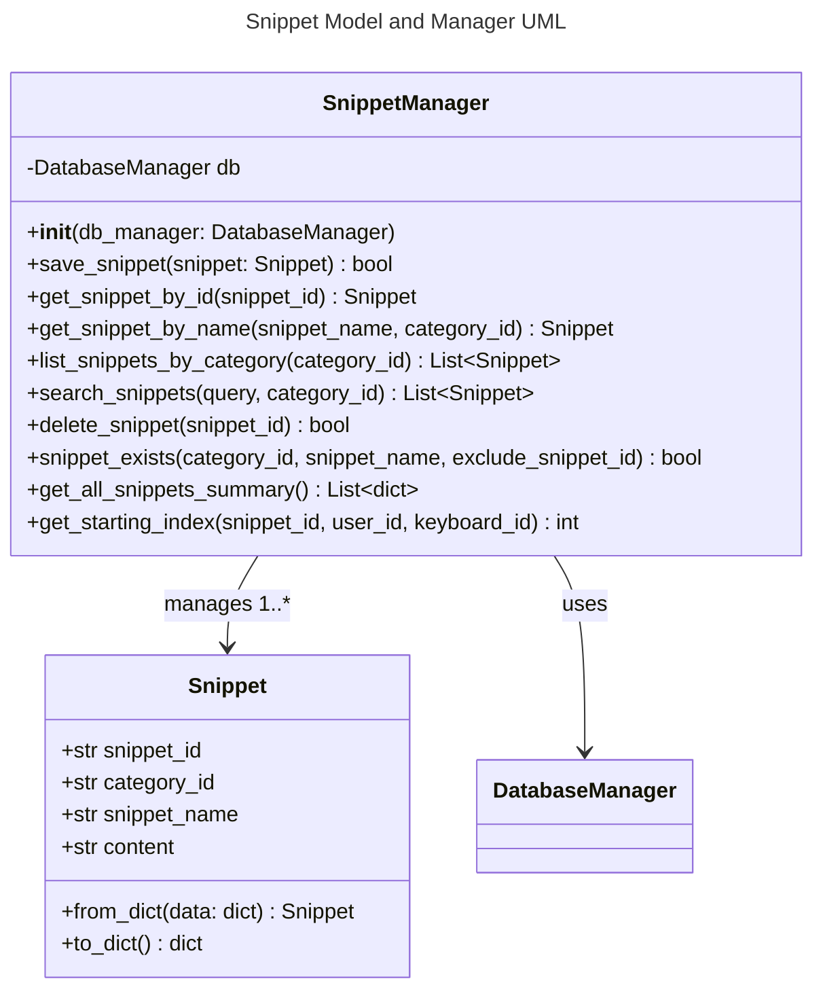

# Snippet Object Specification

## 1. Overview
A Snippet is a segment of text used for typing drills. Each snippet belongs to a Category and is divided into parts for granular practice and analytics. Each part is limited to 500 characters maximum.

## 2. Data Model

### Database Schema

#### categories Table
- **category_id**: INTEGER PRIMARY KEY AUTOINCREMENT
- **category_name**: TEXT NOT NULL UNIQUE

#### snippets Table
- **snippet_id**: INTEGER PRIMARY KEY AUTOINCREMENT NOT NULL
- **category_id**: INTEGER NOT NULL (Foreign Key to categories.category_id)
- **snippet_name**: TEXT NOT NULL (ASCII-only, max 128 chars, min 1 char)
- Constraint: UNIQUE (category_id, snippet_name) - Ensures snippet names are unique within their category

#### snippet_parts Table
- **snippet_id**: INTEGER NOT NULL (Foreign Key to snippets.snippet_id)
- **part_number**: INTEGER NOT NULL (Sequential numbering starting at 1)
- **content**: TEXT NOT NULL (Contains up to 500 characters of snippet content)
- Constraint: PRIMARY KEY (snippet_id, part_number) - Composite primary key

Implemented as a Pydantic model with Field validation for Pydantic v2 compatibility. The SnippetModel combines metadata from the snippets table with content from the snippet_parts table for seamless usage.

## 3. Functional Requirements
- Snippets can be created, renamed, edited, and deleted
- Snippets are linked to categories
- Snippet names must be unique within their category
- **The system can determine the next starting index for a snippet for a given user and keyboard, using the latest session's `snippet_index_end` from the `practice_sessions` table. If the user has completed the snippet, the index wraps to 0.**

## 4. API Endpoints
All Snippet management is handled via a unified GraphQL endpoint at `/api/graphql`.

**GraphQL Queries:**
- `snippets(category_id: Int!)`: List all snippets for a category
- `snippet(snippet_id: Int!)`: Get a specific snippet by ID

**GraphQL Mutations:**
- `createSnippet(category_id: Int!, snippet_name: String!, content: String!)`: Create a new snippet
- `editSnippet(snippet_id: Int!, snippet_name: String, content: String)`: Edit a snippet
- `deleteSnippet(snippet_id: Int!)`: Delete a snippet

All validation is performed using Pydantic models and validators. Errors are surfaced as GraphQL error responses with clear, specific messages.

## 5. UI Requirements
- Snippet management available in both desktop (PyQt5) and web UIs
- Add/Edit/Delete dialogs must validate input and show clear errors
- Desktop UI implemented in `desktop_ui/snippet_scaffold.py` as a QtMainWindow
- List box displays all snippets with tooltips showing content previews
- Double-click to load a snippet for editing
- Status bar provides operation feedback
- Input validation prevents empty submissions

## 6. Testing
- Backend, API, and UI tests must cover all CRUD operations, validation, and error handling
- All tests must run on a clean DB and be independent

## 7. Security/Validation
- No SQL injection (parameterized queries)
- No sensitive data hardcoded
- All user input is validated and sanitized

## 8. Code Quality, Testing, and Security Standards
- All code is formatted with Black and follows PEP 8 style guidelines.
- Linting is enforced with flake8; all lint errors are fixed before merging.
- All code uses type hints and Pydantic for validation.
- All tests use pytest and pytest fixtures for setup/teardown, with DB isolation.
- No test uses the production DB; all tests are independent and parameterized.
- All Snippet CRUD operations, validation, and error handling are covered by backend, API, and UI tests.
- No sensitive data is hardcoded. All user input is validated and sanitized.
- All database operations use parameterized queries for security.

---

## 9. API Implementation and Structure
- GraphQL API is implemented in `api/snippet_graphql.py` using Graphene and Flask
- The API is exposed via a Flask Blueprint (`snippet_graphql`)
- Schema defines types, queries, and mutations with proper validation
- All business logic (creation, update, deletion, DB access) is handled in `models/snippet.py`
- A single endpoint `/api/graphql` handles all operations
- Error handling and status codes follow GraphQL conventions
- Manager instance is retrieved from Flask `g` or app config for flexibility
- Type hints and docstrings document all components
- **The `SnippetManager` provides a `get_starting_index(snippet_id, user_id, keyboard_id)` method to determine the next starting index for a snippet for a user and keyboard, based on the latest session.**

## 10. Testing
- Unit tests for snippet model in `tests/core/test_snippet_model.py`
- GraphQL API tests in `tests/api/test_snippet_graphql.py` and `tests/api/test_snippet_api.py`
- Desktop UI tests in `tests/desktop_ui/test_snippet_ui.py`
- All tests use pytest with centralized fixtures in `tests/conftest.py`
- Fixtures provide temporary database and snippet manager instances
- Type safety ensured with proper type annotations throughout
- Tests validate both happy path and error handling scenarios
- No test uses the production DB; all tests are independent and parameterized

<!--
Code Review Summary:
- `Snippet` (snippet.py):
  - Pydantic model with strong validation for all fields (ASCII, length, SQLi, integer checks).
  - Uses custom validators for name/content, and provides from_dict/to_dict helpers.
  - Enforces uniqueness and security at the model and manager level.
- `SnippetManager` (snippet_manager.py):
  - Handles all CRUD for snippets, including splitting content into parts (max 500 chars).
  - Validates with Pydantic, checks for uniqueness, and handles DB errors robustly.
  - Methods for create, get by id/name, list by category, search, update, delete, and summary.
  - Uses parameterized queries and logs errors.
  - Follows good separation of concerns and error handling.
-->

