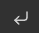
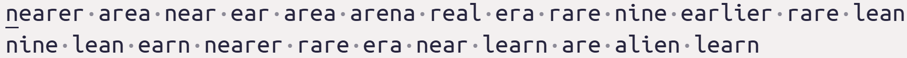

# Typing Drill Screen Specification

## 1. Overview

The Typing Drill screen is the interactive interface where users perform actual typing drills based on a selected snippet and configuration. It is available as both a web UI and a desktop UI, both of which share identical functionality, design standards, and are backed by a unified API. All code and UI must be robust, testable, and adhere to strict quality, validation, and security standards.

---

## 2. Functional Requirements

### 2.1 Drill Execution Workflow

- **Initialization:**
  - either a snippet ID or text is passed in, along with start/end indices as provided by the drill configuration screen.
  - if snippet text is passed in - then snippet ID will be set to -1
  - If text is passed in then use this text - otherwise fetch the snippet's text (from `snippet_parts`), reconstructing it in order, limiting this to the beginning and ending index provided in the Drill Config Screen

- **Typing Session:**
  - Displays the snippet text for the user to type.
  - Provides a typing input area with real-time feedback (e.g., highlighting correct/incorrect characters, showing progress).
  - **Text Highlighting**: Correct characters appear in **green italic** text, incorrect characters are displayed in **red bold** text, and untyped characters remain in plain black regular text (not bold, not italic). The current character is highlighted based on whether it is correct, incorrect, or untyped. Backspace removes the previous character's highlighting. The highlighting logic correctly handles newline characters, which are represented by a special symbol (`↵`) in the display text, by adjusting the cursor position to account for the extra characters.
  - When the user presses backspace, the highlighting is properly removed from deleted characters, restoring the text to its normal appearance.
  - Enter keys (newlines) in the sample text are treated as single characters for typing purposes, but display as a return symbol (↵) followed by an actual newline.
  - Shows a timer which starts when the first character is typed.
  - **Error Counting**: Every time a character is typed (excluding backspace) that does not match the expected character, the error count increments by 1. This count persists throughout the session and is used for both the real-time error display and the error progress bar.
  - Tracks typing speed (WPM), accuracy, and errors as the user types visually on the screen in real time.
  - Shows three progress bars that track different aspects of typing performance in real-time:
    - **Chars**: Shows the ratio of characters currently present in input to expected characters (e.g., "ab" out of "abcd" = 50%). This reflects actual text completion regardless of how many keystrokes or backspaces were used.
    - **Errors**: Shows the current error count vs. the error budget (e.g., "5/20" meaning 5 errors out of 20 allowed). The error budget is 5% of the total expected characters (with a minimum of 1). The progress bar displays the current error count and changes color to bright red when the error budget is exceeded.
    - **Speed**:     - **Speed**: Shows typing speed in WPM from 0 to 2x the target typing speed (looked up from the Keyboard object). The bar changes color based on speed thresholds: orange if <75% of target, green if >= the target. This provides immediate visual feedback on typing performance.

  - The session ends automatically as soon as the user finishes typing the expected text. The completion dialog is displayed immediately, and the typing window is disabled and greyed out - see completion.

- **Completion:**
  - The typing drill automatically detects when the user has finished typing the expected text and immediately shows the completion dialog. The completion is triggered as soon as the typed text matches the expected content, without requiring any additional keystrokes.
  - The completion dialog presents a summary including:
    - WPM (words per minute)
    - MS Per Keystroke (total time in ms / number of expected characters typed)
    - Efficiency percentage (expected characters / keystrokes excluding backspaces) - **Note: This calculation must be identical in both real-time stats and final summary**
    - Correctness percentage (correct characters in final text / expected characters) - **Note: This is calculated by comparing the final typed text character-by-character with the expected text. Only characters that match in the final state count as correct, regardless of errors made and corrected during typing.    In realitme this is calculated by counting the differences between the current text after corrections and the expected text, and then counting the number of characters that are different.**

    - Accuracy percentage (calculated as efficiency × correctness)
    - Option to retry, continue, or return to menu
  - Records the session in the `practice_sessions` table with all relevant metrics and indices, including `ms_per_keystroke` (average ms per expected character, always required, never null).
  - Records all keystrokes in the `session_keystrokes` table with precise timing information:
    - For the first keystroke: `time_since_previous` is set to 0
    - For subsequent keystrokes: `time_since_previous` contains the time difference (in milliseconds) between the current keystroke and the previous one
    - Backspace keystrokes are always marked as errors
  - Records any session errors in the 'practice_session_errors' table
  - Invokes the ngram analysis service to capture the speed and errors in ngrams within the session just typed

- **Error Handling:**
  - All input and actions are validated.
  - User receives clear error messages for any issues (e.g., snippet not found, invalid indices, session save failure).

---

## 3. User Interface

### 3.1 Web UI
- Responsive, modern design.
- Displays snippet text, typing area, real-time feedback, and stats.
- Accessible from the drill_configuration_screen.
- Uses RESTful API endpoints for all data.

### 3.2 Desktop UI
- Mirrors web UI functionality and layout.
- Invoked from the drill_configuration  screen.
- Uses the same API/backend as the web UI.
- Preference for PyQt5 over tkinter for desktop UI just for testability.
-- screen should load up in the middle of the screen - at least 800x600 pixels in size
-- focus should be set to the typing area

---

## 4. API & Backend

- All business logic is encapsulated in service classes (e.g., `typing_drill_service`).
- API endpoints for fetching snippet parts, saving session results, and retrieving past performance.
- Input validation and error handling at both API and backend layers.
- Dependency injection for database access to enable test mocks.

---

## 5. Testing

- **Test-Driven Development (TDD):**
  - All features are developed test-first.
  - Pytest is used exclusively for all tests except UI testing which can be done with a UI test framework like pytest-qt or pytest-gtk or selenium or similar.   You can choose the best testing framework for the UI tests.

- **Test Coverage:**
  - Unit tests for backend and service classes.
  - API tests for all endpoints.
  - Selenium (or equivalent) tests for web UI (typing logic, feedback, completion, error handling).
  - Desktop UI tests (functional, using UI test frameworks).

- **Test Isolation:**
  - All tests use temporary databases and pytest fixtures for setup/teardown.
  - No test uses the production DB.
  - Tables are created using the app's own DB initialization logic, not raw SQL.

- **Test File Naming:**
  - Test files are placed in the `tests` folder and named after the functionality and layer, e.g.:
    - `test_typing_drill_backend.py`
    - `test_typing_drill_api.py`
    - `test_typing_drill_web.py`
    - `test_typing_drill_desktop.py`

---

## 6. Code Quality & Security

- All code follows PEP 8, is type-hinted, and uses Pydantic for data validation.
- All user input is validated and sanitized.
- Parameterized queries are used throughout.
- No sensitive data is hardcoded.
- All code is linted (`flake8`, `black`) before submission.
- all code is checked with mypy and pylint before submission.

---

## 7. Error Handling

- User receives meaningful error messages for all validation and system errors.
- All exceptions are logged and surfaced appropriately in the UI.
- Check that the session was written to the database in the database in all 5 tables listed above (practice_sessions, session_keystrokes, practice_session_errors, session_ngram_speed, session_ngram_errors) - if not, please show the user an error message.

---

## 8. Documentation

---

## 9. API Implementation and Structure
- All Typing Drill API endpoints are implemented in modular API files using Flask Blueprints:
  - `snippet_api.py` for snippet retrieval
  - `session_api.py` for session creation and retrieval
  - `keystroke_api.py` for keystroke recording
  - `error_api.py` for error recording
  - `ngram_api.py` for n-gram analysis
- Endpoints only handle request/response, validation, and error handling.
- All business logic (session, keystroke, error, n-gram, and snippet handling) is in `db/models/snippet.py`, `db/models/practice_session.py`, `db/models/keystroke.py`, `db/models/session_error.py`, and `db/models/ngram_analyzer.py`.
- Endpoints used:
  - `GET /api/snippets/<snippet_id>` — fetch snippet details
  - `POST /api/sessions` — create a new session
  - `POST /api/keystrokes` — record a keystroke
  - `POST /api/session-errors` — record a session error
  - `POST /api/ngram/analyze` — trigger n-gram analysis

## 10. Testing Practices
- Unit tests for all model and service logic
- API tests for all endpoints in `tests/test_snippet_api.py`, `tests/test_session_api.py`, `tests/test_keystroke_api.py`, `tests/test_error_api.py`, and `tests/test_ngram_api.py`
- UI tests for typing drill execution and summary in both web and desktop UIs
- All tests use pytest, pytest-mock, and proper fixtures for DB isolation
- No test uses the production DB; all tests are independent and parameterized

- All modules, classes, and functions have docstrings with type hints.
- README and inline documentation are updated with each significant change.

--

## 9. Security

- All user input is validated and sanitized.
- All database access is protected with parameterized queries.
- No sensitive data is hardcoded.

---

## 10. Future Enhancements
-- in order to differentiate between a tab, an enter, or a space character, or an underscore - the sample text at the top of the page should use a special character that is not used in the sample text for each of these.    For example a tab can use the unicode character that looks like tab (U+2B7E), but with the text slightly greyed out, the enter can use the unicode character that looks like a return symbol (U+23CE) or preferrably this character , but with the text slightly greyed out, and the space can use the unicode character that looks like a subscript ^ character, but with the text slightly greyed out, and the underscore can use a regular old underscore.
-- Even though these novel characters are shown in the sample text - the user's typing must be compared to the original text rather than these funky characters.

.   This gives an example of a character that can be used for a space if a subscript ^ cannot be used

**This specification is up-to-date with the current Typing Drill implementation and testing standards.**
