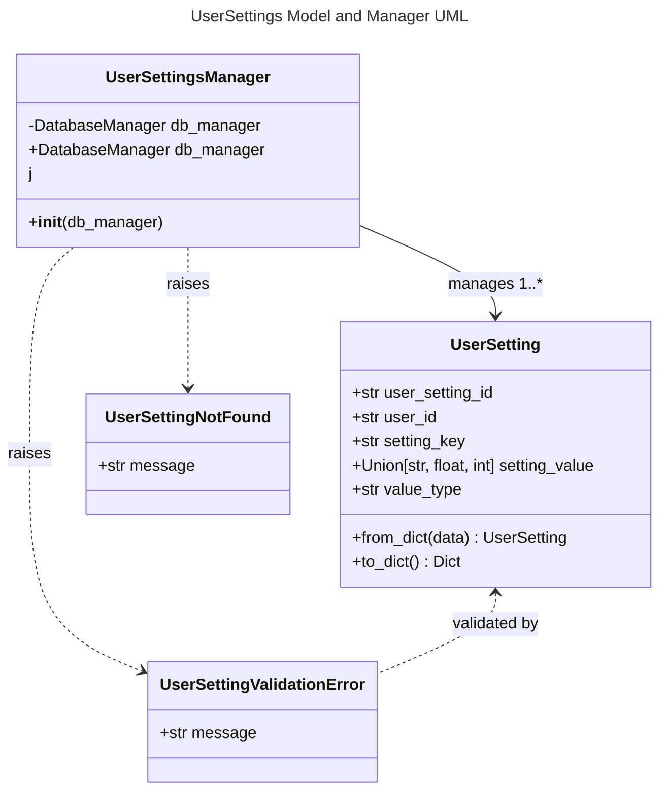

# UserSettings Object Specification

## 1. Overview
UserSettings represents a system for storing and retrieving user-specific configuration settings. Each user can have multiple settings, identified by unique keys, with values that can be text, floating point numbers, or integers. This enables personalized experiences and preferences across the application.

## 2. Data Model

### Database Schema

#### user_settings Table
- **user_setting_id**: TEXT PRIMARY KEY (UUID string, auto-generated if not provided or None)
- **user_id**: TEXT NOT NULL (UUID string, identifying the user)
- **setting_key**: TEXT NOT NULL (Unique identifier for the setting within a user's context)
- **setting_value_store**: TEXT NOT NULL (The setting value stored as a string)
- **value_type**: TEXT NOT NULL (Type of value: "str", "float", "int")

Constraints:
- UNIQUE (user_id, setting_key): Each setting key must be unique per user

## 3. Functional Requirements
- User settings can be created, updated, retrieved, and deleted.
- Each setting is associated with a specific user via user_id.
- Settings have a key (string identifier) and value (which can be text, float, or integer).
- Value types are preserved during serialization to and from the database.
- When retrieving a specific setting by key, an exception is raised if the setting doesn't exist.
- All validation is performed using Pydantic models and validators, with DB-level uniqueness enforced by `UserSettingsManager`.
- All database operations use parameterized queries and centralized validation to prevent SQL injection and other attacks.
- If `user_setting_id` is omitted or None, a new UUID is auto-generated by the model.

## 4. API Endpoints

All user settings management is handled via a unified GraphQL endpoint at `/api/graphql`.

**GraphQL Queries:**
- `userSettings(user_id: String!)`: List all settings for a specific user
- `userSetting(user_id: String!, setting_key: String!)`: Get a specific setting by user_id and setting_key

**GraphQL Mutations:**
- `saveUserSetting(user_setting: UserSettingInput!)`: Save (insert or update) a user setting
- `deleteUserSetting(user_id: String!, setting_key: String!)`: Delete a specific user setting
- `deleteAllUserSettings(user_id: String!)`: Delete all settings for a specific user

All validation errors are surfaced as GraphQL error responses with clear, specific messages.

## 5. UI Requirements
- Settings management available in both desktop (PyQt5) and web UIs
- Settings UI should adapt based on the value type (text field for strings, number inputs for numeric types)
- Add/Edit dialogs must validate input and show clear errors

## 6. Testing
- Backend, API, and UI tests must cover all CRUD operations, validation, and error handling
- All tests must run on a clean DB and be independent
- Model-level tests must cover all field types, blank/null/invalid values, and auto-generation of IDs
- Manager-level tests must cover all CRUD, validation, error, and edge cases (including DB error simulation)

## 7. Security/Validation
- No SQL injection (parameterized queries)
- No sensitive data hardcoded
- All user input is validated and sanitized

---

## 8. API Implementation and Structure
- All UserSettings API operations are implemented in `api/user_settings_graphql.py` using Graphene and Flask.
- The GraphQL schema defines types, queries, and mutations with proper validation.
- All business logic (creation, update, deletion, DB access) is handled in `models/user_setting.py` and `models/user_setting_manager.py`.
- The unified endpoint `/api/graphql` handles all operations.
- Error handling and status codes follow GraphQL conventions.
- Type hints and docstrings document all components.

## 9. Testing, Code Quality, and Security Standards
- All code is formatted with Black and follows PEP 8 style guidelines.
- Linting is enforced with flake8; all lint errors are fixed before merging.
- All code uses type hints and Pydantic for validation.
- All tests use pytest and pytest fixtures for setup/teardown, with DB isolation.
- No test uses the production DB; all tests are independent and parameterized.
- All UserSettings CRUD operations, validation, and error handling are covered by backend, API, and UI tests.
- No sensitive data is hardcoded. All user input is validated and sanitized.
- All database operations use parameterized queries for security.

---

## 10. UML Class Diagram

