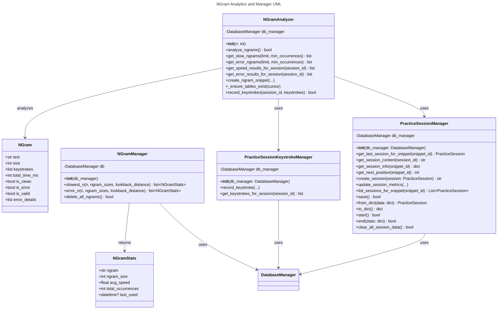

# N-Gram Analysis Specification

## 1. Overview

The ngram_manager provides detailed analysis of typing session keystrokes to identify speed bottlenecks and error-prone character sequences (n-grams, n=2–10). It writes results to unified `session_ngram_speed` and `session_ngram_errors` tables. Analysis is triggered both automatically at the end of every typing session.

### Details
an nGram of a given snippet of text is a substring of that snippet of length n.

#### Size: 
So for a length of text like "abcde" there are 4 ngrams of length 2 (ab, bc, cd and de), there are 3 ngrams of length 3 (abc, bcd, and cde), 2 ngrams of length 4 (abcd, and bcde) and one ngram of size 5.     This continues up to ngrams of size 10 maximum.     Ngrams are always sequential keystrokes, not random combinaitons
We do not want any ngrams shorter than 2, or longer than 10

#### Speed:
The speed of an ngram is stored in ngram_speed_ms - this is calculated as the time between the first keystroke and the last keystroke divided by (ngram size - 1) - then converted to ms

So if you have the following keystrokes 
a: 08:01:00.00
b: 08:01:01.00
c: 08:01:01.50

then:
- ngram ab has time 1000 ms (1000 / 1)
- ngram bc has time 500 ms (500 / 1)
- ngram abc has time 750ms (1500 ms / 2)

#### valid status
an ngram is only valid if it doesn't hit any of the following
  - Skip n-grams with errors in any position except the last character.
    - Skip n-grams containing any backspace characters (backspaces act as sequence separators).
    - Skip n-grams with a total typing time of 0.0 ms.
    - Skip n-grams containing spaces in any position (spaces act as sequence separators).

#### Error Status
each keystroke has a status of "iserror".      any ngrams with only an error in the last position should have an error status of true, otherwise error = false

#### Clean status
A "clean" n-gram meets ALL the following criteria:
  - No errors in any position
  - No backspace characters in any position (backspaces act as sequence separators)
  - No spaces in any position (spaces act as sequence separators)
  - Total typing time is greater than 0.0 ms

---

## 2. Functional Requirements

### 2.1 N-Gram Analysis Scope
- **N-Gram Sizes:** Analyze n-grams for n = 2 through 10.
- **Data Source:** Operates on keystroke data from completed typing sessions.
- **Trigger Points:**
  - Automatically at the end of every typing session (e.g., in Typing Drill logic).
  - On demand via a temporary button in the main menu UI.
- **Tables Updated:**
  - `session_ngram_speed` (for clean n-grams with timing data)
  - `session_ngram_errors` (for n-grams ending in an error)
- **Filtering:**
  - Spaces and backspace characters act as sequence separators, breaking n-gram sequences
  - Valid n-grams can exist on either side of spaces or backspaces
  - No n-gram will contain spaces or backspace characters
  - Only include n-grams that are either "clean" (see clean n-gram definition) or have an error only on the last character (subject to additional filtering)
  - Skip n-grams with errors in any position except the last character

### 2.2 N-Gram Speed Analysis
- For each n-gram (n=2–10) in a session:
  - If the n-gram is "clean", record it in `session_ngram_speed`.
  - A "clean" n-gram meets ALL the following criteria:
    - No errors in any position
    - No backspace characters in any position (backspaces act as sequence separators)
    - No spaces in any position (spaces act as sequence separators)
    - Total typing time is greater than 0.0 ms
  - Each occurrence of a "clean" n-gram is recorded individually in `session_ngram_speed`.
  - Store: session_id, ngram_size, ngram_text, ngram_time_ms (for that specific occurrence).

### 2.3 N-Gram Error Analysis
- For each n-gram (n=2–10) in a session:
  - If the n-gram has an error ONLY on the last character, record it in `session_ngram_errors`.
  - Apply the following additional filtering for error n-grams:
    - Skip n-grams with errors in any position except the last character.
    - Skip n-grams containing any backspace characters (backspaces act as sequence separators).
    - Skip n-grams with a total typing time of 0.0 ms.
    - Skip n-grams containing spaces in any position (spaces act as sequence separators).
  - Each occurrence of an n-gram that has an error ONLY on the last character (and meets other filter criteria) is recorded individually in `session_ngram_errors`.
  - Store: session_id, ngram_size, ngram_text.

### 2.4 Database Schema
- **session_ngram_speed**: Tracks n-gram speed per session
    - **ngram_speed_id**: UUID String (Primary Key)
    - **session_id**: UUID String (Foreign Key to practice_sessions)
    - **ngram_size**: Integer (n, 2–10)
    - **ngram_text**: String (the n-gram itself)
    - **ngram_time_ms**: Float (total time in ms for this n-gram occurrence)
- **session_ngram_errors**: Tracks n-gram errors per session
    - **ngram_error_id**: UUID String (Primary Key)
    - **session_id**: UUID String (Foreign Key to practice_sessions)
    - **ngram_size**: Integer (n, 2–10)
    - **ngram_text**: String (the n-gram itself)

See PracticeSession.md for the session table and Keystroke.md for keystroke table details.

**Note:**
- The `Session` object is created by direct instantiation (with a string UUID `session_id`) and persisted by calling `save_session` on `SessionManager`.
- The `practice_sessions` table includes a required `ms_per_keystroke` (REAL NOT NULL) field, which is a computed property in the model and stored in the DB for analytics.
- All n-gram analysis and DB logic should reference the updated Session model and schema.
- All n-gram tables use UUID string primary keys (`ngram_speed_id`, `ngram_error_id`).
- All code, models, and tests must use UUIDs for n-gram IDs and session IDs.

---

## 3. Validation & Security
- N-grams must not contain whitespace.
- All database input is parameterized to prevent SQL injection.
- All user-facing actions provide clear feedback on success or failure.

---

## 4. API Implementation and Structure
- All N-Gram analysis API endpoints are implemented in `ngram_api.py` using a Flask Blueprint (`ngram_api`).
- Endpoints only handle request/response, validation, and error handling.
- All business logic for analysis is encapsulated in the `NGramManager` class in `models/ngram_manager.py`.
- The `NGramManager` follows object-oriented principles:
  - Works with `Session` and `Keystroke` objects rather than IDs or raw data.
  - Creates `NGram` objects for each valid n-gram occurrence, tracking timing and error information for that specific instance.
  - Internally, it stores these `NGram` instances in collections keyed by n-gram size, allowing multiple instances of the same n-gram text to be recorded (e.g., `Dict[int, List[NGram]]`).
  - Provides clear separation between data loading, analysis, and database operations.
- Endpoints:
  - `GET /api/ngrams?session_id=<id>&type=<speed|errors>&size=<n>`: List n-gram analysis results for a session
  - `POST /api/ngram/analyze`: Trigger n-gram analysis for a session or on demand

## 5. Testing
- Unit tests for n-gram analyzer and snippet generation logic
- API tests for all endpoints in `tests/test_ngram_api.py`
- UI tests for n-gram analysis and practice snippet generation in both web and desktop UIs
- All tests use pytest, pytest-mock, and proper fixtures for DB isolation
- No test uses the production DB; all tests are independent and parameterized

## 6. Test Cases

### 6.1 Class-Level Tests
- **Test object model:**
  - Test that `Session`, `Keystroke`, and `NGram` objects correctly encapsulate their data.
  - Verify that `NGram` objects correctly identify clean vs. error n-grams.
  - Ensure proper computation of timing metrics for n-grams.
- **Test n-gram extraction:**
  - Given session content and keystrokes, verify correct n-gram extraction for n=2–10.
  - Verify spaces and backspaces properly break n-gram sequences but allow valid n-grams on either side.
  - Test cases with spaces in various positions (beginning, middle, end of typing sequence).
  - Test cases with backspaces in various positions (correcting errors and non-errors).
  - Verify timing calculations for n-grams around spaces and backspaces are correct.
- **Test space handling:**
  - Test n-gram extraction with spaces at different positions (position 2, 3, 5, etc).
  - Verify multi-word input correctly generates n-grams on either side of spaces.
  - Confirm spaces act as sequence separators similar to backspaces.
- **Test backspace handling:**
  - Test n-gram extraction with backspaces after errors and after correct keystrokes.
  - Verify n-grams properly form after backspace correction sequences.
  - Confirm backspaces are excluded from n-grams but allow valid n-grams on either side.
- **Test speed/error classification:**
  - Verify n-grams classified as "clean" (no errors) are correctly identified.
  - Verify n-grams with errors only on the last character are marked as error n-grams.
  - Verify n-grams with errors in other positions are excluded from analysis.
- **Test database operations:**
  - Verify clean n-grams are correctly saved to session_ngram_speed.
  - Verify error n-grams are correctly saved to session_ngram_errors.
  - Test retrieval of slowest and most error-prone n-grams.

### 4.2 API-Level Tests
- **Trigger analysis endpoint:**
  - POST valid keystrokes/session_id, assert correct DB updates.
  - POST with invalid/insufficient data, assert graceful failure.
- **Snippet generation endpoint:**
  - Request new snippet for slow/error n-grams, verify DB and response.

### 4.3 Web UI-Level Tests
- **Main menu button:**
  - Clicking triggers analysis and shows feedback.
- **Session end integration:**
  - Completing a typing session triggers analysis automatically.
- **Practice snippet display:**
  - Generated snippets appear in the correct category and are viewable.

### 4.4 Desktop UI-Level Tests
- **Button triggers analysis:**
  - Temporary main menu button triggers analysis and displays result.
- **Session end triggers analysis:**
  - Typing drill completion triggers analysis.
- **Practice snippet integration:**
  - Generated snippets are accessible in the desktop UI.

---

## 5. Test Automation & Isolation
- All tests use pytest and pytest-mock/selenium where appropriate.
- All tests use temporary databases, initialized via the database manager’s `initialize_database` method—never the production DB.
- Temporary assets (files, folders) are created using pytest fixtures and cleaned up after each test.
- All tests are independent and order-agnostic.
- Tests are named and organized as:
  - `test_ngram_backend.py`
  - `test_ngram_api.py`
  - `test_ngram_web.py`
  - `test_ngram_desktop.py`

---

## 6. Error Handling & Feedback
- All errors are logged with context.
- User is notified of analysis or snippet generation failures via the UI.

---

## 7. Documentation
- This document (`Prompts/ngram.md`) is the canonical specification for all n-gram analysis and testing requirements.
- All code and tests should reference this document for expected behaviors, validation, and test coverage.

<!--
Code Review Summary:
- `NGramAnalyzer` (ngram_analyzer.py):
  - Analyzes n-gram speed and error patterns for sessions, supports multiple n sizes (2-10).
  - Handles DB table creation, analytics, and snippet generation from n-gram data.
  - Provides per-session and aggregate analytics, and robust error handling.
- `NGramManager` (ngram_manager.py):
  - Provides high-level analytics for slowest and most error-prone n-grams, with flexible queries.
  - Uses a data class `NGramStats` for results, and supports deletion of all n-gram data.
  - Integrates with session and keystroke data for analytics.
- `NgramAnalyzer` (practice_session_extensions.py):
  - Session-level n-gram analytics, integrates with keystroke/session managers.
  - Provides methods for speed/error analysis, timestamp conversion, and extensibility.
-->

