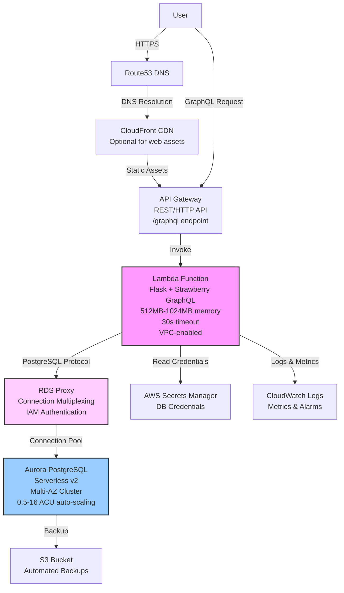
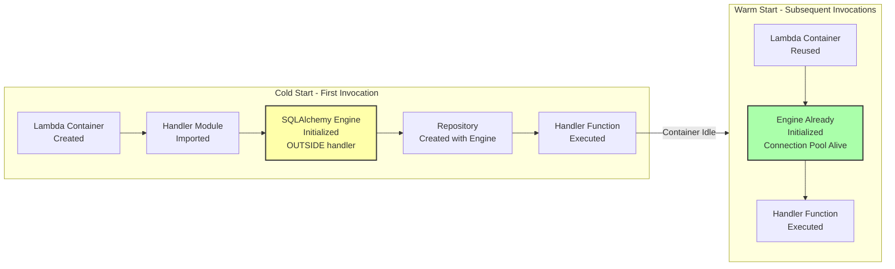
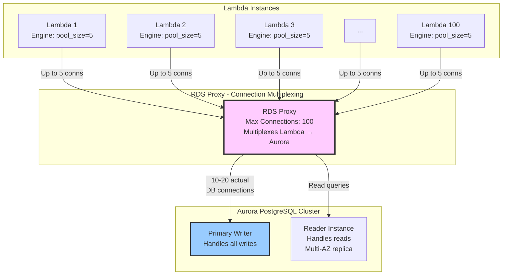
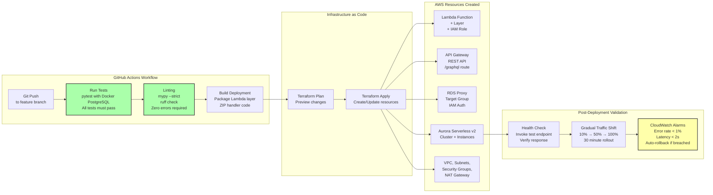
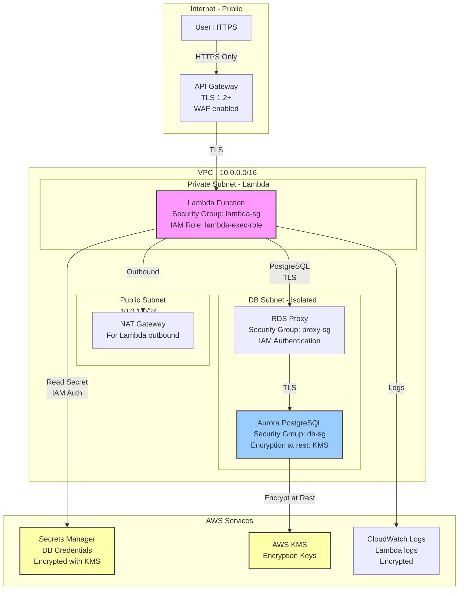

# AWS Architecture for AITypingTrainer

This document defines the AWS serverless architecture for deploying AITypingTrainer with Aurora PostgreSQL Serverless v2, Lambda, and API Gateway.

## Table of Contents
1. [High-Level Architecture](#high-level-architecture)
2. [Lambda Cold Start Optimization](#lambda-cold-start-optimization)
3. [Connection Pooling Strategy](#connection-pooling-strategy)
4. [Deployment Pipeline](#deployment-pipeline)
5. [Cost Analysis](#cost-analysis)
6. [Security Architecture](#security-architecture)

---

## High-Level Architecture



### Component Details

| Component | Purpose | Configuration | Cost Driver |
|-----------|---------|---------------|-------------|
| **Route53** | DNS management | Hosted zone for domain | $0.50/month + queries |
| **CloudFront** | CDN for web UI assets (optional) | Origin: S3 or API Gateway | Data transfer out |
| **API Gateway** | REST/HTTP API endpoint | Regional endpoint, /graphql path | $3.50 per 1M requests |
| **Lambda** | GraphQL handler (stateless) | Python 3.11+, 512MB-1024MB, VPC | Invocations + GB-seconds |
| **RDS Proxy** | Connection pooling for Lambda | Target: Aurora cluster | $18/month + connections |
| **Aurora Serverless v2** | PostgreSQL database | 0.5 ACU min, 16 ACU max | ACU-hours (~$0.12/ACU-hour) |
| **Secrets Manager** | Store DB credentials securely | Rotation enabled (30 days) | $0.40/secret/month |
| **CloudWatch** | Logging, metrics, alarms | Lambda logs, DB metrics | Storage + API requests |

---

## Lambda Cold Start Optimization



### Lambda Handler Pattern

**Module-Level Initialization** (runs once per container):
```
# lambda_handler.py (pseudo-code)
import os
from sqlalchemy import create_engine
from repositories.keyset_repository_postgres import PostgresKeysetRepository

# OUTSIDE handler function - runs ONCE on cold start
DATABASE_URL = os.getenv('DATABASE_URL')  # RDS Proxy endpoint
engine = create_engine(
    DATABASE_URL,
    pool_size=5,              # Connections per Lambda
    max_overflow=10,          # Additional connections if needed
    pool_pre_ping=True,       # Validate connection before use
    pool_recycle=3600,        # Recycle connections hourly
    echo=False                # No SQL logging (performance)
)

repository = PostgresKeysetRepository(engine=engine)

# Handler function - runs on EVERY invocation
def lambda_handler(event, context):
    # Process GraphQL request using repository
    # Repository uses engine (reused from warm container)
    response = process_graphql_request(event, repository)
    return response
```

**Cold Start Timeline**:
1. AWS creates Lambda container (~100-300ms)
2. Python runtime loads (~50-100ms)
3. Import modules (~50-200ms depending on dependencies)
4. Initialize engine (~50-150ms - connects to RDS Proxy)
5. Create repository (~10ms)
6. **Total cold start**: ~260-750ms

**Warm Start Timeline**:
1. Container already exists (0ms)
2. Engine already initialized (0ms)
3. Execute handler only (~10-50ms depending on query complexity)
4. **Total warm start**: ~10-50ms

**Optimization Strategies**:
- ✅ Provisioned Concurrency: Keep 1-2 instances warm (eliminates 80% of cold starts)
- ✅ Lambda Layers: Package SQLAlchemy + dependencies as layer (reduces deployment package size)
- ✅ Lazy Loading: Don't preload data on cold start, load on request only
- ❌ Avoid: Heavy initialization in handler function (runs every time)

---

## Connection Pooling Strategy



### Why RDS Proxy?

**Problem Without RDS Proxy**:
- 100 concurrent Lambdas × 5 connections each = 500 database connections
- Aurora Serverless v2 limited to ~100-200 connections depending on ACU
- Result: Connection exhaustion, Lambda failures

**Solution With RDS Proxy**:
- 100 concurrent Lambdas connect to RDS Proxy (ephemeral connections)
- RDS Proxy multiplexes to 10-20 actual Aurora connections
- Proxy manages connection lifecycle (open, close, reuse)
- Result: No connection exhaustion, Lambda success

### SQLAlchemy Engine Configuration

**Per-Lambda Engine Settings**:
```
pool_size=5          # Max connections per Lambda instance
max_overflow=10      # Additional connections if pool exhausted
pool_pre_ping=True   # Test connection validity before use (prevents stale connections)
pool_recycle=3600    # Recycle connections every hour (prevents timeout issues)
echo=False           # Disable SQL logging (performance)
```

**Why pool_size=5 per Lambda?**:
- Each Lambda handles 1 request at a time (single-threaded execution)
- Pool size > 1 handles connection churn (checkout/checkin overhead)
- Too large wastes memory, too small causes connection thrashing
- 5 is sweet spot for most workloads

### Connection Lifecycle

1. **Lambda cold start**: Engine creates connection pool (5 connections max)
2. **First request**: Check out connection from pool, execute query, check in
3. **Subsequent requests**: Reuse connections from pool (fast)
4. **pool_pre_ping**: Before each use, validate connection (SELECT 1)
5. **pool_recycle**: After 1 hour, close and reopen connection (prevents stale)
6. **Lambda idle**: Container pauses, connections idle in pool
7. **Lambda shutdown**: Container destroyed, connections closed

---

## Deployment Pipeline



### Deployment Steps

1. **Source Control Trigger**: Developer pushes code to GitHub
2. **Continuous Integration**:
   - Run pytest with Docker PostgreSQL (all tests must pass)
   - Run mypy --strict (zero errors required)
   - Run ruff check (zero linting errors)
   - Build succeeds only if all gates pass
3. **Build Artifacts**:
   - Package Python dependencies as Lambda layer (SQLAlchemy, Strawberry, Flask)
   - ZIP handler code (entities, use_cases, repositories, api)
4. **Infrastructure Provisioning** (Terraform):
   - Lambda function with layer attached
   - API Gateway REST API with /graphql route
   - RDS Proxy with target group pointing to Aurora
   - Aurora Serverless v2 cluster (primary + replica)
   - VPC, subnets, security groups, NAT Gateway
   - IAM roles (Lambda execution, RDS Proxy access)
   - Secrets Manager secret (database credentials)
5. **Post-Deployment Validation**:
   - Health check: Invoke test GraphQL query, verify response
   - Gradual traffic shift: Route 10% traffic to new version, monitor for 10 minutes
   - If no errors: Increase to 50%, monitor for 10 minutes
   - If no errors: Increase to 100%
   - If errors detected: Automatic rollback to previous version (CloudWatch alarm triggers)
6. **Monitoring**:
   - CloudWatch Logs: Lambda execution logs, Aurora slow query logs
   - CloudWatch Metrics: Lambda invocations, duration, errors; Aurora CPU, connections
   - CloudWatch Alarms: Error rate > 1% = alert, Latency > 2s = alert, DB connections > 80% = alert

---

## Cost Analysis

### Monthly Cost Breakdown (Estimated)

#### Scenario: Small App (1,000 users, 100K requests/month)

| Service | Configuration | Usage | Cost |
|---------|---------------|-------|------|
| **Aurora Serverless v2** | 0.5 ACU baseline, scales to 2 ACU peak | 0.5 ACU × 730 hours × $0.12/ACU-hour | **$43.80/month** |
| **RDS Proxy** | 1 proxy endpoint | Base fee | **$18.00/month** |
| **Lambda** | 512MB, 100K invocations, 500ms avg duration | Free tier covers first 1M requests + 400K GB-seconds | **$0.00/month** (within free tier) |
| **API Gateway** | REST API, 100K requests | Free tier covers first 1M requests | **$0.00/month** (within free tier) |
| **Secrets Manager** | 1 secret (DB credentials) | $0.40/secret/month | **$0.40/month** |
| **CloudWatch Logs** | 5 GB/month ingestion, 1 month retention | 5 GB × $0.50/GB | **$2.50/month** |
| **Data Transfer** | Minimal (GraphQL responses < 100 MB/month) | Negligible | **$0.50/month** |
| **VPC** | NAT Gateway (for Lambda internet access) | $0.045/hour × 730 hours | **$32.85/month** |
| **Route53** | 1 hosted zone | Base fee | **$0.50/month** |
| **Total** | | | **~$98/month** |

#### Scenario: Medium App (10,000 users, 1M requests/month)

| Service | Configuration | Usage | Cost |
|---------|---------------|-------|------|
| **Aurora Serverless v2** | 1 ACU average (scales 0.5-4 ACU) | 1 ACU × 730 hours × $0.12 | **$87.60/month** |
| **RDS Proxy** | 1 proxy endpoint, higher connection hours | Base + connection fees | **$25.00/month** |
| **Lambda** | 512MB, 1M invocations, 500ms avg | 1M requests + 500K GB-seconds beyond free tier | **$5.20/month** |
| **API Gateway** | 1M requests | 1M × $3.50/million | **$3.50/month** |
| **Secrets Manager** | 1 secret | $0.40/month | **$0.40/month** |
| **CloudWatch Logs** | 20 GB/month | 20 GB × $0.50/GB | **$10.00/month** |
| **Data Transfer** | ~500 MB/month | 500 MB × $0.09/GB | **$0.05/month** |
| **VPC** | NAT Gateway | $0.045/hour × 730 hours + data processing | **$35.00/month** |
| **Route53** | 1 hosted zone | $0.50/month | **$0.50/month** |
| **Total** | | | **~$167/month** |

### Cost Optimization Strategies

1. **Aurora Serverless v2 Auto-Scaling**:
   - Scales down to 0.5 ACU minimum when idle (overnight, weekends)
   - Scales up to 2-4 ACU during peak practice hours
   - Average: ~1 ACU over 24 hours (saves ~50% vs. always-on 2 ACU)

2. **Lambda Free Tier**:
   - 1M requests/month free forever
   - 400,000 GB-seconds/month free forever
   - Typical typing app stays within free tier for long time

3. **RDS Proxy Connection Pooling**:
   - Without proxy: Need larger Aurora instance for connection capacity
   - With proxy: Smaller Aurora instance handles same load
   - Savings: ~$40-80/month by avoiding instance over-provisioning

4. **VPC Endpoint (Alternative to NAT Gateway)**:
   - If Lambda doesn't need internet access, use VPC endpoints (S3, Secrets Manager)
   - Eliminates NAT Gateway (~$33/month savings)
   - Trade-off: Less flexibility if Lambda needs external APIs later

### Comparison: Serverless vs. Traditional EC2

| Approach | Infrastructure | Monthly Cost (Small) | Monthly Cost (Medium) | Scaling | Maintenance |
|----------|----------------|---------------------|----------------------|---------|-------------|
| **Serverless (Lambda + Aurora Serverless)** | Lambda + Aurora Serverless v2 + RDS Proxy | ~$98 | ~$167 | Automatic (0-1000s concurrent) | Minimal (managed services) |
| **Traditional (EC2 + RDS)** | EC2 t3.medium + RDS db.t4g.medium | ~$80 (EC2) + $60 (RDS) = ~$140 | ~$150 (EC2) + $120 (RDS) = ~$270 | Manual (add instances) | High (patching, monitoring) |

**Serverless Advantages**:
- Lower cost for small load (Aurora scales down to 0.5 ACU)
- Higher cost efficiency for variable load (scales up only during peaks)
- Zero maintenance (AWS manages Lambda, Aurora)
- Infinite horizontal scaling (Lambda handles traffic spikes)

**Traditional Advantages**:
- Slightly lower cost for constant high load (dedicated instances cheaper at scale)
- Predictable monthly bill (no surprise scaling costs)

**Recommendation**: Serverless for AITypingTrainer (variable load pattern, low maintenance)

---

## Security Architecture



### Security Layers

#### 1. Network Security (VPC)

**VPC Layout**:
- **Public Subnet (10.0.1.0/24)**: NAT Gateway only (for Lambda outbound internet)
- **Private Subnet (10.0.2.0/24)**: Lambda functions (no direct internet access)
- **DB Subnet (10.0.3.0/24 + 10.0.4.0/24)**: Aurora + RDS Proxy (isolated, no internet route)

**Security Groups**:

| Security Group | Inbound Rules | Outbound Rules |
|----------------|---------------|----------------|
| **lambda-sg** | None (no direct inbound) | Port 5432 to proxy-sg (PostgreSQL), HTTPS to Secrets Manager |
| **proxy-sg** | Port 5432 from lambda-sg only | Port 5432 to db-sg only |
| **db-sg** | Port 5432 from proxy-sg only | None (no outbound) |

**Network Flow**:
1. API Gateway invokes Lambda (AWS internal, no public IP)
2. Lambda in private subnet (no internet route)
3. Lambda → RDS Proxy via private IP (VPC internal)
4. RDS Proxy → Aurora via private IP (VPC internal)
5. Lambda → Internet via NAT Gateway (for external APIs if needed)

#### 2. IAM Security (Identity & Access)

**Lambda Execution Role** (`lambda-exec-role`):
```
Permissions:
- logs:CreateLogGroup, logs:CreateLogStream, logs:PutLogEvents (CloudWatch)
- secretsmanager:GetSecretValue (read DB credentials)
- rds-db:connect (RDS Proxy IAM authentication)
- ec2:CreateNetworkInterface, ec2:DescribeNetworkInterfaces, ec2:DeleteNetworkInterface (VPC access)

Trust Policy:
- Principal: lambda.amazonaws.com
```

**RDS Proxy IAM Authentication**:
- Lambda authenticates to RDS Proxy using IAM temporary credentials (no password in code)
- RDS Proxy authenticates to Aurora using username/password (stored in Secrets Manager)
- Benefits: No hardcoded credentials, automatic credential rotation

#### 3. Data Security (Encryption)

**Encryption at Rest**:
- **Aurora Storage**: AES-256 encryption using AWS KMS
- **Aurora Backups**: Encrypted with same KMS key
- **Secrets Manager**: Encrypted with KMS key
- **CloudWatch Logs**: Encrypted with KMS key
- **Lambda Environment Variables**: Encrypted with KMS (if storing sensitive config)

**Encryption in Transit**:
- **User → API Gateway**: TLS 1.2+ (HTTPS enforced)
- **API Gateway → Lambda**: TLS (AWS internal network)
- **Lambda → RDS Proxy**: TLS/SSL required (connection string: `sslmode=require`)
- **RDS Proxy → Aurora**: TLS/SSL enforced

**Key Management**:
- AWS KMS Customer Managed Key (CMK) for Aurora encryption
- Automatic key rotation enabled (every year)
- CloudTrail logs all KMS key usage (audit trail)

#### 4. Secrets Management

**Database Credentials**:
- Stored in AWS Secrets Manager (not environment variables)
- Automatic rotation enabled (every 30 days)
- Lambda retrieves secret at runtime (not at build time)

**Pattern**:
```
Lambda cold start:
1. Call secretsmanager:GetSecretValue API
2. Parse JSON secret (username, password, host, port)
3. Build DATABASE_URL connection string
4. Initialize SQLAlchemy engine
5. Cache connection string for warm invocations (not in code/logs)

Lambda warm start:
1. Reuse cached connection string (secret already retrieved)
```

#### 5. Application Security

**GraphQL Security**:
- **Query Complexity Limits**: Max depth 5, max fields 50 (prevent abuse)
- **Rate Limiting**: API Gateway throttling (100 requests/second per IP)
- **Input Validation**: Strawberry validates all inputs (type checking)
- **SQL Injection Prevention**: SQLAlchemy parameterized queries (no string concatenation)

**Authentication** (future enhancement):
- AWS Cognito User Pools for user authentication
- JWT tokens in Authorization header
- Lambda authorizer validates JWT before GraphQL execution

**Authorization** (future enhancement):
- User can only access their own keyboards/keysets
- Check user_id in GraphQL resolvers before data access

---

## Monitoring and Alerting

### CloudWatch Metrics

**Lambda Metrics**:
- `Invocations`: Total requests processed
- `Duration`: Execution time (p50, p95, p99)
- `Errors`: Failed invocations
- `Throttles`: Rate-limited requests
- `ConcurrentExecutions`: Active Lambda instances

**Aurora Metrics**:
- `CPUUtilization`: CPU usage percentage
- `DatabaseConnections`: Active connections
- `FreeableMemory`: Available memory
- `ReadLatency` / `WriteLatency`: Query performance
- `ServerlessDatabaseCapacity`: Current ACU (scaling indicator)

**RDS Proxy Metrics**:
- `DatabaseConnections`: Multiplexed connections to Aurora
- `DatabaseConnectionsCurrentlyBorrowed`: In-use connections
- `DatabaseConnectionsSetupSucceeded` / `DatabaseConnectionsSetupFailed`: Connection health

### CloudWatch Alarms

| Alarm | Metric | Threshold | Action |
|-------|--------|-----------|--------|
| **High Error Rate** | Lambda Errors | > 1% over 5 minutes | SNS alert to dev team |
| **High Latency** | Lambda Duration p99 | > 2000ms over 5 minutes | SNS alert + auto-scale Aurora |
| **DB Connection Exhaustion** | RDS Proxy Connections | > 80% of max | SNS alert + investigate |
| **Aurora CPU High** | Aurora CPUUtilization | > 80% over 5 minutes | Auto-scale Aurora ACU |
| **Lambda Throttling** | Lambda Throttles | > 0 over 1 minute | SNS alert + increase concurrency limit |

### Logging Strategy

**Lambda Logs** (CloudWatch Logs):
- **Log Group**: `/aws/lambda/typing-trainer-graphql`
- **Retention**: 30 days (configurable)
- **Content**: GraphQL queries, execution time, errors with stack traces, validation failures

**Aurora Logs** (CloudWatch Logs):
- **Log Group**: `/aws/rds/cluster/typing-trainer-aurora/postgresql`
- **Slow Query Log**: Queries > 1 second (for optimization)
- **Error Log**: Database errors, connection failures

**Structured Logging** (JSON format):
```
{
  "timestamp": "2025-11-23T10:15:30Z",
  "level": "INFO",
  "request_id": "abc123...",
  "user_id": "user-456",
  "query": "query { keysets(keyboardId: \"kbd-123\") }",
  "duration_ms": 150,
  "status": "success"
}
```

---

## Summary

This AWS architecture provides:

✅ **Scalability**: Lambda auto-scales to 1000s of concurrent users  
✅ **Cost Efficiency**: Aurora Serverless scales down to 0.5 ACU when idle (~$43/month baseline)  
✅ **High Availability**: Multi-AZ Aurora with automatic failover  
✅ **Performance**: RDS Proxy connection pooling prevents connection exhaustion  
✅ **Security**: VPC isolation, encryption at rest/transit, IAM authentication, Secrets Manager  
✅ **Observability**: CloudWatch metrics, logs, and alarms with auto-rollback  
✅ **Maintainability**: Fully managed services (no server patching or maintenance)  

**Estimated Cost**: ~$98-167/month for small-medium load (1K-10K users)  
**Deployment Time**: ~30 minutes via Terraform  
**Maintenance**: Minimal (AWS manages infrastructure)
