# DatabaseManager Specification

## 1. Overview

The `DatabaseManager` class is the central database access layer for the AI Typing Trainer application. It provides a clean, type-safe interface for all PostgreSQL database operations, ensuring data integrity and consistency across the application. The manager handles connection management, query execution, and Docker container lifecycle while providing robust error handling and type safety.

## 2. Class Diagram


## 3. Key Features

- **PostgreSQL Support**: Native PostgreSQL support with AWS Aurora and Docker backends
- **Docker Integration**: Automatic Docker container lifecycle management for development
- **Type Safety**: Full type hints and Protocol-based interfaces for data validation
- **Transaction Support**: Context manager interface for transaction handling
- **Error Handling**: Comprehensive error handling with specific exception types
- **Schema Management**: Automatic schema creation and search_path configuration
- **Bulk Operations**: Optimized bulk insert operations using psycopg2.extras

## 3. Database Schema

The `DatabaseManager` is responsible for managing the following tables:

### 3.1 Core Tables
- **categories**: Stores text categories for organizing snippets
- **snippets**: Contains text snippets for typing practice
- **snippet_parts**: Stores parts of snippets for efficient loading
- **words**: Dictionary of words for word-based practice

### 3.2 Session Tables
- **practice_sessions**: Tracks typing practice sessions
- **session_keystrokes**: Records individual keystrokes during practice
- **session_ngram_speed**: Tracks typing speed for n-grams
- **session_ngram_errors**: Records common error patterns

## 3.3 Entity Relationship Diagram

```mermaid
erDiagram
    CATEGORIES {
        string category_id PK "UUID"
        string category_name UK
    }
    SNIPPETS {
        string snippet_id PK "UUID"
        string category_id FK
        string snippet_text
        string description
    }
    SNIPPET_PARTS {
        string part_id PK "UUID"
        string snippet_id FK
        int part_index
        string part_text
    }
    WORDS {
        string word_id PK "AUTOINC"
        string word UK
    }
    PRACTICE_SESSIONS {
        string session_id PK "UUID, NOT NULL"
        string snippet_id FK "UUID, NOT NULL"
        int snippet_index_start "NOT NULL"
        int snippet_index_end "NOT NULL"
        string content "NOT NULL"
        string start_time "ISO 8601, NOT NULL"
        string end_time "ISO 8601, NOT NULL"
        int actual_chars "NOT NULL"
        int errors "NOT NULL"
        float ms_per_keystroke "NOT NULL"
    }
    SESSION_KEYSTROKES {
        string keystroke_id PK "UUID"
        string session_id FK
        int keystroke_index
        string key
        string timestamp
        int is_error
    }
    SESSION_NGRAM_SPEED {
        string ngram_speed_id PK "UUID"
        string session_id FK
        string ngram
        float speed
    }
    SESSION_NGRAM_ERRORS {
        string ngram_error_id PK "UUID"
        string session_id FK
        string ngram
        int error_count
    }

    CATEGORIES ||--o{ SNIPPETS : contains
    SNIPPETS ||--o{ SNIPPET_PARTS : has
    CATEGORIES ||--o{ PRACTICE_SESSIONS : used_in
    SNIPPETS ||--o{ PRACTICE_SESSIONS : practiced_in
    PRACTICE_SESSIONS ||--o{ SESSION_KEYSTROKES : records
    PRACTICE_SESSIONS ||--o{ SESSION_NGRAM_SPEED : speeds
    PRACTICE_SESSIONS ||--o{ SESSION_NGRAM_ERRORS : errors
```



## 4. API Reference

### 4.1 Initialization

```python
db_manager = DatabaseManager(
    db_path: Optional[str] = None,
    connection_type: ConnectionType = ConnectionType.CLOUD
)
```

**Parameters**:
- `db_path`: Database path (unused for Docker, optional for Cloud)
- `connection_type`: Either `ConnectionType.CLOUD` (AWS Aurora) or `ConnectionType.POSTGRESS_DOCKER`

### 4.2 Core Methods

#### `execute(query: str, params: Tuple[Any, ...] = ()) -> CursorProtocol`
Execute a SQL query with parameters and return the cursor. Automatically converts `?` placeholders to `%s` for PostgreSQL.

#### `fetchone(query: str, params: Tuple[Any, ...] = ()) -> Optional[Dict[str, object]]`
Execute a query and return the first row as a dictionary, or None if no results.

#### `fetchall(query: str, params: Tuple[Any, ...] = ()) -> List[Dict[str, object]]`
Execute a query and return all rows as a list of dictionaries.

#### `init_tables() -> None`
Initialize all required database tables. Should be called once after instantiation.

#### `close() -> None`
Close the database connection.

### 4.3 Context Manager

```python
with DatabaseManager(connection_type=ConnectionType.POSTGRESS_DOCKER) as db:
    # Use db here - Docker container automatically managed
    pass  # Connection and container automatically cleaned up when block exits
```

## 5. Error Handling

The following custom exceptions are raised by `DatabaseManager`:

- **ConnectionError**: Failed to connect to the database
- **SchemaError**: Missing tables or columns
- **ForeignKeyError**: Foreign key constraint violation
- **ConstraintError**: Constraint violation (NOT NULL, UNIQUE, etc.)
- **DatabaseTypeError**: Type mismatch in query parameters
- **IntegrityError**: Database integrity violation
- **DatabaseError**: Other database-related errors

## 6. Usage Examples

### Basic Usage

```python
# Initialize the database manager with Docker Postgres
db_manager = DatabaseManager(connection_type=ConnectionType.POSTGRESS_DOCKER)
try:
    # Initialize tables (only needed once)
    db_manager.init_tables()
    
    # Execute a query (? automatically converted to %s)
    cursor = db_manager.execute("SELECT * FROM categories")
    
    # Fetch a single row
    row = db_manager.fetchone("SELECT * FROM snippets WHERE snippet_id = ?", (1,))
    
    # Fetch all rows
    rows = db_manager.fetchall("SELECT * FROM practice_sessions ORDER BY start_time DESC")
    
finally:
    # Always close the connection (stops Docker container)
    db_manager.close()
```

### Using with Context Manager

```python
with DatabaseManager(connection_type=ConnectionType.POSTGRESS_DOCKER) as db:
    # Tables are automatically created if they don't exist
    db.init_tables()
    
    # Execute queries
    categories = db.fetchall("SELECT * FROM categories")
    
# Connection and Docker container are automatically cleaned up when the block exits
```

## 7. Integration with Services

`DatabaseManager` is designed to be used with service classes through dependency injection:

```python
# In service initialization
db_manager = DatabaseManager(connection_type=ConnectionType.POSTGRESS_DOCKER)
snippet_manager = SnippetManager(db_manager)
session_manager = SessionManager(db_manager)

# Or using the service initializer
from services import init_services
db_manager, snippet_manager, session_manager = init_services(ConnectionType.POSTGRESS_DOCKER)
```

## 8. Testing

When testing code that uses `DatabaseManager`:

1. Use Docker Postgres for isolated tests (containers are automatically cleaned up):
   ```python
   def test_something():
       with DatabaseManager(connection_type=ConnectionType.POSTGRESS_DOCKER) as db:
           db.init_tables()
           # Run tests here - each test gets a fresh container
   ```

2. Use dependency injection to provide a test double when needed.
3. Ensure Docker Desktop is running for tests that use `POSTGRESS_DOCKER`.

## 9. Security Considerations

- All queries use parameterized inputs to prevent SQL injection
- AWS Aurora credentials are managed via AWS Secrets Manager
- Docker containers use default credentials (suitable for development only)
- Sensitive data should be encrypted at rest
- Connection strings should never be hardcoded in source files

## 10. Performance Considerations

- Connection pooling is handled by psycopg2
- Use bulk operations (`execute_many`) for large data sets
- PostgreSQL-specific optimizations (VALUES, COPY) are used automatically
- Consider adding indexes for frequently queried columns
- Close connections when done to free resources and stop Docker containers
