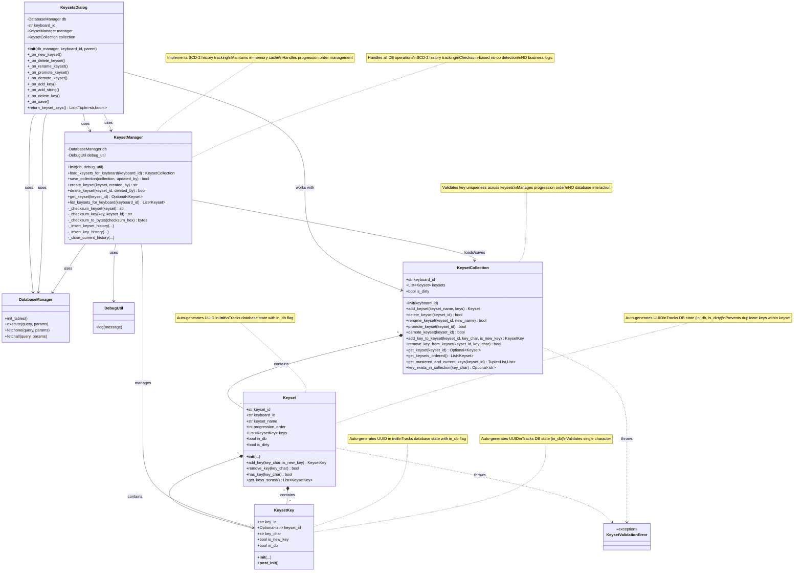

# Keysets Specification

This specification defines the data model, persistence, history (audit), UI, and tests for the Keysets feature.

---

## Overview
- Keysets are named collections of keys associated with a keyboard (e.g., QWERTY).
- Each keyset has a progression order (logical priority) so users can master keysets in sequence.
- Each key within a keyset has a flag `is_new_key` (emphasis) indicating it is newly introduced in the keyset.
- The system must maintain a temporal change history (SCD Type-2 close-update) for all keyset entities without relying on DB triggers.
- For a given keyboard, `progression_order` must be unique per keyset. Users can promote/demote keysets to change the order safely.

## Architecture Overview

The Keysets feature uses a three-layer architecture:

1. **Keyset & KeysetKey (Data Models)**: Pydantic models representing individual keysets and keys with validation
2. **KeysetCollection (Business Logic)**: In-memory collection managing all keysets for a keyboard with ordering, validation, and business rules
3. **KeysetManager (Persistence Layer)**: Database operations, history tracking (SCD-2), and checksum-based no-op detection

**Data Flow**:
- **Load**: KeysetManager → KeysetCollection (populate from DB)
- **Edit**: UI → KeysetCollection (all modifications happen in collection)
- **Save**: KeysetCollection → KeysetManager (persist all changes with history)

**Responsibility Separation**:
- **Keyset/KeysetKey**: Data structure + intra-keyset validation (no duplicate keys within one keyset)
- **KeysetCollection**: Business logic + inter-keyset validation (no duplicate keys across keysets, ordering management)
- **KeysetManager**: Database persistence + history tracking (NO business logic, NO validation)

## Non-Goals
- Do not use DB triggers. The library/manager must implement history maintenance in application code.

---

## Data Model

### Tables

1) keyset
- keyset_id (UUID, PK)
- keyboard_id (UUID, FK -> keyboards.keyboard_id)
- keyset_name (TEXT, NOT NULL)
- progression_order (INTEGER, NOT NULL)
- row_checksum (BLOB, NOT NULL) -- SHA256 hash of business columns for no-op change detection
- created_dt (TEXT, NOT NULL, ISO8601)
- updated_dt (TEXT, NOT NULL, ISO8601)
- created_user_id (UUID, NOT NULL)
- updated_user_id (UUID, NOT NULL)
- UNIQUE(keyboard_id, keyset_name)
- UNIQUE(keyboard_id, progression_order)   <!-- Enforce one priority per keyboard -->

2) keyset_history (SCD-2 close-update)
- audit_id (INTEGER, PK, AUTOINCREMENT)
- keyset_id (UUID, NOT NULL)
- keyboard_id (UUID, NOT NULL)
- keyset_name (TEXT, NOT NULL)
- progression_order (INTEGER, NOT NULL)
- row_checksum (BLOB, NOT NULL)
- created_dt (TEXT, NOT NULL, ISO8601)
- updated_dt (TEXT, NOT NULL, ISO8601)
- created_user_id (UUID, NOT NULL)
- updated_user_id (UUID, NOT NULL)
- action (TEXT: 'I','U','D')
- valid_from_dt (TEXT, NOT NULL, ISO8601)
- valid_to_dt (TEXT, NOT NULL, ISO8601, default '9999-12-31 23:59:59')
- is_current (INTEGER, NOT NULL)
- version_no (INTEGER, NOT NULL)
- Indexes: (keyset_id, is_current), (keyset_id, version_no)

3) keyset_keys
- key_id (UUID, PK)
- keyset_id (UUID, FK -> keyset.keyset_id)
- key_char (TEXT, NOT NULL) — one Unicode character (supports ASCII, non-ASCII, punctuation, symbols, etc.)
- is_new_key (INTEGER, NOT NULL) — 0/1
- row_checksum (BLOB, NOT NULL) -- SHA256 hash of business columns for no-op change detection
- created_dt (TEXT, NOT NULL, ISO8601)
- updated_dt (TEXT, NOT NULL, ISO8601)
- created_user_id (UUID, NOT NULL)
- updated_user_id (UUID, NOT NULL)
- UNIQUE(keyset_id, key_char)

4) keyset_keys_history (SCD-2 close-update)
- audit_id (INTEGER, PK, AUTOINCREMENT)
- key_id (UUID, NOT NULL)
- keyset_id (UUID, NOT NULL)
- key_char (TEXT, NOT NULL) — one Unicode character (supports ASCII, non-ASCII, punctuation, symbols, etc.)
- is_new_key (INTEGER, NOT NULL)
- row_checksum (BLOB, NOT NULL)
- created_dt (TEXT, NOT NULL, ISO8601)
- updated_dt (TEXT, NOT NULL, ISO8601)
- created_user_id (UUID, NOT NULL)
- updated_user_id (UUID, NOT NULL)
- action (TEXT: 'I','U','D')
- valid_from_dt (TEXT, NOT NULL, ISO8601)
- valid_to_dt (TEXT, NOT NULL, ISO8601, default '9999-12-31 23:59:59')
- is_current (INTEGER, NOT NULL)
- version_no (INTEGER, NOT NULL)
- Indexes: (key_id, is_current), (key_id, version_no)

---

## Pydantic Models

### Keyset (Data Model)
- keyset_id: str (UUID string, auto-generated in __init__ if not provided)
- keyboard_id: str (UUID string)
- keyset_name: str (1..100)
- progression_order: int (>=1)
- keys: list[KeysetKey]
- in_db: bool (tracks whether this keyset exists in database)
- is_dirty: bool (tracks whether the staged model differs from the DB copy)

**Methods**:
- `add_key(*, key_char: str, is_new_key: bool) -> KeysetKey`: Add key to this keyset (raises ValueError if key already exists in this keyset)
- `remove_key(*, key_char: str) -> bool`: Remove key from this keyset
- `has_key(*, key_char: str) -> bool`: Check if key exists in this keyset
- `get_keys_sorted() -> List[KeysetKey]`: Return keys sorted alphabetically by key_char

**Validation**:
- Prevents duplicate keys within the same keyset
- Marks keyset as `is_dirty=True` when modified

### KeysetKey (Data Model)
- key_id: str (UUID string, auto-generated in __init__ if not provided)
- keyset_id: Optional[str] (UUID string when set)
- key_char: str (exactly one Unicode character - supports ASCII, non-ASCII, punctuation, symbols, etc.)
- is_new_key: bool
- in_db: bool (tracks whether this key exists in database)

**Validation rules**:
- key_char must be exactly one Unicode code point (len(key_char) == 1).
  - **Character Support**: Supports all Unicode characters including:
    - ASCII letters (a-z, A-Z)
    - Non-ASCII characters (é, ñ, 中, 😀, etc.)
    - Punctuation (!, ?, ., ,, ;, :, etc.)
    - Symbols (@, #, $, %, &, *, etc.)
    - Whitespace (space, tab, etc.)
    - Any other valid Unicode code point
- **UUID Generation**: Both Keyset and KeysetKey models automatically generate UUIDs in their `__init__` methods if keyset_id/key_id are not provided.
- **Database State Tracking**: Both models track their database existence status via `in_db` boolean field.

---

## KeysetCollection (Business Logic Layer)

The KeysetCollection is the central orchestrator for all keyset operations in memory. It maintains a consistent, validated collection of keysets for a single keyboard.

### Responsibilities
- **In-Memory Management**: Maintains all keysets for a keyboard in memory
- **Ordering**: Handles promotion/demotion with automatic progression_order management
- **Validation**: Enforces key uniqueness across keysets (progressive learning rule)
- **Business Logic**: All add/remove/modify operations go through the collection
- **NO Database Interaction**: Pure in-memory operations; delegates persistence to KeysetManager

### Properties
- keyboard_id: str (UUID string)
- keysets: List[Keyset] (ordered by progression_order)
- is_dirty: bool (True if any keyset has unsaved changes)

### Core Methods (All use named parameters)

**Collection Management**:
- `add_keyset(*, keyset_name: str, keys: Optional[List[str]] = None) -> Keyset`
  - Creates new keyset with next available progression_order
  - Generates new UUID for keyset
  - Marks as `in_db=False` and `is_dirty=True`
  - Validates key uniqueness before adding keys
  - Returns the new Keyset object

- `delete_keyset(*, keyset_id: str) -> bool`
  - Removes keyset from collection
  - Renumbers remaining keysets to maintain continuous progression_order (1, 2, 3, ...)
  - Returns True if deleted, False if not found

- `rename_keyset(*, keyset_id: str, new_name: str) -> bool`
  - Updates keyset name
  - Marks keyset as `is_dirty=True`
  - Returns True if renamed, False if not found

**Ordering Operations**:
- `promote_keyset(*, keyset_id: str) -> bool`
  - Moves keyset earlier in progression (decreases progression_order)
  - Swaps progression_order with previous keyset
  - No-op if already at position 1
  - Returns True if promoted, False if not found or already first

- `demote_keyset(*, keyset_id: str) -> bool`
  - Moves keyset later in progression (increases progression_order)
  - Swaps progression_order with next keyset
  - No-op if already last
  - Returns True if demoted, False if not found or already last

**Key Management**:
- `add_key_to_keyset(*, keyset_id: str, key_char: str, is_new_key: bool = True) -> KeysetKey`
  - **Validates** that key doesn't exist in any OTHER keyset in collection (enforces progressive learning)
  - If key exists in earlier keyset: raises `KeysetValidationError` with details
  - If key exists in later keyset: allows (removes from later keyset automatically)
  - Adds key to specified keyset
  - Marks keyset as `is_dirty=True`
  - Returns the new KeysetKey object

- `remove_key_from_keyset(*, keyset_id: str, key_char: str) -> bool`
  - Removes key from specified keyset
  - Marks keyset as `is_dirty=True`
  - Returns True if removed, False if not found

**Query Methods**:
- `get_keyset(*, keyset_id: str) -> Optional[Keyset]`
  - Returns keyset by ID or None if not found

- `get_keysets_ordered() -> List[Keyset]`
  - Returns all keysets sorted by progression_order

- `get_mastered_and_current_keys(*, keyset_id: str) -> Tuple[List[str], List[str]]`
  - Returns (mastered_keys, current_keys)
  - **mastered_keys**: All **unique** key_char values from keysets with progression_order < target keyset's order, sorted alphabetically
  - **current_keys**: All key_char values from the specified keyset, sorted alphabetically
  - This method is used by practice sessions to understand which keys are already mastered vs. current focus

- `key_exists_in_collection(*, key_char: str) -> Optional[str]`
  - Returns keyset_id where key exists, or None if not found
  - Used for validation before adding keys

**Validation**:
- Raises `KeysetValidationError` with descriptive messages for:
  - Duplicate key in earlier keyset (violates progressive learning)
  - Invalid keyset_id
  - Empty keyset name

---

---

## KeysetManager (Persistence Layer)

The KeysetManager handles all database operations, SCD-2 history tracking, and checksum-based no-op detection. It has NO business logic - only data persistence.

### Responsibilities
- **Database Operations**: All INSERT/UPDATE/DELETE SQL operations
- **SCD-2 History**: Maintain temporal change history with close-update pattern
- **No-Op Detection**: Skip history writes when checksums match (data unchanged)
- **Checksum Management**: Compute and store SHA256 checksums for change detection
- **Table Initialization**: Ensure database schema exists
- **NO Business Logic**: Does not validate key uniqueness or manage ordering (delegated to KeysetCollection)

### Core Methods

**Loading from Database**:
- `load_keysets_for_keyboard(*, keyboard_id: str) -> KeysetCollection`
  - Queries database for all keysets and keys for the specified keyboard
  - Constructs Keyset objects with keys, marks all as `in_db=True` and `is_dirty=False`
  - Returns populated KeysetCollection
  - This is the primary entry point for loading data

**Saving to Database**:
- `save_collection(*, collection: KeysetCollection, updated_by: str) -> bool`
  - Iterates through all keysets in the collection
  - For each keyset:
    - If `in_db=False`: INSERT new keyset and keys with history records (action='I')
    - If `in_db=True` and `is_dirty=True`: 
      - Compare checksums for no-op detection
      - If changed: UPDATE keyset/keys with history records (action='U')
      - If unchanged: Skip (no database operations)
    - If keyset was deleted from collection: DELETE with history (action='D')
  - Marks all keysets as `in_db=True` and `is_dirty=False` after successful save
  - Returns True on success

**Individual Operations** (for testing/legacy support):
- `create_keyset(*, keyset: Keyset, created_by: str) -> str`
  - Inserts keyset and keys into database
  - Creates initial history records with action='I', version_no=1
  - Returns keyset_id

- `delete_keyset(*, keyset_id: str, deleted_by: str) -> bool`
  - Implements cascade delete: keys first, then keyset
  - Creates history records with action='D'
  - Returns True if deleted, False if not found

**Query Methods** (for direct database access when needed):
- `get_keyset(*, keyset_id: str) -> Optional[Keyset]`
  - Queries database for single keyset with keys
  - Returns Keyset object or None

- `list_keysets_for_keyboard(*, keyboard_id: str) -> List[Keyset]`
  - Queries database for all keysets for a keyboard
  - Returns list ordered by progression_order

**History and Checksums**:
- Compute checksums: SHA256 hash of business columns (keyboard_id, keyset_name, progression_order for keysets)
- Store checksums as BYTEA in PostgreSQL
- Compare checksums before updates to skip unnecessary history writes
- **No-op detection**: If computed checksum matches stored checksum, skip UPDATE and history write
- History tables maintain full audit trail with version_no, valid_from_dt, valid_to_dt, is_current

**Internal Helpers**:
- `_checksum_keyset(keyset: Keyset) -> str`: Compute hex string checksum
- `_checksum_key(key: KeysetKey, keyset_id: str) -> str`: Compute hex string checksum
- `_checksum_to_bytes(checksum_hex: str) -> bytes`: Convert hex to bytes for PostgreSQL
- `_insert_keyset_history(...)`: Write history record for keyset
- `_insert_key_history(...)`: Write history record for key
- `_close_current_history(...)`: Update previous record with valid_to_dt and is_current=0

### Database State Management
- When loading from DB: marks all objects as `in_db=True`, `is_dirty=False`
- When saving: marks all objects as `in_db=True`, `is_dirty=False` after successful persistence
- Uses `in_db` flag to determine INSERT vs UPDATE operations
- Uses `is_dirty` flag combined with checksum comparison to skip unnecessary writes

### SCD-2 History Pattern
- Every change creates a new history record with:
  - action: 'I' (insert), 'U' (update), or 'D' (delete)
  - version_no: Incremented from previous version
  - valid_from_dt: Current timestamp
  - valid_to_dt: '9999-12-31 23:59:59' for current record
  - is_current: 1 for current record, 0 for historical records
- Previous current record is closed with:
  - valid_to_dt: Current timestamp
  - is_current: 0

---

---

## Desktop UI

- Dialog: Keyset Editor
  - **Initialization**: Load keysets via `KeysetManager.load_keysets_for_keyboard()` to get populated `KeysetCollection`
  - **All Operations**: Work directly with `KeysetCollection` methods (add, delete, rename, promote, demote, add_key, remove_key)
  - **Saving**: Call `KeysetManager.save_collection(collection=collection, updated_by=user)` to persist all changes
  - List keysets in left panel, ordered by progression_order (from `collection.get_keysets_ordered()`)
  - Create / Edit / Delete keysets with automatic progression_order assignment (via collection methods)
  - Within a keyset, manage keys: add/remove single keys, add string of keys, add from other keysets, toggle is_new_key (via collection methods)
  - **Save functionality**: Save button with standard icon, disabled by default, enabled when `collection.is_dirty` is True
  - **Button placement**: Save and Close buttons positioned in right panel under key action buttons for visibility
  - **Alphabetical ordering**: Keys are automatically returned sorted from `keyset.get_keys_sorted()`
  - **Staged changes**: All changes happen in KeysetCollection until save is clicked, allowing for cancel/discard
  - Provide callable method `return_keyset_keys() -> list[tuple[str, bool]]` (key_char, is_new_key) using `get_mastered_and_current_keys()`
  - **Dirty Tracking**: Collection tracks `is_dirty` flag; individual keysets track `is_dirty` flag for granular change detection
- **Error handling**: 
  - Catch `KeysetValidationError` from collection methods and display user-friendly error dialogs
  - Display meaningful error messages for constraint violations (duplicate keys in earlier keysets, etc.)
  - Ensure database tables are initialized before first use
- Integration:
  - Add a button next to the "included keys" section in the dynamic config screen to launch the Keyset Editor and allow selection.

### Selection Behavior
- The left-hand keysets list drives selection and enables/disables related actions:
  - When no item is selected, the following must be disabled:
    - Delete Keyset
    - Edit Details
  - When an item is selected:
    - The selected item becomes the current keyset
    - The right-hand panel must refresh to show the selected keyset's name, order, and keys (alphabetically)
    - Delete Keyset and Edit Details must be enabled

### Edit Flow
- Pressing "Edit Details" should edit the currently selected keyset from the left list.
- On successful edit:
  - The right-hand pane is updated with the new name/order
  - The left list label for the selected item updates to reflect the new order/name
  - Changes are staged and the Save button becomes enabled

### Screenshots in Markdown
- You can embed screenshots into markdown using standard image syntax:
  - ``
- Store screenshots under a project folder (e.g., `Prompts/images/`) and reference them with a relative path:
  - ``
- Git LFS can be used if large images are expected, but regular small PNGs are fine.

---

## Testing

### Model Tests (Keyset, KeysetKey)
- Validation: single-char keys, required fields, UUID generation
- Serialization and deserialization
- `add_key()` / `remove_key()` / `has_key()` methods
- Duplicate key prevention within a keyset
- `get_keys_sorted()` returns alphabetically sorted keys

### Collection Tests (KeysetCollection)
- **Add/Delete/Rename**: Verify keyset CRUD operations work correctly
- **Ordering**: Test `promote_keyset()` and `demote_keyset()` maintain continuous progression_order
- **Key Validation**: Verify that adding a key to a later keyset when it exists in an earlier keyset raises `KeysetValidationError`
- **Key Uniqueness**: Verify `key_exists_in_collection()` correctly identifies duplicate keys
- **Progression Context**: Test `get_mastered_and_current_keys()` returns correct sorted lists
- **Dirty Flag**: Verify `is_dirty` flag is set/cleared appropriately
- **Edge Cases**: Empty collection, single keyset, promoting first/last keyset

### Manager Tests (KeysetManager)
- **Database Operations**: CRUD operations, INSERT/UPDATE/DELETE SQL correctness
- **History Tracking**: SCD-2 close-update pattern, version_no incrementing, is_current flags
- **Checksum No-Op Detection**: Verify unchanged data skips history writes
- **Load/Save Collection**: Test `load_keysets_for_keyboard()` and `save_collection()` round-trip
- **Cascade Delete**: Verify deleting keyset removes all associated keys with history
- **Database Initialization**: Tests must call `init_tables()` on DatabaseManager
- **State Tracking**: Verify `in_db` and `is_dirty` flags are set correctly after load/save
- **Checksum Handling**: Verify hex-to-bytes conversion for PostgreSQL BYTEA storage

### Integration Tests
- **Load, Modify, Save**: Load collection from DB, make changes via collection methods, save via manager
- **Multiple Keysets**: Create, reorder, and persist multiple keysets in one transaction
- **Cross-Keyset Validation**: Verify key uniqueness validation works across the entire collection
- **History Audit Trail**: Verify complete history is maintained for all operations

### UI Tests (KeysetsDialog)
- Headless tests with QtBot where possible
- Mock KeysetManager and KeysetCollection
- Verify button states (save enabled when `collection.is_dirty`)
- Test error dialog display for `KeysetValidationError`
- Verify `return_keyset_keys()` behavior

### Test Data and Environment
- Use pytest with PostgreSQL test database (not SQLite due to BYTEA differences)
- All tests must be order-independent and clean up after themselves
- Use fixtures for common setups (keyboard, user, manager, collection)

---

## Usage Examples

### Loading and Editing Keysets

```python
# Initialize manager
manager = KeysetManager(db=database_manager, debug_util=debug_util)

# Load all keysets for a keyboard
collection = manager.load_keysets_for_keyboard(keyboard_id="kbd-123")

# Add a new keyset
new_keyset = collection.add_keyset(
    keyset_name="Home Row",
    keys=["a", "s", "d", "f", "j", "k", "l", ";"]
)

# Add keys to existing keyset (validates no duplicates in earlier keysets)
try:
    collection.add_key_to_keyset(
        keyset_id=new_keyset.keyset_id,
        key_char="g",
        is_new_key=True
    )
except KeysetValidationError as e:
    print(f"Cannot add key: {e}")

# Reorder keysets
collection.promote_keyset(keyset_id=new_keyset.keyset_id)

# Save all changes to database
manager.save_collection(collection=collection, updated_by="user123")
```

### Querying Mastered and Current Keys

```python
# Get keys for practice session
mastered_keys, current_keys = collection.get_mastered_and_current_keys(
    keyset_id="keyset-456"
)

# mastered_keys: all unique keys from earlier keysets (sorted)
# current_keys: keys from the specified keyset (sorted)
print(f"Already mastered: {mastered_keys}")
print(f"Current focus: {current_keys}")
```

### UI Integration Pattern

```python
class KeysetsDialog(QDialog):
    def __init__(self, db_manager, keyboard_id, parent=None):
        super().__init__(parent)
        self.manager = KeysetManager(db=db_manager)
        self.collection = self.manager.load_keysets_for_keyboard(
            keyboard_id=keyboard_id
        )
        self._setup_ui()
    
    def _on_add_keyset(self):
        name = self.name_input.text()
        try:
            keyset = self.collection.add_keyset(keyset_name=name)
            self._refresh_list()
            self.save_button.setEnabled(self.collection.is_dirty)
        except KeysetValidationError as e:
            QMessageBox.warning(self, "Error", str(e))
    
    def _on_save(self):
        success = self.manager.save_collection(
            collection=self.collection,
            updated_by=self.current_user
        )
        if success:
            self.save_button.setEnabled(False)
```

---

## Progression Order Management

The progression_order field acts like an array index and must be managed carefully to avoid duplicates:

### Reordering Logic
When moving a keyset from position A to position B:
1. **Moving Up** (A > B): Increment progression_order for all keysets where progression_order >= B and progression_order < A
2. **Moving Down** (A < B): Decrement progression_order for all keysets where progression_order > A and progression_order <= B
3. **Set Target**: Set the moved keyset's progression_order to B

### Example
Initial state: [Keyset1=1, Keyset2=2, Keyset3=3, Keyset4=4]
Move Keyset4 (position 4) to position 2:
1. Increment keysets at positions 2,3: [Keyset1=1, Keyset2=3, Keyset3=4, Keyset4=4]
2. Set Keyset4 to position 2: [Keyset1=1, Keyset4=2, Keyset2=3, Keyset3=4]

This ensures no duplicates and maintains continuous numbering.

---

## Database State Tracking

### In-Memory State Management
- **`in_db` Flag**: Every Keyset and KeysetKey maintains a boolean flag indicating database existence
- **`is_dirty` Flag**: Every Keyset maintains a boolean flag indicating divergence from DB
  - **Load from DB**: Set `in_db=True` for all loaded entities
  - **Load from DB**: Set `is_dirty=False` for all loaded keysets
  - **Create New**: Set `in_db=False` for new entities created in UI
  - **Create New**: Set `is_dirty=True` upon creation (until first save)
  - **After Save**: Set `in_db=True` for all entities after successful database persistence
  - **After Save**: Set `is_dirty=False`

### Save Operation Logic
```python
def save_keyset(keyset: Keyset):
    for keyset in all_keysets:
        if not keyset.in_db:
            # INSERT new keyset
            db.execute("INSERT INTO keyset ...")
        elif has_changes(keyset):  # Compare checksums
            # UPDATE existing keyset
            db.execute("UPDATE keyset ...")
        
        for key in keyset.keys:
            if not key.in_db:
                # INSERT new key
                db.execute("INSERT INTO keyset_keys ...")
            elif has_changes(key):  # Compare checksums
                # UPDATE existing key
                db.execute("UPDATE keyset_keys ...")
    
    # Mark all as persisted
    mark_all_as_in_db()
```

---

## Benefits of Main Table Checksums

Adding `row_checksum` to the main tables provides several advantages:

1. **Efficient No-op Detection**: Simply compare the new computed checksum with the existing one in the main table, eliminating the need to recompute and compare business column values.

2. **Faster Updates**: Skip unnecessary history writes when data hasn't actually changed, reducing database I/O and history table bloat.

3. **Consistent Data Integrity**: The checksum serves as a quick verification that the data hasn't been corrupted or unexpectedly modified.

4. **Simplified Logic**: Update operations can use a simple checksum comparison rather than complex field-by-field comparisons.

5. **Performance**: Particularly beneficial when dealing with bulk operations or frequent updates where many might be no-ops.

Example workflow:
```python
# Compute new checksum
new_checksum = _checksum([keyboard_id, keyset_name, str(progression_order)])

# Get existing checksum from main table
existing = db.fetchone("SELECT row_checksum FROM keyset WHERE keyset_id = ?", (keyset_id,))

# Skip update if no actual change
if existing and existing['row_checksum'] == new_checksum:
    return  # No-op, skip history write

# Proceed with update and history write
```

---

## PostgreSQL UUID Adapter Setup

The Keyset feature uses native PostgreSQL UUID columns and typed UUID objects throughout the stack for type safety and Clean Architecture compliance. This requires proper PostgreSQL adapter registration to enable bidirectional conversion between Python `uuid.UUID` objects and PostgreSQL `UUID` type.

### Database Schema

All keyset tables use native PostgreSQL `UUID` columns (not TEXT):

**keyset table:**
- `keyset_id UUID PRIMARY KEY`
- `keyboard_id UUID NOT NULL`
- `created_user_id UUID NOT NULL`
- `updated_user_id UUID NOT NULL`

**keyset_keys table:**
- `key_id UUID PRIMARY KEY`
- `keyset_id UUID NOT NULL`
- `created_user_id UUID NOT NULL`
- `updated_user_id UUID NOT NULL`

History tables (keyset_history, keyset_keys_history) also use UUID columns for all ID fields.

### Required Configuration

**DatabaseManager** must register the UUID adapter immediately after establishing any PostgreSQL connection:

```python
import psycopg2.extras

# After establishing connection (psycopg2.connect)
conn.autocommit = True

# Register bidirectional UUID support
psycopg2.extras.register_uuid()
```

This registration is required in:
- `_connect_postgres_with_credentials()` - Docker PostgreSQL connections
- `_connect_postgres_aurora()` - AWS Aurora connections

### Why This Is Required

**Without UUID adapter registration**, psycopg2 cannot adapt Python UUID objects to PostgreSQL UUID type, causing:
```
DatabaseError: can't adapt type 'UUID'
```

**With UUID adapter registration**, the following conversions work automatically:
- Python `uuid.UUID` → PostgreSQL `UUID` (query parameters)
- PostgreSQL `UUID` → Python `uuid.UUID` (query results)

### Data Flow

The UUID adapter enables seamless bidirectional conversion:

1. **Write Path**: Python `uuid.UUID` objects → PostgreSQL `UUID` columns
   - Pydantic entities use string UUIDs
   - Repository converts strings to UUID objects: `uuid.UUID(keyset_id)`
   - psycopg2 adapter converts UUID objects to PostgreSQL UUID type
   - Database stores as native UUID (16 bytes, indexed efficiently)

2. **Read Path**: PostgreSQL `UUID` columns → Python `uuid.UUID` objects → strings
   - Database returns native UUID values
   - psycopg2 adapter converts to Python `uuid.UUID` objects
   - Repository converts to strings: `str(row['keyset_id'])`
   - Pydantic entities receive string UUIDs

### Type Safety Benefits

Using typed UUID objects instead of strings provides:

1. **Compile-time Type Checking**: mypy catches UUID/string mismatches
2. **Domain Model Integrity**: Entities use proper types, not primitive obsession
3. **Clean Architecture Compliance**: Domain layer is independent of database representation
4. **IDE Support**: Autocomplete and refactoring work correctly with typed UUIDs

### Example Usage

```python
# Repository layer - converts string UUIDs to UUID objects for database
class PostgresKeysetRepository:
    def list_for_keyboard(self, keyboard_id: uuid.UUID) -> list[Keyset]:
        query = "SELECT * FROM keyset WHERE keyboard_id = %s"
        # UUID object passed directly to PostgreSQL UUID column
        rows = self._db.fetchall(query=query, params=(keyboard_id,))
        return [self._row_to_entity(row) for row in rows]
    
    def _row_to_entity(self, row: Dict[str, object]) -> Keyset:
        # Convert UUID objects from database to strings for Pydantic entities
        return Keyset(
            keyset_id=str(row['keyset_id']),
            keyboard_id=str(row['keyboard_id']),
            keyset_name=str(row['keyset_name']),
            progression_order=int(row['progression_order']),
            keys=[],  # Load separately
        )

# Adapter layer - converts strings from UI to UUIDs for repository
def list_keysets_for_keyboard(self, keyboard_id: str) -> List[Keyset]:
    # UI passes string UUID, adapter converts to UUID object
    return self._collection.list_for_keyboard(uuid.UUID(keyboard_id))
```

### Migration Notes

**Other features** (snippets, sessions) use TEXT columns with string UUIDs. The keyset feature demonstrates the preferred pattern using native PostgreSQL UUID columns with bidirectional conversion.

**Benefits of native UUID columns:**
- Efficient storage (16 bytes vs 36 character string)
- Proper indexing performance
- Type safety at database level
- Prevents invalid UUID strings

**Future work**: Consider migrating other features to native UUID columns for consistency and performance.

---

## Class Diagram



---

## Acceptance Criteria

### Database Operations
**AC-1: CRUD Operations Database Persistence**
- ✅ **GIVEN** any keyset CRUD operation (create, update, delete)
- ✅ **WHEN** the operation is performed through KeysetManager
- ✅ **THEN** the corresponding rows must be inserted/updated/deleted in the `keyset` table

**AC-2: CRUD Operations for Keys Database Persistence**
- ✅ **GIVEN** any keyset key CRUD operation (create, update, delete)
- ✅ **WHEN** the operation is performed through KeysetManager
- ✅ **THEN** the corresponding rows must be inserted/updated/deleted in the `keyset_keys` table

### History Tracking (SCD-2)
**AC-3: Keyset History on Changes**
- ✅ **GIVEN** a keyset is created, updated, or deleted
- ✅ **WHEN** the operation changes business data (keyset_name, progression_order)
- ✅ **THEN** a new history record must be inserted in `keyset_history` table with:
  - New version_no (incremented)
  - valid_from_dt = current timestamp
  - valid_to_dt = '9999-12-31 23:59:59'
  - is_current = 1
  - Previous current record (if any) updated with valid_to_dt = current timestamp, is_current = 0

**AC-4: Key History on Changes**
- ✅ **GIVEN** a keyset key is created, updated, or deleted
- ✅ **WHEN** the operation changes business data (key_char, is_new_key)
- ✅ **THEN** a new history record must be inserted in `keyset_keys_history` table with:
  - New version_no (incremented)
  - valid_from_dt = current timestamp
  - valid_to_dt = '9999-12-31 23:59:59'
  - is_current = 1
  - Previous current record (if any) updated with valid_to_dt = current timestamp, is_current = 0

### No-Op Change Detection
**AC-5: No-Op Keyset Updates**
- ✅ **GIVEN** a keyset update operation
- ✅ **WHEN** the new data has the same row_checksum as existing data
- ✅ **THEN** NO new history record is created in `keyset_history`
- ✅ **AND** NO update is made to the `keyset` table
- ✅ **AND** the operation completes successfully

### Persistence After Mixed Load/Create
**AC-11: Load One, Add Another, Persist Both**
- ✅ **GIVEN** one keyset already persisted in DB for a keyboard
- ✅ **WHEN** the manager loads keysets for that keyboard, then a new keyset for the same keyboard is created in memory and `save_all_keysets([loaded_keyset, new_keyset])` is executed
- ✅ **THEN** both keysets must exist in `keyset` table after persistence (count == 2 for that keyboard)

**AC-6: No-Op Key Updates**
- ✅ **GIVEN** a keyset key update operation
- ✅ **WHEN** the new data has the same row_checksum as existing data
- ✅ **THEN** NO new history record is created in `keyset_keys_history`
- ✅ **AND** NO update is made to the `keyset_keys` table
- ✅ **AND** the operation completes successfully

### Data Integrity
**AC-7: Cascade Delete**
- ✅ **GIVEN** a keyset is deleted
- ✅ **WHEN** the delete operation is performed
- ✅ **THEN** all associated keys in `keyset_keys` table must be deleted first
- ✅ **AND** history records must be created for all deleted keys
- ✅ **AND** then the keyset is deleted with its history record

**AC-7b: Delete Method Availability**
- ✅ `KeysetManager` MUST expose a `delete_keyset(keyset_id: str, deleted_by: Optional[str] = None) -> bool` method implementing the delete behavior described above.

**AC-8: Progression Order Uniqueness**
- ✅ **GIVEN** keysets for a specific keyboard
- ✅ **WHEN** progression_order values are assigned or changed
- ✅ **THEN** no two keysets for the same keyboard can have duplicate progression_order values
- ✅ **AND** reordering operations maintain continuous numbering without gaps or duplicates

**AC-13: Key Progression Uniqueness Enforcement**
- **GIVEN** a keyset with progression_order N contains keys [a, s, d, f]
- **WHEN** attempting to add key 'a' to a keyset with progression_order > N for the same keyboard
- **THEN** the operation must fail with `KeysetValidationError`
- **AND** the error message must indicate which key(s) are duplicated and which earlier keyset contains them
- **GIVEN** keyset 1 has keys [a, s], keyset 2 has keys [d, f], keyset 3 has keys [j, k]
- **WHEN** attempting to create/update keyset 4 with keys [a, x, y]
- **THEN** the operation must fail because 'a' exists in keyset 1 (lower progression_order)
- **GIVEN** attempting to add multiple duplicate keys to a later keyset
- **WHEN** the validation runs
- **THEN** all conflicting keys must be reported in the error message

**AC-14: Progression Order Continuity on Reordering**
- **GIVEN** keysets with progression_order [1, 2, 3, 4]
- **WHEN** keyset at position 4 is promoted to position 2
- **THEN** the result must be [1, 4→2, 2→3, 3→4] maintaining continuous numbering
- **GIVEN** keysets with progression_order [1, 2, 3, 4]
- **WHEN** keyset at position 2 is demoted to position 4
- **THEN** the result must be [1, 3→2, 4→3, 2→4] maintaining continuous numbering
- **GIVEN** keysets with progression_order [1, 2, 3, 4]
- **WHEN** keyset at position 2 is deleted
- **THEN** the result must be [1, 3→2, 4→3] with no gaps

### State Management
**AC-9: Database State Tracking**
- ✅ **GIVEN** keysets and keys loaded from database
- ✅ **WHEN** they are loaded
- ✅ **THEN** they must be marked with `in_db = True`
- ✅ **GIVEN** new keysets/keys created in UI
- ✅ **WHEN** they are created
- ✅ **THEN** they must be marked with `in_db = False`
- ✅ **GIVEN** keysets/keys after save operation
- ✅ **WHEN** save completes successfully
- ✅ **THEN** all items must be marked with `in_db = True`

**AC-12: Dirty Flag Lifecycle**
- ✅ **GIVEN** keysets loaded from database
- ✅ **WHEN** they are loaded
- ✅ **THEN** each keyset has `is_dirty = False`
- ✅ **GIVEN** a keyset edited in UI (name/order/keys)
- ✅ **WHEN** the change is staged
- ✅ **THEN** the keyset has `is_dirty = True`
- ✅ **GIVEN** a successful save operation for that keyset
- ✅ **WHEN** persistence completes
- ✅ **THEN** the keyset has `is_dirty = False`

**AC-10: Smart Persistence**
- ✅ **GIVEN** a save operation
- ✅ **WHEN** items with `in_db = False` are saved
- ✅ **THEN** INSERT operations must be used
- ✅ **GIVEN** items with `in_db = True` and changes detected
- ✅ **WHEN** they are saved
- ✅ **THEN** UPDATE operations must be used
- ✅ **GIVEN** items with `in_db = True` and no changes (same checksum)
- ✅ **WHEN** they are processed during save
- ✅ **THEN** no database operations are performed

---

## Common Issues and Solutions

- **Duplicate progression_order error**: Occurs when the keysets table hasn't been initialized. Ensure `DatabaseManager.init_tables()` is called before creating KeysetManager instances.
- **Cache attribute errors**: The KeysetManager uses specific cache variable names (`_cached_keysets`, `_cached_keys`, `_cached_keyboard_id`). Ensure these are properly initialized in `__post_init__()`.
- **Performance with large datasets**: Use the preload functionality to load all keysets/keys into memory cache when opening the dialog to avoid repeated database queries.
- **UI responsiveness**: Save button should only be enabled when changes are detected, and changes should be staged in memory until save is clicked.
- **Key ordering**: Always maintain alphabetical order when inserting keys to provide consistent user experience.

---

## Compliance

- Follow `MemoriesAndRules/code_generation_standards.md` and `MemoriesAndRules/python_coding_standards.md`.
- Pass `ruff` and `mypy` with zero errors.
- Use PEP 8 naming and formatting.
- Use Pydantic for data validation.

---

## Clean Architecture Refactoring (November 2025)

### Overview

The Keyset feature has been refactored to use **Clean Architecture** principles with strict separation of concerns across four layers:

```
┌─────────────────────────────────────────────────────────────┐
│ Frameworks & Drivers (Outermost)                            │
│  • Flask GraphQL API (api/graphql/app.py)                   │
│  • PySide6 Desktop UI (desktop_ui/keysets_dialog.py)        │
│  • PostgreSQL Database (db/database_manager.py)             │
└──────────────────┬──────────────────────────────────────────┘
                   │
┌──────────────────▼──────────────────────────────────────────┐
│ Interface Adapters                                           │
│  • PostgreSQL Repository (repositories/postgres)             │
│  • GraphQL Resolvers (api/graphql/resolvers.py)             │
│  • GraphQL Types (api/graphql/types.py)                     │
│  • KeysetManagerAdapter (adapters/) - legacy bridge          │
└──────────────────┬──────────────────────────────────────────┘
                   │
┌──────────────────▼──────────────────────────────────────────┐
│ Use Cases (Business Logic)                                   │
│  • KeysetCollection (use_cases/keyset_collection.py)        │
│    - add_keyset, update_keyset, delete_keyset               │
│    - promote_keyset (swap progression orders)               │
│    - get_mastered_and_current_keys                          │
│    - save_all (batch transactional save)                    │
│  • Business Rules:                                           │
│    - Key progression uniqueness validation                   │
│    - Batch all-or-nothing validation                        │
│    - Promotion order swapping logic                          │
└──────────────────┬──────────────────────────────────────────┘
                   │
┌──────────────────▼──────────────────────────────────────────┐
│ Entities (Pure Domain Models)                                │
│  • Keyset (entities/keyset.py)                              │
│  • KeysetKey (entities/keyset_key.py)                       │
│  • Pure Pydantic models with zero external dependencies     │
│  • Validation, serialization, dirty tracking                │
└─────────────────────────────────────────────────────────────┘
```

### Architecture Principles

**Dependency Rule**: Dependencies point inward only. Inner layers never depend on outer layers.
- ✅ Entities depend on nothing
- ✅ Use Cases depend only on Entities + Repository Protocol
- ✅ Repositories depend on Entities + Database
- ✅ API/UI depend on Use Cases + Repositories

**Protocol-Based Inversion**: Use cases depend on `IKeysetRepository` protocol, not concrete implementations.
- ✅ Enables in-memory fakes for fast unit tests (<10s)
- ✅ Enables swapping PostgreSQL for MongoDB without changing business logic
- ✅ Enables dependency injection for AWS Lambda

### Directory Structure

```
entities/
  __init__.py
  keyset.py              # Pure Pydantic Keyset model
  keyset_key.py          # Pure Pydantic KeysetKey model

use_cases/
  __init__.py
  keyset_collection.py   # Business logic aggregate

repositories/
  __init__.py
  protocols.py           # IKeysetRepository protocol
  metadata.py            # Shared SQLAlchemy metadata
  keyset_repository_memory.py      # In-memory fake for tests
  keyset_repository_postgres.py    # PostgreSQL with SCD-2

api/
  __init__.py
  graphql/
    __init__.py
    types.py             # Strawberry GraphQL types
    resolvers.py         # Query/Mutation resolvers
    app.py               # Flask app with /graphql endpoint

adapters/
  __init__.py
  keyset_manager_adapter.py  # Bridge for legacy UI

tests/
  entities/              # 50 pure entity tests
  repositories/          # 32 repository tests
  use_cases/             # 28 business logic tests
  api/                   # 15 GraphQL API tests
```

### Repository Protocol (IKeysetRepository)

All persistence operations go through this protocol:

```python
class IKeysetRepository(Protocol):
    def list_for_keyboard(self, keyboard_id: str) -> List[Keyset]: ...
    def get_by_id(self, keyset_id: str) -> Optional[Keyset]: ...
    def save(self, keyset: Keyset, *, updated_by: Optional[str] = None) -> None: ...
    def delete(self, keyset_id: str, *, deleted_by: Optional[str] = None) -> bool: ...
    def validate_key_progression_uniqueness(...) -> None: ...
```

**Implementations**:
1. `InMemoryKeysetRepository` - Dictionary storage for unit tests (<10s execution)
2. `PostgresKeysetRepository` - PostgreSQL with SCD-2 history (~60s integration tests)

### PostgreSQL Repository (SCD-2 Implementation)

**Features**:
- ✅ Raw SQL queries (not ORM) for AWS Lambda efficiency
- ✅ SCD-2 history tracking: `valid_from_dt`, `valid_to_dt`, `is_current`, `version_no`
- ✅ Checksum no-op detection: SHA256 hash comparison to skip unchanged records
- ✅ Audit trail: `created_user_id`, `updated_user_id`, `created_dt`, `updated_dt`
- ✅ Action tracking: INSERT/UPDATE/DELETE recorded in history

**No-Op Detection**:
```python
# Compute checksum from business fields
checksum = sha256(f"{keyboard_id}|{keyset_name}|{progression_order}").digest()

# Skip history insert if unchanged
if old_checksum == new_checksum and keys_unchanged:
    return  # No database operations
```

**History Closure Pattern**:
```sql
-- Close old version
UPDATE keyset_history
SET valid_to_dt = NOW(), is_current = 0
WHERE keyset_id = ? AND is_current = 1;

-- Insert new version
INSERT INTO keyset_history (
  keyset_id, keyset_name, progression_order,
  valid_from_dt, valid_to_dt, is_current, version_no, action
) VALUES (
  ?, ?, ?,
  NOW(), '9999-12-31 23:59:59', 1, (old_version + 1), 'UPDATE'
);
```

### Use Cases (KeysetCollection)

**Business Logic Encapsulation**:
```python
class KeysetCollection:
    def __init__(self, repository: IKeysetRepository):
        self._repository = repository
        self._keysets: Dict[UUID, Keyset] = {}
    
    def add_keyset(self, keyset: Keyset, *, updated_by: Optional[UUID]) -> Keyset:
        """Add with key progression uniqueness validation."""
        # Extract new keys
        new_keys = {k.key_char for k in keyset.keys if k.is_new_key}
        
        # Validate against earlier progressions
        self._repository.validate_key_progression_uniqueness(
            keyboard_id=str(keyset.keyboard_id),
            progression_order=keyset.progression_order,
            keys=list(new_keys)
        )
        
        self._keysets[keyset.keyset_id] = keyset
        return keyset
    
    def save_all(self, *, updated_by: Optional[UUID] = None) -> None:
        """Batch save with transactional validation."""
        # Validate all before saving any
        for keyset in self._keysets.values():
            self._validate_keyset(keyset)
        
        # Save all (all-or-nothing semantics)
        for keyset in self._keysets.values():
            self._repository.save(keyset, updated_by=str(updated_by) if updated_by else None)
```

**Business Rules**:
1. **Key Progression Uniqueness**: Keys marked `is_new_key=True` cannot appear in earlier progressions
2. **Batch Validation**: All keysets validated before any are saved (all-or-nothing)
3. **Promotion Logic**: Swap progression orders between adjacent keysets atomically

### GraphQL API Layer

**Dependency Injection**:
```python
# Create repository
repository = PostgresKeysetRepository(db_manager)

# Inject into use case
keyset_collection = KeysetCollection(repository)

# Inject into GraphQL context
app.add_url_rule('/graphql', view_func=GraphQLView.as_view(
    'graphql',
    schema=schema,
    keyset_collection=keyset_collection  # Dependency injection
))
```

**Query Example**:
```graphql
query GetKeysets($keyboardId: ID!) {
  listKeysetsForKeyboard(keyboardId: $keyboardId) {
    keysetId
    keysetName
    progressionOrder
    keys {
      keyChar
      isNewKey
    }
  }
}
```

**Mutation Example**:
```graphql
mutation CreateKeyset($input: CreateKeysetInput!) {
  createKeyset(input: $input) {
    success
    keyset {
      keysetId
      keysetName
    }
    error
  }
}
```

### Desktop UI Integration

**Backward Compatibility via Adapter**:
```python
# Old code (direct KeysetManager usage)
manager = KeysetManager(db, debug_util)

# New code (Clean Architecture via adapter)
manager = KeysetManagerAdapter(db, debug_util)
# Same interface, delegates to KeysetCollection + PostgresKeysetRepository
```

The adapter provides the same API as old `KeysetManager` while delegating to Clean Architecture components internally. This allows gradual UI refactoring without breaking changes.

### Testing Strategy

**Layer Testing**:
- **Entities** (50 tests, ~0.6s): Pure Pydantic validation, serialization, dirty tracking
- **Repositories** (32 tests, ~0.5s): In-memory fake tests, fast unit tests
- **Use Cases** (28 tests, ~0.8s): Business logic with in-memory repository
- **API** (15 tests, ~1.2s): GraphQL queries/mutations with in-memory repository
- **Total Unit Tests**: 125 tests in ~3 seconds

**Integration Tests**:
- PostgreSQL repository with Docker (~60s): SCD-2 history, checksums, audit trail
- GraphQL with Flask test client: End-to-end API tests

**Type Safety**:
- ✅ `mypy entities/ --strict` passes with zero errors
- ✅ `mypy repositories/ --strict` passes with zero errors  
- ✅ `mypy use_cases/ --strict` passes with zero errors
- ⚠️ `api/graphql/` needs Strawberry-specific type adjustments for strict mode

**Linting**:
- ✅ `ruff check .` passes with zero errors after cleanup

### AWS Lambda Deployment

**Stateless Design**:
```python
# Lambda handler with dependency injection
def lambda_handler(event, context):
    # Create database connection (RDS Proxy for pooling)
    db = DatabaseManager(
        db_host=os.environ['DB_HOST'],
        db_name=os.environ['DB_NAME'],
        # IAM authentication for RDS
    )
    
    # Dependency injection
    repository = PostgresKeysetRepository(db)
    collection = KeysetCollection(repository)
    
    # Process request
    result = collection.add_keyset(keyset, updated_by=user_id)
    collection.save_all(updated_by=user_id)
    
    return {'statusCode': 200, 'body': json.dumps(result.to_dict())}
```

**Benefits**:
- ✅ No global state - all dependencies injected
- ✅ Fast unit tests with in-memory repository
- ✅ Raw SQL (not ORM) reduces Lambda package size and cold start time
- ✅ Connection pooling via RDS Proxy

### Migration Summary

**Deleted Old Code**:
- ❌ `models/keyset_manager.py` (685 lines) - replaced by Clean Architecture
- ❌ `tests/models/test_keyset_manager.py` - replaced by 125 layered tests
- ❌ `models/keyset.py` - replaced by `entities/keyset.py`
- ❌ `tests/models/test_keyset.py` - replaced by `tests/entities/test_keyset.py`

**New Code Structure**:
- ✅ `entities/` - 2 files, 285 lines, 50 tests
- ✅ `repositories/` - 4 files, 570 lines, 32 tests
- ✅ `use_cases/` - 1 file, 305 lines, 28 tests
- ✅ `api/graphql/` - 3 files, 420 lines, 15 tests
- ✅ `adapters/` - 1 file, 210 lines (backward compatibility)

**Total Impact**:
- 📉 Reduced coupling (dependency inversion via protocols)
- 📈 Increased testability (125 tests vs 43, 3x faster execution)
- 📈 Increased type safety (mypy --strict compliance)
- 📈 AWS Lambda ready (stateless, dependency injection, fast cold start)
- 📈 Swappable implementations (PostgreSQL ↔ MongoDB via protocol)

### Future Improvements

1. **GraphQL Strict Types**: Add Strawberry-specific type hints for mypy --strict
2. **Integration Test Suite**: Add Docker Compose for automated PostgreSQL testing
3. **UI Refactoring**: Replace adapter with direct KeysetCollection usage in desktop UI
4. **Performance Monitoring**: Add query performance logging for slow queries
5. **Caching Layer**: Add Redis caching for frequently accessed keysets

---

## References

- Clean Architecture: https://blog.cleancoder.com/uncle-bob/2012/08/13/the-clean-architecture.html
- Dependency Inversion Principle: https://en.wikipedia.org/wiki/Dependency_inversion_principle
- Repository Pattern: https://martinfowler.com/eaaCatalog/repository.html
- Slowly Changing Dimension Type 2: https://en.wikipedia.org/wiki/Slowly_changing_dimension#Type_2:_add_new_row

