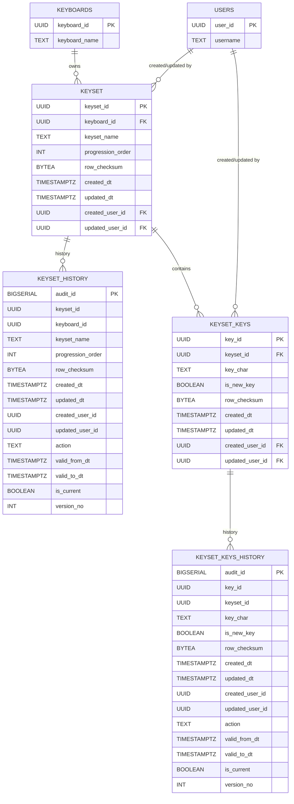
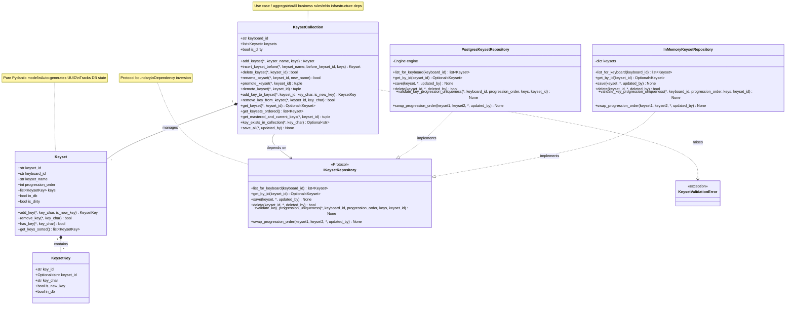

# Keysets Specification

---

## 1. Main Objective

### Purpose

Keysets are the progressive learning backbone of the AI Typing Trainer. A keyset is a named, ordered collection of keyboard characters that a learner must master before advancing. By organising keys into a strict progression, the system can generate practice drills that focus on the learner's current frontier while reinforcing previously mastered keys.

### Scope

This specification covers:

- Domain entities (`Keyset`, `KeysetKey`) and their validation rules
- Business logic (the `KeysetCollection` use case / aggregate)
- Persistence via a repository protocol with PostgreSQL + SCD-2 history implementation and SQLAlchemy Core for database abstraction
- A GraphQL API for web clients
- Web UI (React + MUI) and desktop UI (PySide6) for keyset management
- Acceptance criteria, testing strategy, and deployment considerations

### Non-Goals

- Database triggers for history maintenance — all history logic lives in the application layer.
- Keyboard layout management — keyboards are managed by the Keyboard feature; keysets reference a keyboard by `keyboard_id`.
- Practice drill generation — drill features consume keysets via `get_mastered_and_current_keys()` but drill logic is out of scope.

---

## 2. User Stories & Use Cases

### User Stories

- **As a learner**, I want keysets arranged in a clear progression so I know which keys to practise next.
- **As a learner**, I want the system to prevent the same key from appearing in two different keysets so my practice stays focused.
- **As an instructor / admin**, I want to create, reorder, and edit keysets so I can tailor the learning path for different keyboard layouts.
- **As an instructor / admin**, I want a full audit trail of keyset changes for accountability.
- **As a developer**, I want the persistence layer abstracted behind a protocol so I can swap databases or run fast in-memory tests.

### Use Cases

| # | Actor | Action | Expected Outcome |
|---|-------|--------|------------------|
| UC-1 | Admin | Create a new keyset for a keyboard | Keyset is appended with the next progression_order; keys validated for cross-keyset uniqueness |
| UC-2 | Admin | Insert a keyset before an existing one | New keyset placed at the correct position; all orders renumbered 1..N |
| UC-3 | Admin | Delete a keyset | Keyset and its keys removed; remaining orders renumbered; SCD-2 history records created |
| UC-4 | Admin | Promote / demote a keyset | Progression_order swapped with adjacent keyset atomically |
| UC-5 | Admin | Add keys to a keyset | Each key validated for single-character and cross-keyset uniqueness |
| UC-6 | Admin | Remove a key from a keyset | Key removed; keyset marked dirty |
| UC-7 | Admin | Rename a keyset | Name updated; keyset marked dirty |
| UC-8 | Learner | View mastered and current keys | System returns all keys from earlier keysets (mastered) and current keyset keys |
| UC-9 | System | Auto-save changes | After a debounce interval, dirty keysets are persisted with SCD-2 history |

---

## 3. Functional Requirements

### 3.1 Domain Entities (Entities Layer)

Entities are pure Pydantic models with zero external dependencies. They live in `entities/`.

#### Keyset

| Field | Type | Rules |
|-------|------|-------|
| `keyset_id` | `str` (UUID) | Auto-generated if not provided |
| `keyboard_id` | `str` (UUID) | Required, references `keyboards.keyboard_id` |
| `keyset_name` | `str` | 1–100 characters, not blank, unique within the same `keyboard_id` |
| `progression_order` | `int` | >= 1 |
| `keys` | `list[KeysetKey]` | Ordered collection |
| `in_db` | `bool` | Tracks whether persisted; default `False` |
| `is_dirty` | `bool` | Tracks unsaved edits; default `False` |

**Methods** (all use keyword-only arguments):

- `add_key(*, key_char: str, is_new_key: bool) -> KeysetKey` — Adds a key; raises `ValueError` if duplicate within this keyset.
- `remove_key(*, key_char: str) -> bool` — Removes a key; returns `True` if found.
- `has_key(*, key_char: str) -> bool` — Checks existence within this keyset.
- `get_keys_sorted() -> list[KeysetKey]` — Returns keys sorted alphabetically by `key_char`.

#### KeysetKey

| Field | Type | Rules |
|-------|------|-------|
| `key_id` | `str` (UUID) | Auto-generated if not provided |
| `keyset_id` | `Optional[str]` (UUID) | Set when associated with a keyset |
| `key_char` | `str` | Exactly one Unicode code point (`len(key_char) == 1`). Supports ASCII, non-ASCII, punctuation, symbols, whitespace, emoji. |
| `is_new_key` | `bool` | Indicates key is newly introduced in this keyset |
| `in_db` | `bool` | Tracks whether persisted; default `False` |

#### KeysetValidationError

Custom exception raised by the use-case layer for business rule violations (duplicate key in earlier keyset, invalid keyset_id, empty name, etc.).

---

### 3.2 Business Logic (Use Cases Layer)

The `KeysetCollection` is the central aggregate. It lives in `use_cases/` and depends only on entities and the `IKeysetRepository` protocol — never on concrete repositories or frameworks.

#### Properties

- `keyboard_id: str`
- `keysets: list[Keyset]` (ordered by `progression_order`)
- `is_dirty: bool` — True if any keyset has unsaved changes

#### Collection Management (all keyword-only)

- `add_keyset(*, keyset_name: str, keys: Optional[list[str]] = None) -> Keyset`
  Creates a keyset at the next progression_order. Validates key uniqueness across the collection.

- `insert_keyset_before(*, keyset_name: str, before_keyset_id: Optional[str], keys: Optional[list[str]] = None) -> Keyset`
  Inserts before the given keyset (or appends if `None`). Renumbers all orders to contiguous 1..N.

- `delete_keyset(*, keyset_id: str) -> bool`
  Removes keyset; renumbers remaining to 1..N.

- `rename_keyset(*, keyset_id: str, new_name: str) -> bool`

#### Ordering Operations

- `promote_keyset(*, keyset_id: str) -> tuple[bool, Optional[Keyset]]`
  Swaps with previous keyset. No-op if already first. Returns `(True, swapped_keyset)` on success.

- `demote_keyset(*, keyset_id: str) -> tuple[bool, Optional[Keyset]]`
  Swaps with next keyset. No-op if already last.

#### Key Management

- `add_key_to_keyset(*, keyset_id: str, key_char: str, is_new_key: bool = True) -> KeysetKey`
  Validates that the key does not exist in any **earlier** keyset (raises `KeysetValidationError` if so). If the key exists in a **later** keyset, it is removed from there and added here.

- `remove_key_from_keyset(*, keyset_id: str, key_char: str) -> bool`

#### Query Methods

- `get_keyset(*, keyset_id: str) -> Optional[Keyset]`
- `get_keysets_ordered() -> list[Keyset]`
- `get_mastered_and_current_keys(*, keyset_id: str) -> tuple[list[str], list[str]]`
  Returns `(mastered_keys, current_keys)`. Mastered = unique sorted keys from all earlier keysets. Current = sorted keys from the target keyset.
- `key_exists_in_collection(*, key_char: str) -> Optional[str]`
  Returns the `keyset_id` containing the key, or `None`.

#### Save

- `save_all(*, updated_by: str) -> None`
  Validates all keysets, then delegates to the repository for batch persistence. All-or-nothing semantics.

---

### 3.3 Adapter Layer (Interface Adapters)

#### KeysetManagerAdapter

Located in `adapters/keyset_manager_adapter.py`. This is a **transitional bridge** between the legacy desktop UI (`desktop_ui/keysets_dialog.py`) and the Clean Architecture `KeysetCollection` use case. The adapter provides a `KeysetManager`-compatible interface that the UI expects while internally delegating all operations to `KeysetCollection`.

**Critical coupling rule**: The adapter **must only call public methods on `KeysetCollection` as defined in Section 3.2**. When the `KeysetCollection` API is refactored (methods renamed, parameters added/removed), the adapter **must be updated in the same commit** to prevent silent runtime failures.

**Methods** (all use keyword-only arguments):

| Method | Delegates to | Notes |
|--------|-------------|-------|
| `get_keyset_by_id(*, keyset_id)` | `collection.get_keyset(keyset_id=...)` | Also checks local cache |
| `save_keyset(*, keyset, updated_by)` | `_stage_keyset_into_collection()` or `_update_existing_keyset()` then `collection.save_all(updated_by=...)` | New keysets staged directly; existing updated in-place |
| `save_all_keysets(*, keysets, updated_by)` | Same as `save_keyset` per item, then `collection.save_all(updated_by=...)` | Must log errors via `DebugUtil.debugMessage()`, never swallow silently |
| `delete_keyset(*, keyset_id, deleted_by)` | `collection.delete_keyset(keyset_id=...)` | `deleted_by` used only for `save_all(updated_by=...)` |
| `promote_keyset(*, keyboard_id, keyset_id, updated_by)` | `collection.promote_keyset(keyset_id=...)` | `keyboard_id` used for `_load_collection` only |
| `demote_keyset(*, keyboard_id, keyset_id, updated_by)` | `collection.demote_keyset(keyset_id=...)` | Same pattern as promote |
| `get_mastered_and_current_keys(*, keyboard_id, keyset_id)` | `collection.get_mastered_and_current_keys(keyset_id=...)` | `keyboard_id` used for `_load_collection` only |

**Removed / forbidden delegations** (these methods no longer exist on `KeysetCollection`):

| Forbidden call | Replacement |
|---------------|-------------|
| `collection.get_by_id(...)` | `collection.get_keyset(keyset_id=...)` |
| `collection.add_keyset(keyset=entity)` | Stage entity directly into `collection._keysets` dict |
| `collection.update_keyset(keyset=entity)` | Update the tracked entity's fields in-place |
| `collection.delete_keyset(deleted_by=...)` | `collection.delete_keyset(keyset_id=...)` (no `deleted_by`) |
| `collection.promote_keyset(keyboard_id=..., updated_by=...)` | `collection.promote_keyset(keyset_id=...)` |
| `collection.demote_keyset(keyboard_id=..., updated_by=...)` | `collection.demote_keyset(keyset_id=...)` |
| `collection.get_mastered_and_current_keys(keyboard_id=...)` | `collection.get_mastered_and_current_keys(keyset_id=...)` |

**Debug messaging requirements**:

- Every public method must emit at least one `self._debug_util.debugMessage(...)` call at entry.
- All `except` blocks must log the exception message and traceback via `debugMessage` — **never silently swallow exceptions**.
- Critical operations (`save_all_keysets`, `save_keyset`) should log both success and failure paths.

#### GraphQL Resolvers

Located in `api/graphql/resolvers.py`. Subject to the same coupling rule — resolvers must call only the current `KeysetCollection` public API. When the use-case layer API changes, resolvers must be updated in the same commit.

---

### 3.4 Repository Protocol (Interface Adapters Layer)

Defined in `repositories/keyset_protocols.py`:

```python
class IKeysetRepository(Protocol):
    def list_for_keyboard(self, keyboard_id: str) -> list[Keyset]: ...
    def get_by_id(self, keyset_id: str) -> Optional[Keyset]: ...
    def save(self, keyset: Keyset, *, updated_by: str) -> None: ...
    def delete(self, keyset_id: str, *, deleted_by: str) -> bool: ...
    def validate_key_progression_uniqueness(
        self, *, keyboard_id: str, progression_order: int,
        keys: list[str], keyset_id: Optional[str] = None,
    ) -> None: ...
    def swap_progression_order(
        self, keyset1: Keyset, keyset2: Keyset, *, updated_by: str,
    ) -> None: ...
```

**Method notes**:
- `save()`: Uses `keyset.in_db` and `keyset.is_dirty` to decide INSERT vs UPDATE vs no-op. Writes SCD-2 history. Sets `in_db = True`, `is_dirty = False` on success.
- `delete()`: Creates 'D' history records, then removes base rows.
- `validate_key_progression_uniqueness()`: Business rule enforcement — checks that keys marked `is_new_key=True` in a given progression do not appear in any earlier progression for the same keyboard.
- `swap_progression_order()`: Three-step update with sentinel value (-1) to avoid `UNIQUE(keyboard_id, progression_order)` constraint violations.

**Implementations**:

1. `InMemoryKeysetRepository` — Dictionary-backed; used for fast unit tests (< 10 s).
2. `PostgresKeysetRepository` — PostgreSQL via SQLAlchemy Core with SCD-2 history.

---

### 3.4 Database Abstraction — SQLAlchemy Core

**Decision**: Use **SQLAlchemy Core** (not the ORM) for the repository layer.

**Rationale**:

| Concern | Raw SQL (psycopg2) | SQLAlchemy Core | SQLAlchemy ORM |
|---------|---------------------|-----------------|----------------|
| DB portability | None — SQL dialect is hard-coded | Dialect-agnostic DDL and DML | Full abstraction |
| Lambda cold-start | Fastest (no import overhead) | Small overhead (~50 ms) | Larger overhead |
| Maintainability | Fragile string concatenation, hard to refactor | Composable query objects, schema metadata | Highest abstraction |
| Testing | Requires real DB or hand-rolled fakes | Supports `create_all()` on SQLite/PG | Same |
| Migration tooling | Manual SQL scripts | Integrates with Alembic | Same |
| Complexity | Low but error-prone | Moderate; explicit SQL feel retained | Higher |

SQLAlchemy Core provides the best balance: queries are still explicit and SQL-like (no hidden N+1 or lazy-load surprises), schema DDL is defined once in Python metadata, and we gain dialect portability plus Alembic migration support — all without the weight or magic of the full ORM. This aligns with the clean_architecture_folder_structure.md standard which already lists `metadata.py` as a shared SQLAlchemy MetaData file.

**Schema metadata** is defined in `repositories/metadata.py` and shared across repository implementations:

```python
from sqlalchemy import MetaData, Table, Column, String, Integer, Boolean, LargeBinary, DateTime, ForeignKey, UniqueConstraint, Index, text
import uuid

metadata = MetaData()

keyset_table = Table(
    "keyset", metadata,
    Column("keyset_id", String, primary_key=True, default=lambda: str(uuid.uuid4())),
    Column("keyboard_id", String, nullable=False),
    Column("keyset_name", String, nullable=False),
    Column("progression_order", Integer, nullable=False),
    Column("row_checksum", LargeBinary, nullable=False),
    Column("created_dt", DateTime(timezone=True), nullable=False),
    Column("updated_dt", DateTime(timezone=True), nullable=False),
    Column("created_user_id", String, nullable=False),
    Column("updated_user_id", String, nullable=False),
    UniqueConstraint("keyboard_id", "keyset_name", name="uq_keyset_kbd_name"),
    UniqueConstraint("keyboard_id", "progression_order", name="uq_keyset_kbd_order"),
)

# keyset_history, keyset_keys, keyset_keys_history tables follow the same pattern
```

The repository implementation uses `sqlalchemy.engine.Engine` (connection-based, no session). This keeps the AWS Lambda package lean and cold-start fast.

---

## 4. Non-Functional Requirements

### Performance

- Repository `list_for_keyboard` should return within 100 ms for up to 50 keysets with 200 total keys.
- Auto-save debounce: 500 ms default, configurable for tests.
- Web API latency target: < 200 ms p95 for queries, < 500 ms p95 for mutations.

### Security

- All database queries use parameterised statements (enforced by SQLAlchemy Core).
- GraphQL mutations require an authenticated user context; the `updated_by` / `created_by` field must match the authenticated user.
- Input validation at the API boundary (Strawberry type validation) and the domain boundary (Pydantic models).

### Reliability

- All persistence operations use database transactions. On failure, the in-memory state is unchanged (dirty flags remain set) so the user can retry.
- History tables provide a full audit trail; no data is ever physically deleted from history.

### Scalability

- The design is stateless per request (no server-side session). Suitable for horizontal scaling behind a load balancer or API Gateway + Lambda.
- SQLAlchemy engine supports connection pooling; for Lambda, use RDS Proxy.

### Portability

- Entities and use cases have zero infrastructure dependencies.
- Swapping PostgreSQL for another database requires only a new `IKeysetRepository` implementation and updated SQLAlchemy dialect in `metadata.py`.

---

## 5. Data Model & Design

### 5.1 Database Tables

All tables use native PostgreSQL types. Timestamps are `TIMESTAMPTZ` (UTC). UUIDs are stored as `UUID` where the database supports it, falling back to `TEXT` elsewhere. Binary checksums use `BYTEA`. Column types below use PostgreSQL names.

#### keyset

| Column | Type | Constraints |
|--------|------|-------------|
| `keyset_id` | UUID | PRIMARY KEY |
| `keyboard_id` | UUID | NOT NULL, FK → keyboards.keyboard_id |
| `keyset_name` | TEXT | NOT NULL |
| `progression_order` | INTEGER | NOT NULL |
| `row_checksum` | BYTEA | NOT NULL |
| `created_dt` | TIMESTAMPTZ | NOT NULL |
| `updated_dt` | TIMESTAMPTZ | NOT NULL |
| `created_user_id` | UUID | NOT NULL |
| `updated_user_id` | UUID | NOT NULL |

Constraints:
- `UNIQUE(keyboard_id, keyset_name)`
- `UNIQUE(keyboard_id, progression_order)`

Name uniqueness is keyboard-scoped: two different keyboards may both contain a keyset named `Home Keys` (or any other name), but the same keyboard may not.

#### keyset_history (SCD-2 close-update)

| Column | Type | Constraints |
|--------|------|-------------|
| `audit_id` | BIGSERIAL | PRIMARY KEY |
| `keyset_id` | UUID | NOT NULL |
| `keyboard_id` | UUID | NOT NULL |
| `keyset_name` | TEXT | NOT NULL |
| `progression_order` | INTEGER | NOT NULL |
| `row_checksum` | BYTEA | NOT NULL |
| `created_dt` | TIMESTAMPTZ | NOT NULL |
| `updated_dt` | TIMESTAMPTZ | NOT NULL |
| `created_user_id` | UUID | NOT NULL |
| `updated_user_id` | UUID | NOT NULL |
| `action` | TEXT | NOT NULL, CHECK IN ('I','U','D') |
| `valid_from_dt` | TIMESTAMPTZ | NOT NULL |
| `valid_to_dt` | TIMESTAMPTZ | NOT NULL, DEFAULT '9999-12-31 23:59:59+00' |
| `is_current` | BOOLEAN | NOT NULL |
| `version_no` | INTEGER | NOT NULL |

Indexes: `(keyset_id, is_current)`, `(keyset_id, version_no)`

#### keyset_keys

| Column | Type | Constraints |
|--------|------|-------------|
| `key_id` | UUID | PRIMARY KEY |
| `keyset_id` | UUID | NOT NULL, FK → keyset.keyset_id |
| `key_char` | TEXT | NOT NULL — one Unicode code point |
| `is_new_key` | BOOLEAN | NOT NULL |
| `row_checksum` | BYTEA | NOT NULL |
| `created_dt` | TIMESTAMPTZ | NOT NULL |
| `updated_dt` | TIMESTAMPTZ | NOT NULL |
| `created_user_id` | UUID | NOT NULL |
| `updated_user_id` | UUID | NOT NULL |

Constraints:
- `UNIQUE(keyset_id, key_char)`

#### keyset_keys_history (SCD-2 close-update)

| Column | Type | Constraints |
|--------|------|-------------|
| `audit_id` | BIGSERIAL | PRIMARY KEY |
| `key_id` | UUID | NOT NULL |
| `keyset_id` | UUID | NOT NULL |
| `key_char` | TEXT | NOT NULL |
| `is_new_key` | BOOLEAN | NOT NULL |
| `row_checksum` | BYTEA | NOT NULL |
| `created_dt` | TIMESTAMPTZ | NOT NULL |
| `updated_dt` | TIMESTAMPTZ | NOT NULL |
| `created_user_id` | UUID | NOT NULL |
| `updated_user_id` | UUID | NOT NULL |
| `action` | TEXT | NOT NULL, CHECK IN ('I','U','D') |
| `valid_from_dt` | TIMESTAMPTZ | NOT NULL |
| `valid_to_dt` | TIMESTAMPTZ | NOT NULL, DEFAULT '9999-12-31 23:59:59+00' |
| `is_current` | BOOLEAN | NOT NULL |
| `version_no` | INTEGER | NOT NULL |

Indexes: `(key_id, is_current)`, `(key_id, version_no)`

### 5.2 Entity-Relationship Diagram



### 5.3 SCD-2 History Pattern

Per `history_standards.md`, on each change to a base row:

1. **Insert** a new history row: `valid_from_dt = now()`, `valid_to_dt = '9999-12-31 23:59:59+00'`, `is_current = true`, `version_no` incremented, correct `action`.
2. **Update** the previous current history row: `valid_to_dt = now()`, `is_current = false`.

**No-op detection**: Compute SHA-256 checksum of business columns. If the new checksum matches the stored `row_checksum`, skip the write entirely — no base-table update, no history row.

**Checksum includes** (keyset): `keyboard_id`, `keyset_name`, `progression_order`.
**Checksum includes** (keyset_key): `keyset_id`, `key_char`, `is_new_key`.

### 5.4 Database State Tracking

| Event | `in_db` | `is_dirty` |
|-------|---------|------------|
| Loaded from DB | `True` | `False` |
| Created in memory | `False` | `True` |
| Modified in memory | unchanged | `True` |
| After successful save | `True` | `False` |

The repository uses `in_db` to choose INSERT vs UPDATE and `is_dirty` + checksum comparison to skip no-op writes.

### 5.5 Progression Order Management

`progression_order` must always form a contiguous 1..N sequence per keyboard. After any mutation:

- **Add / insert**: Assign order, renumber to 1..N.
- **Delete**: Remove keyset, renumber remaining to 1..N.
- **Promote / demote**: Swap orders with adjacent keyset. The repository's `swap_progression_order` uses a three-step approach with a temporary sentinel value (-1) to avoid unique constraint violations.

### 5.6 UML Class Diagram



---

## 6. Acceptance Criteria

### Database Operations

**AC-1: Keyset CRUD persistence**
- GIVEN any keyset CRUD operation (create, update, delete)
- WHEN performed through the repository
- THEN the corresponding rows are inserted/updated/deleted in `keyset`

**AC-2: Key CRUD persistence**
- GIVEN any keyset key CRUD operation
- WHEN performed through the repository
- THEN the corresponding rows are inserted/updated/deleted in `keyset_keys`

### History Tracking (SCD-2)

**AC-3: Keyset history on change**
- GIVEN a keyset is created, updated, or deleted
- WHEN business data changes (`keyset_name`, `progression_order`)
- THEN a new row in `keyset_history` with incremented `version_no`, `valid_from_dt = now()`, `valid_to_dt = '9999-12-31 23:59:59+00'`, `is_current = true`; previous current row closed

**AC-4: Key history on change**
- GIVEN a keyset key is created, updated, or deleted
- WHEN business data changes (`key_char`, `is_new_key`)
- THEN a new row in `keyset_keys_history` with the same pattern as AC-3

### No-Op Detection

**AC-5: No-op keyset update**
- GIVEN a keyset update where `row_checksum` matches the stored value
- THEN no update to `keyset`, no new row in `keyset_history`

**AC-6: No-op key update**
- GIVEN a key update where `row_checksum` matches the stored value
- THEN no update to `keyset_keys`, no new row in `keyset_keys_history`

### Data Integrity

**AC-7: Cascade delete**
- GIVEN a keyset is deleted
- THEN all associated `keyset_keys` rows are deleted first (with history), then the keyset row (with history)

**AC-8: Progression order uniqueness**
- GIVEN keysets for a keyboard
- THEN no two keysets share the same `progression_order`; reordering maintains contiguous 1..N

**AC-9: Cross-keyset key uniqueness**
- GIVEN a key exists in keyset at progression_order N
- WHEN adding the same key to another keyset
- THEN if the target is earlier: raise `KeysetValidationError`
- AND if the target is later: the key is moved (removed from later, added to target)

### Progression Order

**AC-10: Contiguous after any mutation**
- GIVEN any create, insert-before, delete, promote, demote, or reorder
- THEN all keysets for the keyboard have progression_order values 1..N with no gaps

**AC-11: Promote / demote**
- GIVEN promote on the first keyset → no-op
- GIVEN demote on the last keyset → no-op
- GIVEN promote on keyset at position P (P > 1) → swaps with P-1

### State Management

**AC-12: in_db flag lifecycle**
- Loaded from DB → `in_db = True`
- Created in memory → `in_db = False`
- After successful save → `in_db = True`

**AC-13: is_dirty flag lifecycle**
- Loaded from DB → `is_dirty = False`
- Modified → `is_dirty = True`
- After successful save → `is_dirty = False`

**AC-14: Smart persistence**
- `in_db = False` → INSERT
- `in_db = True` + changed checksum → UPDATE
- `in_db = True` + same checksum → skip

### Mixed Load/Create

**AC-15: Load one, add another, persist both**
- GIVEN one keyset loaded from DB
- WHEN a new keyset is created in memory and `save_all` is called
- THEN both exist in `keyset` table (count == 2 for that keyboard)

### UI Interactions

**AC-16: Insert-before UX**
- GIVEN a selected keyset in the UI
- WHEN the user chooses "Insert before selected"
- THEN the new keyset is placed before the selected one; all orders renumber to 1..N

**AC-17: Cross-keyset duplicate prompt**
- GIVEN a key 'a' exists in keyset X
- WHEN adding 'a' to keyset Y
- THEN the UI prompts: "Key 'a' already exists in keyset {X.name} (position {X.order}). Move it here?"
- If accepted: key removed from X, added to Y
- If declined: key skipped

**AC-18: Auto-save with spinner**
- GIVEN edits are made in the UI
- WHEN the debounce interval elapses
- THEN a spinner overlay (centred, blurred background) appears during save
- AND the overlay clears on completion

**AC-22: Save All unique-name regression (keyboard-scoped)**
- GIVEN an existing keyset named `Home Keys` for keyboard K
- AND a newly created keyset named `rtuy` for the same keyboard K
- WHEN the user clicks `Save All`
- THEN the UI does not show a duplicate-name validation error for `rtuy`
- AND the save operation proceeds successfully

### Adapter & Resolver Layer

**AC-19: Adapter delegates only to current KeysetCollection public API**
- GIVEN the KeysetManagerAdapter
- WHEN any public method is called
- THEN it delegates only to methods listed in Section 3.2 (e.g. `get_keyset`, `save_all`, `promote_keyset`, `demote_keyset`, `get_mastered_and_current_keys`, `delete_keyset`)
- AND never calls removed methods (`get_by_id`, `update_keyset`, `list_for_keyboard`)

**AC-20: Adapter uses correct parameter signatures**
- GIVEN the adapter calls a KeysetCollection method
- THEN parameters match the current Section 3.2 signatures exactly:
  - `get_keyset(*, keyset_id: str)` — no other kwargs
  - `delete_keyset(*, keyset_id: str)` — no `deleted_by`
  - `promote_keyset(*, keyset_id: str)` — no `keyboard_id`, no `updated_by`
  - `demote_keyset(*, keyset_id: str)` — no `keyboard_id`, no `updated_by`
  - `get_mastered_and_current_keys(*, keyset_id: str)` — no `keyboard_id`

**AC-21: Adapter error handling emits debug messages**
- GIVEN the adapter's `save_all_keysets` encounters an exception
- THEN the exception message AND traceback are logged via `DebugUtil.debugMessage()`
- AND the method returns `False` (never silently swallows the error)

**AC-22: GraphQL resolvers delegate only to current KeysetCollection public API**
- GIVEN any GraphQL query or mutation resolver
- WHEN it interacts with `KeysetCollection`
- THEN it uses only methods from Section 3.2 with correct parameter signatures

---

## 7. User Interface & Experience

### 7.1 Shared Layout and Behaviour

Both web and desktop UIs share the same layout pattern:

- **List-first**: Keyset list on the left panel (ordered by `progression_order`), key details on the right panel.
- **Entry points**: Accessible from Keyboard Management and as a standalone "Keysets" section.
- **Actions**: Create, Insert Before Selected, Delete, Rename, Promote (Ctrl+Up), Demote (Ctrl+Down).
- **Drag-and-drop** reorder for keysets with immediate persistence.
- **Auto-save** with debounce; no explicit Save button.
- **Spinner overlay** (centred, blurred background) while save is in-flight.
- **Debug/test hook**: Configurable save delay so testers can verify the overlay.
- **Alphabetical key ordering**: Keys always displayed sorted by `key_char`.
- **`is_new_key` not exposed in UI** — managed automatically by the backend.
- **Selection behaviour**: When no keyset is selected, Delete/Edit are disabled. Selecting a keyset refreshes the right panel.

### 7.2 Key Addition Rules

1. **Single input**: One character at a time via text input.
2. **String input**: Every character in the input becomes a key (no delimiters). Example: `abc;` → `a`, `b`, `c`, `;`.
3. **Duplicate in same keyset**: Silently ignored.
4. **Duplicate in another keyset**: Prompt per AC-17.
5. **Invalid characters**: Silently ignored for now; add validation messaging in a future iteration.

### 7.3 Keyboard Shortcuts

| Shortcut | Action | Button Tooltip |
|----------|--------|----------------|
| Ctrl+Up | Promote selected keyset | "Move keyset earlier in progression (Ctrl+Up)" |
| Ctrl+Down | Demote selected keyset | "Move keyset later in progression (Ctrl+Down)" |

### 7.4 Web UI (React + MUI)

Per `web_development_standards.md`:

- **Technology**: TypeScript + React + MUI.
- **State**: React context for keyboard selection; local state for keyset editing. No business logic in components — all mutations call GraphQL API.
- **Responsive**: Must work at 360px, 768px, 1024px, 1280px widths.
- **Theming**: Light/dark mode toggle; text-size control.
- **Accessibility**: WCAG 2.1 AA; keyboard navigation; ARIA labels on icon-only buttons; visible focus outlines.
- **Loading/error/empty states**: Spinner for loading, error banner for failures, placeholder for empty keyset list.
- **Deployment**: Static build (S3 + CloudFront).

### 7.5 Desktop UI (PySide6)

- Uses `KeysetCollection` (use case) and `IKeysetRepository` via dependency injection.
- Headless-testable with QtBot and mocked repository.
- Provides `return_keyset_keys() -> list[tuple[str, bool]]` for integration with drill configuration.
- Auto-save via `QTimer`-based debounce.

---

## 8. API Layer — GraphQL

### 8.1 Decision: GraphQL over REST

Per `python_coding_standards.md` ("Prefer GraphQL for new APIs unless not possible") and `code_generation_standards.md` ("Strong preference for GraphQL APIs over REST APIs").

**Rationale**:

| Concern | REST | GraphQL |
|---------|------|---------|
| Over-fetching | Returns full resource; client must filter | Client requests exactly the fields needed |
| Related data | Multiple round-trips (keyset → keys) | Single query with nested fields |
| Typing | OpenAPI spec is separate from code | Schema is the single source of truth (Strawberry generates it from Python types) |
| Versioning | URL versioning (`/v1/`, `/v2/`) | Schema evolution; deprecated fields |
| Tooling | Swagger/Postman | GraphiQL/Playground built-in; IDE autocomplete |

GraphQL is particularly well suited here because keyset queries naturally want nested key data, and the Strawberry library provides type-safe schema generation from Pydantic models with minimal boilerplate.

### 8.2 Schema

```graphql
type KeysetKey {
  keyId: ID!
  keyChar: String!
  isNewKey: Boolean!
}

type Keyset {
  keysetId: ID!
  keyboardId: ID!
  keysetName: String!
  progressionOrder: Int!
  keys: [KeysetKey!]!
}

type MasteredAndCurrentKeys {
  masteredKeys: [String!]!
  currentKeys: [String!]!
}

type MutationResult {
  success: Boolean!
  keyset: Keyset
  error: String
}

type Query {
  listKeysetsForKeyboard(keyboardId: ID!): [Keyset!]!
  getKeyset(keysetId: ID!): Keyset
  getMasteredAndCurrentKeys(keysetId: ID!): MasteredAndCurrentKeys!
}

input CreateKeysetInput {
  keyboardId: ID!
  keysetName: String!
  keys: [String!]
}

input InsertKeysetBeforeInput {
  keyboardId: ID!
  keysetName: String!
  beforeKeysetId: ID
  keys: [String!]
}

type Mutation {
  createKeyset(input: CreateKeysetInput!): MutationResult!
  insertKeysetBefore(input: InsertKeysetBeforeInput!): MutationResult!
  deleteKeyset(keysetId: ID!): MutationResult!
  renameKeyset(keysetId: ID!, newName: String!): MutationResult!
  promoteKeyset(keysetId: ID!): MutationResult!
  demoteKeyset(keysetId: ID!): MutationResult!
  addKeyToKeyset(keysetId: ID!, keyChar: String!, isNewKey: Boolean): MutationResult!
  removeKeyFromKeyset(keysetId: ID!, keyChar: String!): MutationResult!
}
```

### 8.3 Implementation

- **Framework**: Strawberry GraphQL + Flask.
- **Endpoint**: `/graphql` (single endpoint, supports GraphiQL in development).
- **Dependency injection**: Repository injected into GraphQL context per request.
- **Error mapping**: `KeysetValidationError` → GraphQL error with `extensions.code = "VALIDATION_ERROR"`.
- **Authentication**: User identity extracted from request context; passed as `updated_by` / `created_by` to use cases.

### 8.4 Pagination (Future)

For large keyset lists, add cursor-based pagination following the Relay Connection specification. Not required for MVP as typical keyboards have < 20 keysets.

---

## 9. Architecture Overview

The Keysets feature follows Clean Architecture (hexagonal architecture) as defined in `clean_architecture_folder_structure.md`:

```
┌─────────────────────────────────────────────────────────────┐
│ Frameworks & Drivers (Outermost)                            │
│  • Flask + Strawberry GraphQL (api/graphql/)                │
│  • PySide6 Desktop UI (desktop_ui/)                         │
│  • React + MUI Web UI (web_ui/)                             │
│  • PostgreSQL via SQLAlchemy Engine                          │
└──────────────────┬──────────────────────────────────────────┘
                   │
┌──────────────────▼──────────────────────────────────────────┐
│ Interface Adapters                                           │
│  • PostgresKeysetRepository (repositories/)                  │
│  • InMemoryKeysetRepository (repositories/)                  │
│  • GraphQL Resolvers (api/graphql/)                          │
│  • GraphQL Types (api/graphql/)                              │
└──────────────────┬──────────────────────────────────────────┘
                   │
┌──────────────────▼──────────────────────────────────────────┐
│ Use Cases (Business Logic)                                   │
│  • KeysetCollection (use_cases/keyset_collection.py)        │
└──────────────────┬──────────────────────────────────────────┘
                   │
┌──────────────────▼──────────────────────────────────────────┐
│ Entities (Pure Domain Models)                                │
│  • Keyset (entities/keyset.py)                              │
│  • KeysetKey (entities/keyset_key.py)                       │
└─────────────────────────────────────────────────────────────┘
```

**Dependency Rule**: Dependencies point inward only.
- Entities depend on nothing (Pydantic + stdlib only).
- Use cases depend on entities + `IKeysetRepository` protocol.
- Repositories depend on entities + SQLAlchemy.
- API/UI depend on use cases + repositories (via DI).

### Directory Structure

```
entities/
  __init__.py
  keyset.py                    # Pure Pydantic Keyset model
  keyset_key.py                # Pure Pydantic KeysetKey model

use_cases/
  __init__.py
  keyset_collection.py         # Business logic aggregate

repositories/
  __init__.py
  keyset_protocols.py          # IKeysetRepository protocol
  metadata.py                  # Shared SQLAlchemy MetaData
  keyset_repository_memory.py  # In-memory fake for tests
  keyset_repository_postgres.py # PostgreSQL + SCD-2

api/
  __init__.py
  graphql/
    __init__.py
    types.py                   # Strawberry types
    resolvers.py               # Query + Mutation resolvers
    app.py                     # Flask app with /graphql endpoint

desktop_ui/
  __init__.py
  keysets_dialog.py            # PySide6 keyset management dialog
  keyset_selection_dialog.py   # PySide6 keyset picker for drills

adapters/                      # Transitional bridge (legacy → clean arch)
  __init__.py
  keyset_manager_adapter.py    # Legacy KeysetManager-compatible wrapper

web_ui/                        # React + MUI (TypeScript)
  index.html
  index.tsx                    # App entry point, routing, theme
  KeysetsPage.tsx              # Keyset management page
  graphqlClient.js             # Shared GraphQL fetch wrapper
  components/
    KeysetList.tsx
    KeysetDetail.tsx
    KeyAddInput.tsx

tests/
  entities/
    test_keyset.py
    test_keyset_key.py
  use_cases/
    test_keyset_collection.py
  repositories/
    test_keyset_repository_memory.py
    test_keyset_repository_postgres.py
  adapters/
    test_keyset_manager_adapter_unit.py   # Unit tests (in-memory repo, no DB)
    test_keyset_manager_adapter.py        # Integration tests (PostgreSQL)
  api/
    test_keyset_resolvers_unit.py
    test_keyset_resolvers_integration.py
  desktop_ui/
    test_keysets_dialog.py
```

---

## 10. Testing Strategy

### Layer Testing

| Layer | Test Type | Database? | Target Speed | Count |
|-------|-----------|-----------|-------------|-------|
| Entities | Pure unit | No | < 5 s | ~50 |
| Use Cases | Unit with in-memory repo | No | < 10 s | ~30 |
| Repositories (memory) | Unit | No | < 5 s | ~20 |
| Adapter (unit) | Unit with in-memory repo | No | < 5 s | ~25 |
| Repositories (Postgres) | Integration (Docker) | Yes | < 60 s | ~30 |
| Adapter (integration) | Integration (Docker) | Yes | < 30 s | ~10 |
| API (unit) | Unit with mocked repo | No | < 5 s | ~15 |
| API (integration) | Integration (Docker) | Yes | < 30 s | ~10 |
| Desktop UI | QtBot with mocked use case | No | < 10 s | ~15 |
| Web UI | Jest + React Testing Library | No | < 15 s | ~20 |

### Test Environment

- **Unit tests**: No Docker, no real database. Use `InMemoryKeysetRepository`.
- **Integration tests**: Docker PostgreSQL via `conftest.py` fixtures. Every test must verify `db_manager.connection_type == ConnectionType.POSTGRESS_DOCKER` as the first assertion.
- **All tests** must be order-independent, clean up after themselves, and include a docstring starting with "Test objective:".
- **Tools**: pytest, pytest-mock, ruff, mypy --strict.
- **Execution**: `uv run pytest` for all tests; `uv run pytest tests/entities tests/use_cases -v` for fast feedback.

### Key Test Scenarios

**Entity tests**:
- UUID auto-generation
- `key_char` must be exactly one Unicode code point (ASCII, non-ASCII, emoji, whitespace)
- Duplicate key prevention within a keyset
- `get_keys_sorted()` returns alphabetical order
- `in_db` / `is_dirty` flag semantics

**Use-case tests**:
- Add / delete / rename / promote / demote keysets → contiguous 1..N orders
- Cross-keyset key uniqueness validation
- `get_mastered_and_current_keys()` returns correct partitions
- `save_all()` delegates to repository
- Edge cases: empty collection, single keyset, promote-first, demote-last

**Repository tests (Postgres)**:
- CRUD round-trip
- SCD-2 history rows created correctly
- Checksum no-op detection skips writes
- `swap_progression_order` three-step with sentinel value
- Cascade delete (keys first, then keyset)
- `in_db` / `is_dirty` flags set correctly after load / save

**Adapter unit tests** (AC-19 through AC-22):
- API contract regression guards: verify `KeysetCollection` **has** `get_keyset` and does **not** have `get_by_id` or `update_keyset`
- Parameter signature guards: `inspect.signature()` checks that `delete_keyset`, `promote_keyset`, `demote_keyset`, `get_mastered_and_current_keys` do not accept removed kwargs (`deleted_by`, `keyboard_id`, `updated_by`)
- `save_all_keysets` handles new keysets, existing keysets, and mixed batches via staging / in-place update
- `save_all_keysets` logs error details on failure (never silently returns `False`)
- `delete_keyset`, `promote_keyset`, `demote_keyset` delegate correctly
- `get_mastered_and_current_keys` returns correct partitions through the adapter
- `debugMessage` called on init, on save success, and on save failure

**API tests**:
- Query: `listKeysetsForKeyboard`, `getKeyset`, `getMasteredAndCurrentKeys`
- Mutation: create, delete, rename, promote, demote, add key, remove key
- Error mapping: `KeysetValidationError` → structured GraphQL error
- Authentication context propagation

---

## 11. Integration & Interoperability

### Database Integration

- Uses `DatabaseManager` for Docker container lifecycle management in development/test.
- Uses SQLAlchemy `Engine` for production connections (connection pooling, dialect portability).
- Tables initialised via `metadata.create_all(engine)` in application startup or test fixtures.

### Keyboard Feature

- Keysets reference `keyboards.keyboard_id` (FK).
- The Keyboard feature must exist and be initialised before keyset operations.

### Practice Drills

- Drill configuration consumes `get_mastered_and_current_keys()` from `KeysetCollection`.
- A button in the drill configuration screen launches the Keyset Editor.

### Settings

- The "Included Keys" setting (`NGRKEY`) in drill configuration can be populated from keyset data.
- When multiple keysets are selected, `NGRKEY` is populated as the unique union of selected keysets' `key_char` values.

### AWS Deployment

- Stateless design: all dependencies injected, no global state.
- Lambda handler pattern: `Engine` initialised outside handler (reused on warm invocations), repository + collection created per request.
- Connection pooling via RDS Proxy.

---

## 12. Constraints & Assumptions

### Technical Constraints

- PostgreSQL 14+ required (for `gen_random_uuid()`, `TIMESTAMPTZ`, `BYTEA`).
- Python 3.11+ required.
- UV is the exclusive package manager.
- Docker Desktop required for integration tests.

### Assumptions

- A single keyboard typically has fewer than 20 keysets and fewer than 200 total keys.
- Keyset editing is a low-concurrency operation (typically one admin at a time per keyboard).
- The user/authentication system exists and provides a `user_id` for audit fields.

---

## 13. Glossary & References

### Glossary

| Term | Definition |
|------|-----------|
| **Keyset** | A named, ordered collection of keys for progressive typing practice |
| **Progression Order** | Integer position (1..N) determining the learning sequence |
| **SCD-2** | Slowly Changing Dimension Type 2 — history pattern with versioned rows |
| **Row Checksum** | SHA-256 hash of business columns used for no-op change detection |
| **`in_db`** | Boolean flag tracking whether an entity has been persisted to the database |
| **`is_dirty`** | Boolean flag tracking whether an entity has unsaved modifications |
| **KeysetCollection** | The use-case aggregate managing all keysets for a single keyboard |
| **IKeysetRepository** | Protocol (interface) defining persistence operations |
| **No-op** | An update that produces no actual data change; detected via checksum comparison |

### References

- Clean Architecture: https://blog.cleancoder.com/uncle-bob/2012/08/13/the-clean-architecture.html
- Dependency Inversion Principle: https://en.wikipedia.org/wiki/Dependency_inversion_principle
- Repository Pattern: https://martinfowler.com/eaaCatalog/repository.html
- Slowly Changing Dimension Type 2: https://en.wikipedia.org/wiki/Slowly_changing_dimension#Type_2:_add_new_row
- Strawberry GraphQL: https://strawberry.rocks/
- SQLAlchemy Core: https://docs.sqlalchemy.org/en/20/core/
- Project Standards:
  - `MemoriesAndRules/clean_architecture_folder_structure.md`
  - `MemoriesAndRules/history_standards.md`
  - `MemoriesAndRules/python_coding_standards.md`
  - `MemoriesAndRules/code_generation_standards.md`
  - `MemoriesAndRules/web_development_standards.md`
  - `MemoriesAndRules/keyword_arguments.md`
  - `MemoriesAndRules/testing_and_trustability.md`
  - `MemoriesAndRules/tdd_delivery.md`

---

## 14. Compliance

- All code passes `ruff check` and `mypy --strict` with zero errors.
- PEP 8 naming and formatting.
- Pydantic for all data models.
- Keyword-only arguments for all public methods.
- Google-style docstrings on all public classes and methods.
- TDD: tests written before implementation.
- UV for all package management and execution.
