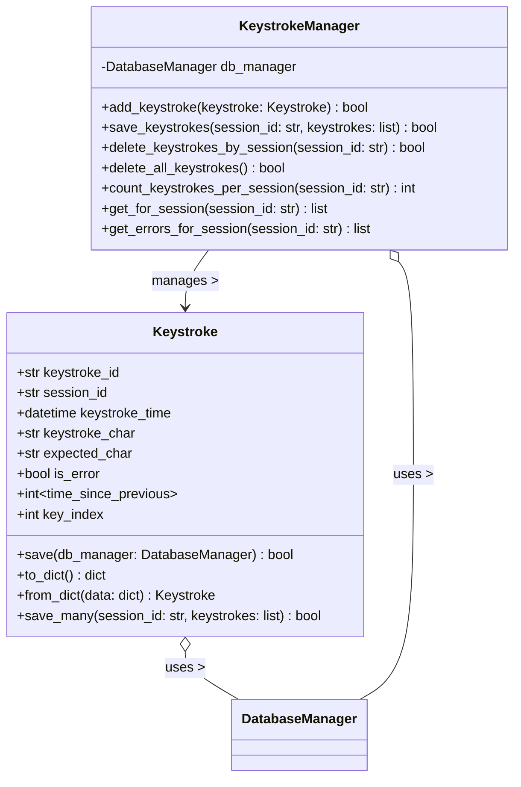

# Keystroke Object Specification

> **NOTE:** `session_id` is always an **integer** throughout the application and database. All APIs, models, and DB tables use integer session IDs. Any previous references to string/UUID session IDs are obsolete.

## 1. Overview
A Keystroke records each key press during a typing session, including timing, correctness, and expected character. Used for detailed analytics and error reporting.

## 2. Data Model
- **keystroke_id**: UUID String (Primary Key)
- **session_id**: UUID String (Foreign Key to practice_sessions)
- **keystroke_time**: DateTime
- **keystroke_char**: String
- **expected_char**: String
- **is_error**: Boolean
- **text_index**: Integer (Position in the text being typed, 0-based)
- **key_index**: Integer (Sequential order of key pressed in the drill, 0-based)

### 2.1 Key Index Details
The **key_index** field captures the exact chronological order of every key press during a typing drill:
- **Purpose**: Provides precise sequencing for keystroke analysis and replay functionality
- **Behavior**: Increments by 1 for each key press, regardless of correctness
- **Start Value**: 0 (first key pressed gets key_index = 0)
- **Scope**: Per session - resets to 0 for each new typing session
- **Usage**: Essential for drill reconstruction, timing analysis, and error pattern detection
- **Example**: In typing "hello", the keystrokes would have key_index values 0, 1, 2, 3, 4 respectively

## 3. Functional Requirements
- Keystrokes are recorded in real time during drills
- Each keystroke is assigned a sequential key_index for precise ordering
- Linked to sessions for analytics and error reporting
- Key sequence tracking enables drill replay and detailed timing analysis

## 4. API Endpoints
- `POST /api/keystrokes`: Record a keystroke
- `GET /api/keystrokes?session_id=<id>`: List keystrokes for a session

## 5. UI Requirements
- Keystrokes are managed automatically by TypingDrill UIs
- Used for real-time feedback and post-drill analytics

## 6. Testing
- Backend, API, and UI tests must cover all keystroke recording and retrieval
- All tests must run on a clean DB and be independent

### 6.1 Acceptance Criteria
- Persisted keystrokes for a session must be retrievable through `KeystrokeManager.get_keystrokes_for_session(session_id)`, populating the manager's internal `KeystrokeCollection` and returning a list ordered by `keystroke_time` that mirrors the exact characters and timestamps that were saved.
- Re-saving keystrokes for an existing session (after `delete_keystrokes_by_session`) must replace the prior records so a subsequent retrieval reflects only the newly provided keystrokes and updates the manager's in-memory collection counts.
- `KeystrokeManager.require_keystrokes_for_session(session_id)` must raise a `LookupError` whenever no keystrokes exist for the supplied session, including after explicit deletion of prior data.
- `delete_keystrokes_by_session(session_id)` must succeed regardless of whether rows exist, and any follow-up call to `require_keystrokes_for_session` for that session must raise a `LookupError`.

## 7. Security/Validation
- No SQL injection (parameterized queries)
- No sensitive data hardcoded
- All user input is validated and sanitized
- key_index values must be validated as non-negative integers

## 7.1 Key Index Analytics and Use Cases
The key_index field enables advanced analytics and features:

### Performance Analysis
- **Typing Speed Over Time**: Calculate WPM at different points during a drill
- **Acceleration/Deceleration**: Identify speed changes throughout the session
- **Fatigue Detection**: Analyze performance degradation over key sequence

### Error Pattern Analysis
- **Error Clustering**: Identify if errors occur in bursts or are evenly distributed
- **Recovery Time**: Measure how quickly users recover from errors
- **Error Progression**: Track error frequency changes during longer drills

### Drill Reconstruction
- **Session Replay**: Recreate the exact typing sequence for review
- **Timing Analysis**: Analyze inter-keystroke timing patterns
- **Progress Visualization**: Show real-time progress through the drill text

### Advanced Features
- **Adaptive Difficulty**: Adjust difficulty based on real-time performance trends
- **Custom Analytics**: Enable coaches/teachers to analyze student performance patterns
- **Comparative Analysis**: Compare performance across different drill segments

---

## 8. API Implementation and Structure
- All Keystroke API endpoints are implemented in `keystroke_api.py` using a Flask Blueprint (`keystroke_api`).
- Endpoints only handle request/response, validation, and error handling.
- All business logic (creation, retrieval, DB access) is handled in `db/models/keystroke.py`.
- Endpoints:
  - `POST /api/keystrokes`: Record a keystroke
  - `GET /api/keystrokes?session_id=<id>`: List keystrokes for a session

## 9. Database Structure
### 9.1 session_keystrokes Table
- **keystroke_id**: UUID String (Primary Key)
- **session_id**: UUID String (Foreign Key to practice_sessions)
- **keystroke_time**: DateTime
- **keystroke_char**: String
- **expected_char**: String
- **is_error**: Boolean
- **text_index**: Integer (Position in text, 0-based, nullable)
- **key_index**: Integer (Sequential keystroke order, 0-based, NOT NULL, DEFAULT 0)

### 9.2 Key Index Implementation
- **Database Column**: `key_index INTEGER NOT NULL DEFAULT 0`
- **Auto-increment**: Managed by application logic, not database auto-increment
- **Validation**: Must be non-negative integer (≥ 0)
- **Uniqueness**: Within a session, each key_index should be unique
- **Backwards Compatibility**: Existing records default to 0, new records get proper sequence

### 9.3 Error Tracking
- Errors are tracked directly in the session_keystrokes table using the is_error field:
    - When is_error = 0: The keystroke was typed correctly
    - When is_error = 1: The keystroke represents an error
- Error analysis can leverage key_index to identify error patterns and timing issues
- Sequential analysis using key_index enables detection of error bursts and recovery patterns

## 10. UML Class Diagram (Keystroke Domain)

**Legend:**
- `+` public, `-` private/protected, `~` optional/nullable
- Types shown for clarity; actual implementation may use type hints or docstrings
- All DB operations use parameterized queries for security

---
